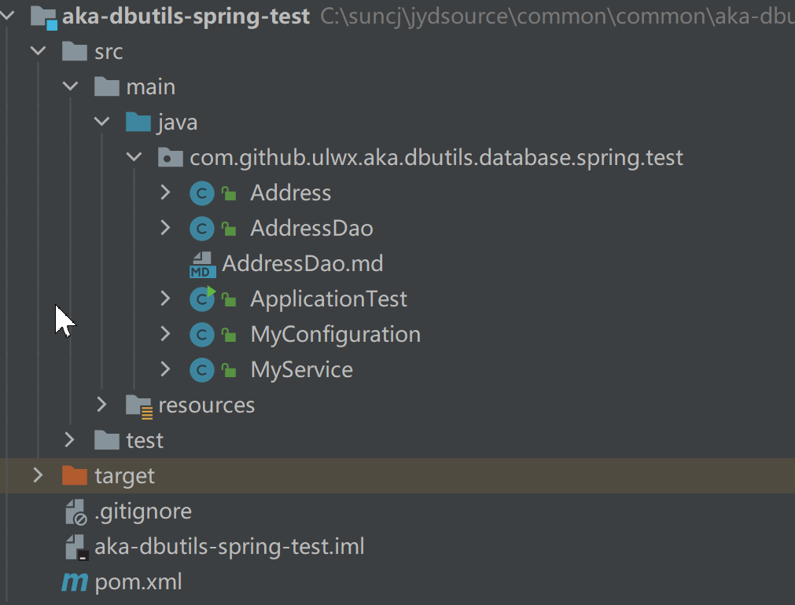
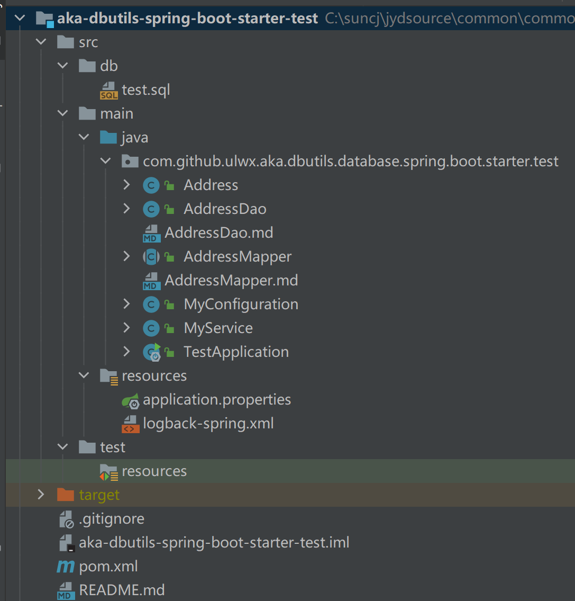

[TOC]


# aka-dbutils

##  为什么选择aka-dbutils?

aka-dbutils是一个**轻量级的**、**强大的**数据库访问工具类。aka-dbutils的设计的初衷就是为了使事情更简单，你只需要30分钟就可以完全掌握aka-dbutils的所有用法。如果你不了解aka-dbutils，你可以把它想象成类似于mybatis，但aka-dbutils能覆盖所有mybatis的功能，但比mybatis更强大，并使用起来更简单和高效，你不需要在mapper xml里写烦人的xml，也不需要为保持命名空间的一致性而苦恼。aka-dbutils提供了大量的对象操作方法，针对这些方法，你不需要编写和传递任何sql语句，因为 aka-dbutils会帮你生成，这些对象操作方法有点类似于hibernate，但aka-dbutils使用起来更简单，它不会要求你在类上使用任何注解。

aka-dbutils就跟它的名字一样，它是一个访问数据库的工具库，它专注于处理数据库的访问。掌握aka-dbutils你不需要了解任何其它技术，，你只需要了解SQL和基本的java语法，它特别适合那些喜欢用一个很简单的访问数据库工具类库来进行数据库操作的朋友。你要明白，aka-dbutils虽然是一个工具类库，易于使用，但它很强大，同时它非常的稳定和可靠，它经历过无数项目的考验，不管从企业应用，互联网项目，还是金融项目，它都工作的很好。

aka-dbutils功能如下：

- 单对象的增删改查不需要SQL，动态通过反射生成SQL语句。

- 天然支持分页查询，多种分页策略可供选择，支持的数据库有

  MYSQL，MS_SQL_SERVER，ORACLE，DB2，H2，HSQL，POSTGRE，SYBASE，SQLITE，INFOMIX，DERBY

- 针对复杂的SQL语句，可为相应的dao方法编写对应md文件，md文件里编写SQL语句的规则非常简洁。同时md文件会转换为java文件并实时编译成java  class文件，所以可以在md文件访问任何java类、对象和方法，非常的强大。

- 提供对象查询的一对一、一对多关联映射。

- 支持数据库事务和事务传播，事务传播类似于spring的事务传播机制。

- 你可以把它集成到spring、spingboot，这通过aka-dbutils-spring，或aka-dbutils-spring-starter。

- 支持多种数据库，如mysql、microsoft sql server、oracle、db2、h2、hsql、postgre、sybase、sqlite。

- 支持主从数据库，事务内的语句和更新的语句在主库上执行，非事务性查询语句在从库执行。

- 集成tomcat-jdbc连接池。

- 支持savepoint操作方法，从而支持局部回滚

- 内置强大的生成java bean的工具。可以从数据库的表生成对应的java bean。

- 良好的日志输出，可以看到每条语句执行的时间，日志输出的SQL语句可以直接到数据库工具上执行，方便调试。

- 支持执行SQL脚本的方法。

- 支持设置拦截器，从而可以拦截数据库操作的执行，你可以取消当前的操作。

- 支持设置监听器，从而可以实时监听执行的SQL语句。

aka-dbutils会具有如下优势：

- 数百个测试用例用来保证aka-dbutils的稳定可靠。
- 经过无数项目的考验，具有12年的发展历程，借鉴了众多开源软件的思想。
- aka-dbutils所有新增功能都必须向前兼容，从而aka-dbutils老版本到新版本升级不会有太多压力。
- aka-dbutils会终身得到维护，如出现bug，我们会第一时间来免费支持。

## 入门例子

入门例子工程名为[aka-dbutils-demo](https://github.com/ulwx/aka-dbutils-demo)，你可以在https://github.com/ulwx/aka-dbutils-demo下载。你需要准备一个mysql数据库，并且需要在src/db目录下找到dbutils_demo.sql文件，并通过mysql数据库客户端工具（如SQLyog)执行从而生成dbutils_demo数据库。

### pom.xml里添加maven依赖

```xml
...
<dependency>
		<groupId>com.github.ulwx</groupId>
		<artifactId>aka-dbutils</artifactId>
		<version>最新版本</version>
</dependency>
...
```
### 在类路径下添加dbpool.xml

**示例—dbpool.xml**

```xml
<?xml version="1.0" encoding="UTF-8"?>
<dbpool-config>
  <setting>
    <!--
     全局设置的数据库表名与javaBean类名的转换规则，有三种转换规则，分别如下：
     underline_to_camel：  表示下划线转驼峰，
     normal：  为数据库表名和javaBean类名一致
     first_letter_upcase： 为数据库表名转为javaBean类名时第一个字母大写
    -->
    <table-name-rule>underline_to_camel</table-name-rule>    <!--  ②-1   -->
    <!--
    全局设置的表字段与javaBean属性名的转换规则，有两种转换规则，分别如下：
     underline_to_camel：  下划线转驼峰
     normal：   为数据库表名和javabean属性一致
    -->
    <table-colum-rule>underline_to_camel</table-colum-rule>    <!--   ③-1   -->
  </setting>
  <!--
  每个<dbpool>元素配置对应一个数据库连接池
  type属性：现在只能指定tomcatdbpool，表示是使用的tomcat jdbc数据库连接池
  table-name-rule属性：指定本数据源对应数据库的表名到javaBean类名的转换规则，覆盖setting里的全局规则
  table-colum-rule属性：指定本数据源对应数据库里表字段与javaBean属性名的转换规则，覆盖setting里的全局规则
  driverClassName：数据库的驱动名称
  url： 连接字符串
  username：用户名
  password：用户密码,如果encrypt=1,则password值是通过aes算法加密后的，既通过DBPoolFactory.aesEncrypt(dbpassword)加密得到
  checkoutTimeout：当数据库满时，等待从连接池里取出connection的最长时间，毫秒为单位
  maxIdleTime ：最长空闲时间，以秒为单位，多于连接池里可容纳的最小connection数（由minPoolSize指定）的连接如果超过此时间就会被释放
  maxPoolSize ：连接池可容纳连接connection最大数量
  minPoolSize： 连接池可容纳的的connection最小数量
  idleConnectionTestPeriod: 每次检测空闲连接的时间间隔（秒），如果检测时发现某空闲连接超过最长空闲时间（maxIdleTime）则清除，但连接池里的连接数会
  会保留到minPoolSize指定的数量。此参数以秒为单位。
  maxStatements：缓存的statement数
  encrypt : password属性是否加密，0：不加密 1：加密（采用的是aes加密，通过DBPoolFactory.aesEncrypt(dbpassword)加密)
  -->
  <dbpool name="dbutils-demo"                     <!--   ①  -->
          type="tomcatdbpool"  
          table-name-rule="underline_to_camel"   <!--   ②   -->
          table-colum-rule="underline_to_camel">   <!--  ③   -->
    <property name="driverClassName">com.mysql.jdbc.Driver</property>
    <property name="url">jdbc:mysql://localhost:3306/dbutils_demo?useUnicode=true&amp;characterEncoding=utf-8&amp;serverTimezone=GMT%2B8&amp;useSSL=false</property>
    <property name="username">root</property>
    <property name="password">abcd</property>
    <property name="encrypt">0</property><!--password属性是否加密，0：不加密 1：加密-->
    <property name="checkoutTimeout">60000</property>
    <property name="idleConnectionTestPeriod">30</property>
    <property name="maxIdleTime">60</property>
    <property name="maxPoolSize">30</property>
    <property name="minPoolSize">2</property>
    <property name="maxStatements">20</property>
  </dbpool>
</dbpool-config>
```

### 从数据库生成javaBean

由于数据库的表，对应的javaBean对象，自己手工编写非常麻烦，可以通过 aka-dbutils提供的工具方法SqlUtils.exportTables()来生成。exportTables()方法签名如下：

```java
public static void exportTables(
    String pool,  //连接池的名称，对应dbpool.xml里的 <dbpool>的 name属性
    String schema, //对应数据库的名称
    String toFolder, //javaBean对应的java文件生成到哪个文件夹里
    String toPackage, //生成的javaBean所属的java包名称，例如com.github.ulwx.aka.dbutils.demo.dao
    String remarkEncoding, //生成javaBean对应java文件的格式
    boolean propertyLowcaseFirstChar //是否属性的第一个字母小写
) 
```

**举例如下**：

```java
SqlUtils.exportTables("dbutils-demo", "dbutils_demo", "c:/dbutils_demo",
                                                                            "com.github.ulwx.aka.dbutils.demo.dao","utf-8",true);
```

假设数据库里存在course表（假设为mysql）

```sql
CREATE TABLE `course` (
  `id` int(10) unsigned NOT NULL AUTO_INCREMENT COMMENT '课程id',
  `name` varchar(20) DEFAULT '' COMMENT '课程名称',
  `class_hours` int(11) DEFAULT '0' COMMENT '学时',
  `creatime` datetime DEFAULT NULL COMMENT '建立时间',
  PRIMARY KEY (`id`)
) ENGINE=InnoDB AUTO_INCREMENT=13 DEFAULT CHARSET=utf8 COMMENT='课程'
```

生成的javaBean文件内容如下：

**示例—Course.java**

```java
package com.github.ulwx.aka.dbutils.demo.domian;
import java.time.LocalDateTime;

/*********************************************
课程
***********************************************/
public class Course extends com.github.ulwx.aka.dbutils.database.MdbOptions implements java.io.Serializable {

	private Integer id;/*课程id;len:10*/
	private String name;/*课程名称;len:20*/
	private Integer classHours;/*学时;len:10*/
	private LocalDateTime creatime;/*建立时间;len:19*/
	public void setId(Integer id){
		this.id = id;
	}
	public Integer getId(){
		return id;
	}
	public void setName(String name){
		this.name = name;
	}
	public String getName(){
		return name;
	}
	public void setClassHours(Integer classHours){
		this.classHours = classHours;
	}
	public Integer getClassHours(){
		return classHours;
	}
	public void setCreatime(LocalDateTime creatime){
		this.creatime = creatime;
	}
	public LocalDateTime getCreatime(){
		return creatime;
	}
	private static final long serialVersionUID =408811385L;

}
```

生成的javaBean Course类继承了com.github.ulwx.aka.dbutils.database.MdbOptions类，用于对单对象查询的提供支持。

### 编写Dao类实现增删改查

下面是针对course表的数据访问类CourseDao，通过MDbUtils的相关方法实现了基本的增删改查逻辑。

**示例—CourseDao.java**

```java
package com.github.ulwx.aka.dbutils.demo.dao;
import com.github.ulwx.aka.dbutils.database.DbException;
import com.github.ulwx.aka.dbutils.tool.MD;
import com.github.ulwx.aka.dbutils.tool.MDbUtils;
import com.github.ulwx.aka.dbutils.demo.domian.Course;

import java.util.HashMap;
import java.util.List;
import java.util.Map;

public class CourseDao {
    public static String DbPoolName="dbutils-demo";
    
    public void delAll(){         //①-1  对应md方法名
        MDbUtils.del(DbPoolName, MD.md(), null);    // ①  用到了CourseDao.md文件
    }
    public int addAndReturnKey(Course course)  {  
        return (int)MDbUtils.insertReturnKeyBy(DbPoolName, course);    // ②  直接通过对象反射生成sql语句
    }
    public void update(Course course)throws  DbException{
         MDbUtils.updateBy(DbPoolName, course, MD.of( course::getId)); // ③  直接通过对象反射生成sql语句
        //MDbUtils.updateBy(DbPoolName, course, MD.of( "id"));    // ③-1  和 ③处的等效
    }
    public Course queryOne(String name, int classHours) {
        Course course=new Course();
        course.setName(name);
        course.setClassHours(classHours);
        return MDbUtils.queryOneBy(DbPoolName, course);  // ④  直接通过对象反射生成sql语句
    }

    public  List<Course> queryListFromMdFile(String name, int classHours) {
        Map<String,Object>map=new HashMap<>();
        map.put("myName",name);
        map.put("myClassHours",classHours);
        return MDbUtils.queryList(DbPoolName, Course.class, MD.md(), map);  // ⑤  用到了CourseDao.md文件
    }
}

```

CourseDao的delAll()和queryListFromMdFile()方法需要在md文件里编写SQL语句。md文件要存放在和CourseDao同级目录下（即com.github.ulwx.aka.dbutils.demo.dao），md文件的名称的.md前面部分需与CourseDao类名一致。下面是上面示例⑤处使用的CourseDao.md文件，它是通过MD.md()方法生成的md文件地址来引用，MD.md()返回的为：com.github.ulwx.aka.dbutils.demo.dao.CourseDao.md

**示例—CourseDao.md：**

```sql
delAll    
====
delete from course   

queryListFromMdFile    
====
select * from course where 1=1  
@if( $$:myName ){
 and name like #{myName%}
@}
@if( (Integer)$$.myClassHours > 0 ){
 and class_hours > #{myClassHours}
@}
```

> aka-dbutils在执行数据库操作时会把md文件实时转换成java类，并在内存里实时编译成class并加载到jvm。

下面针对上面【示例—CourseDao.java】里标记序号（如①、②、、）分别进行解释。

**①  MDbUtils.del(DbPoolName, MD.md(), null)**：删除操作，需要使用md文件，对应的SQL语句存放在md文件里。

> MDbUtils#del()的第一个参数需传入一个数据源名称，表明从哪个数据源执行删除操作。这里传入变量DbPoolName的值为"dbutils-demo"，它对应**dbpool.xml**（前面提到的）文件里的①处里的name属性值（<dbpool name="dbutils-demo">）。后面你会看到MDbUtils里的所有方法都得指定数据源。
>
> 本例的MDbUtils#del()方法需要用到md文件，并在里面编写SQL语句，你需要在调用MDbUtils#del()方法的CourseDao的同级包下，定义一个CourseDao.md文件，在里面编写如下内容：
>
> ```sql
> delAll    
> ====
> delete from course   
> ```
>
> 上面md文件里编写的内容通过====分隔开，=\=\=\=的上方指定了调用MDbUtils#del()所在的Dao方法（CourseDao#dellAll）的名称delAll（称为md方法名），下方指定了SQL语句（称作md方法体）。md方法名、\=\=\=\=和md方法体三者组成了md方法。aka-dbutils在运行时会把整个md文件在内存中转换成一个java类，并在内存中编译成class并加载到jvm，每个md方法会对应到这个java类的方法，如本例中转化的java类如下：
>
> ```java
> public class CourseDaoMd {
> 	public static String delAll(Map<String, Object> args)throws Exception{
> 		String retString="";
>         	MDMehtodOptions options = new MDMehtodOptions();
> 		options.setSource(trimRight("CourseDaoMd",2)+".md:delAll");
> 		retString=retString+" delete from course";
> 		return retString;
> 	}
> 	public static String queryListFromMdFile(Map<String, Object> args)throws Exception{
> 		String retString="";
>         	MDMehtodOptions options = new MDMehtodOptions();
> 		options.setSource(trimRight("CourseDaoMd",2)+".md:queryListFromMdFile");
> 		retString=retString+" select * from course where 1=1";
> 		if(  NFunction.isNotEmpty(args.get("myName"))  ){
> 			retString=retString+" and name like #{myName%}";
> 		}
> 		if( (Integer)args.get("myClassHours")  > 0 ){
> 			retString=retString+" and class_hours > #{myClassHours}";
> 		}
> 		return retString;
> 	}
> }
> ```
>
> 转化的java类的类名为CourseDaoMd，即CourseDao加Md后缀，在其内部的delAll()方法对应到上述的md方法dellAll，可以看出CourseDaoMd类里的每个方法签名里含有一个Map<String, Object>类型的args参数，它其实是MDbUtils#del()方法最后一个参数的引用，用于生成SQL的逻辑。
>
> MDbUtils#del()的第二个参数使用了Md.md()工具方法，它会生成"com.github.ulwx.aka.dbutils.demo.dao.CourseDao.md:delAll"，称为**md方法地址**，aka-dbutils会把它转换成CourseDaoMd#delAll()的方法调用，最终得到方法执行返回的SQL语句。
>
> MDbUtils#del()的第三个参数为Map<String, Object> 类型的参数，用于传递md方法体所需的参数，这里传null，表明CourseDao.md:delAll方法体不需要参数。
>

**②  MDbUtils.insertReturnKeyBy(DbPoolName, course)** ：插入对象到数据表并返回自增id

> MDbUtils#insertReturnKeyBy()方法的第一个参数为数据源名称，对应【示例—dbpool.xml】里的①处（<dbpool name="dbutils-demo">），指定在哪个数据源上执行操作。
>
> MDbUtils#insertReturnKeyBy()方法的第二个参数传入了一个对象course，aka-dbutils会根据对象生成insert语句，这里只会考虑对象不为空的属性，为null的属性会忽略掉从而不会作为生成SQL语句的部分。例如：
>
> ```java
> Course course1=new Course();
> course1.setName("course1");
> course1.setClassHours(11);
> course1.setCreatime(LocalDateTime.now());
> courseDao.add(course1);
> ```
>
> 上面的程序片段传入了course1对象，course1对象只在name、classHours、creatime这三个属性上被赋了非空的值，而id属性值默认为空，所以生成SQL的时候不会考虑，最终生成的SQL如下：
>`insert into course (name,creatime,class_hours) values('course1','2021-01-30 23:25:41',11)`
> 
> 可以看出生成的SQL语句里并没有包含id属性对应的表id字段。insert语句的表名course是根据对象course1的类型Course转换而成，具体转换规则由dbpool.xml里的<dbpool>元素的table-name-rule属性值决定（【示例—dbpool.xml】里的②处）。如果<dbpool>没有指定table-name-rule属性，则由<setting>里的子元素 <table-name-rule>决定。本例中<dbpool>的table-name-rule属性值指定为**underline_to_camel**，表示数据库表名与javaBean类名映射为下划线转驼峰，如：hello_world —>HelloWorld。table-name-rule属性还可以指定其它几种转换规则：first_letter_upcase、normal，你可以在<setting>里找到它们的解释。insert语句的字段名是根据对象course1的属性转换二来，具体转换规则由dbpool.xml里的<dbpool>元素的 table-colum-rule属性值决定（dbpool.xml里的②处）。如果<dbpool>没有指定table-colum-rule属性，则由<setting>里的子元素 <table-colum-rule>决定。本例中<dbpool>的 table-colum-rule属性值指定为**underline_to_camel**，表示表字段与javaBean对象的属性映射为下划线转驼峰，如：class_hours—>classHours。还有其它规则，解释见dbpool.xml里的<setting>元素下的子元素<table-colum-rule>
> 
>MDbUtils#insertReturnKeyBy()方法返回自增id，您也可以使用不返回自增id的MDbUtils#insertBy()方法，它返回成功插入记录的条数（为1），失败返回-1，方法具体签名如下：
> 
>```
> public static <T> int insertBy(String pollName, T insertObject) 
>```
> 
>  MDbUtils#insertReturnKeyBy()和 MDbUtils#insertBy()这两个方法名都是以By为后缀，所有**MDbUtils.XXXBy()**模式的方法都称作**对象操作方法**，**对象操作方法**不需要在md文件里编写SQL语句，这些方法会根据传入的对象反射生成SQL语句，这非常的方便，一般一个项目很大一部分操作都是简单的对象增伤改查操作。MDbUtils里的XXXBy()方法给你提供了极大的便利。
> 

③  **MDbUtils.updateBy(DbPoolName, course, MD.of( course::getId))**：通过对象来更新表记录。

> MDbUtils#updateBy()方法的第一个参数为数据源名称。第二个参数为course对象，它的非空属性将会更新到对应表（course）的记录中，更新哪些记录的查找条件是根据第三个参数所指定的属性来决定。course对象类名到表名的映射规则是根据②里介绍的规则，我们知道它为**underline_to_camel**，即根据course对象类名（Course）通过**underline_to_camel**规则转换成对应的表（course）。第三个参数是个数组类型，它传入的属性构成了update的where条件部分，可以传入对象的多个属性，他们是组成的条件是and关系。MD.of()是一个工具类，方便你去传入多个属性，有两种传入属性的形式，你可以通过方法引用的形式（如：course::getId）传递属性，也可以通过传递属性名称的形式，例如MD.of( "id")，指定了id属性，MD.of()最终会转换成一个数组。下面的程序片段展示了其用法：
>
> ```java
> package com.github.ulwx.aka.dbutils.demo.dao;
> ......
> public class CourseDao {
>  public static String DbPoolName="dbutils-demo";
>  ......
>  public void update(Course course)throws  DbException{
>      MDbUtils.updateBy(DbPoolName, course, MD.of( course::getId));//③ 直接通过对象反射生成sql语句
>      //MDbUtils.updateBy(DbPoolName, course, MD.of( "id")); //另一种形式，和上面运行结果等效
>  }
> ......
> }
> 
> ```
> 由于③处的第三个参数传入了id属性（course::getId），这表示要根据id查询记录并进行更新，它组成了"where id=24"部分。
>
> ```java
> Course courseForUpdate=new Course();
> courseForUpdate.setId(24);
> courseForUpdate.setName("course33");
> courseDao.update(courseForUpdate);
> ```
>
> CourseDao#update()传入了courseForUpdate对象，courseForUpdate对象不为空的属性（要去除组成where条件部分的属性，这里时id属性）组成了update的set部分。上面的程序片段生成的SQL语句为：
> `update course  set name='course33' where id=24`
>
> 需要强调的是MDbUtils#updateBy()第三个参数如果传入字符串数组的形式，则数组里的每个元素字符串必须对应的是对象的java属性名，而不是对应表（course）字段的名称，虽然在本例中它们是一样的。MDbUtils#updateBy()方法最终生成的update语句里的表名到javaBean对象类名、字段名到javaBean属性名的映射转换规则在②中已经介绍。
>

**④ MDbUtils.queryOneBy(DbPoolName, course)** ：根据对象里的非空属性作为查询条件查询一条记录并填充到一个对象并返回。

> MDbUtils#queryOneBy()方法由于以By结尾，它不需要使用md文件来编写SQL，而是它会根据传入的对象通过反射生成SQL查询语句。方法的第一个参数为数据源名称，第二个参数为传入的对象。
>
> ```java
> Course course=new Course();
> course.setName("course33");
> course.setClassHours(13);
> Course course= MDbUtils.queryOneBy(DbPoolName, course);
> ```
>
> 上面的程序片段首先new一个Course对象，并只对name和classHours属性赋值，其它属性默认为null，aka-dbutils会把非null属性构成where查询条件，最终生成的SQL语句如下：
>
> ```sql
> select * from course  where name='course33' and class_hours=13 
> ```
>
> 各个非null属性构成的where条件中各个条件为and关系。

**⑤ MDbUtils.queryList(DbPoolName, Course.class, MD.md(), map)**：根据md文件里的SQL语句进行查询，并返回对象列表。

> 方法的第二个参数为表记录映射到的对象的类型，aka-dbutils当从数据库查询的记录后，会为每条记录根据传入的类型生成一个对象并填充记录到对象里，最终返回一个对象列表。
>
> 展示MDbUtils#queryList()使用，如例1-1所示
>
> **【例1】展示MDbUtils#queryList()使用**
>
> ```java
> //CourseDao.java
> package com.github.ulwx.aka.dbutils.demo.dao;
> ......
> public class CourseDao {
>  public static String DbPoolName="dbutils-demo";
>  ......
>  public  List<Course> queryListFromMdFile(String name, int classHours) {
>      Map<String,Object>map=new HashMap<>();
>      map.put("myName",name);
>      map.put("myClassHours",classHours);
>      return MDbUtils.queryList(DbPoolName, Course.class, MD.md(), map);    // ①
>  }
> ......
> }
> //CourseService.java
> package com.github.ulwx.aka.dbutils.demo.service;
> ......
> public class CourseService {
>  private CourseDao courseDao=new CourseDao();
>  public void testBasicUsage(){
>      ......
>      List<Course> list= courseDao.queryListFromMdFile("course", 10);
>      System.out.println(ObjectUtils.toString(list));
>  }
> 
>  public static void main(String[] args) throws Exception{
>      CourseService courseService=new CourseService();
>      courseService.testBasicUsage();
>  }
> 
> ```
>
> CourseDao#queryListFromMdFile()里调用了MDbUtils#queryList()方法，传入的MD.md()生成了md方法地址com.github.ulwx.aka.dbutils.demo.dao.CourseDao.md:queryListFromMdFile。MDbUtils#queryList()的第三个参数传入了一个Map对象，可以在Map对象里添加参数（称作**Map参数**），这些参数会在md方法（这里是queryListFromMdFile）里动态拼装SQL语句时用到，md方法queryListFromMdFile的内容，如【例1】所示：
>
> **【例2】md方法queryListFromMdFile内容**
>
> ```sql
> queryListFromMdFile    
> ====
> select * from course where 1=1  
> @if( $$:myName ){
> and name like #{myName%}
> @}
> @if( (Integer)$$.myClassHours > 0 ){
> and class_hours > #{myClassHours}
> @}
> ```
>
> 上面的md方法的方法体使用了动态拼装SQL的技术，所有@前缀的行都是java代码，里面使用了一个特殊的$$符号，代表传入的Map对象本身，它代表下方的【例3】里①处的args，\$\$.myClassHours等同于args.get("myClassHours") ，即获取Map对象里的**Map参数**myClassHours的值 ，而\$\$:myName 等同于NFunction.isNotEmpty(args.get("myName")) ，即·对Map参数myName进行了非空判断。在非@前缀的部分为SQL语句，在SQL语句里含有#{XXX}的语法，XXX为Map参数名称，#{XXX}本质上是占位符，类似于mybatis，aka-dbutils会对SQL语句含有#{XXX}的部分进行处理从而替换成?，从而通过jdbc的PreprareStatement进行预处理，防止注入式攻击。#{XXX}可以支持%，如name like #{myName%}，表示Map参数myName值的前缀匹配。#{XXX}中XXX参数可以为数组，如：roles in(#{roles})，aka-dbutils在对SQL语句处理时会判断参数是否为数组，从而替换成形如 roles in(3,4,5,6)的形式。
>
> md方法queryListFromMdFile最终转换成的java类CourseDaoMd#queryListFromMdFile()方法，如【例3】所示：
>
> **【例3】CourseDaoMd#queryListFromMdFile()源代码**
>
> ```java
> public class CourseDaoMd {
> 	......
> 	public static String queryListFromMdFile(Map<String, Object> args)  // ①
>              throws Exception{
> 		String retString="";
> 		MDMehtodOptions options = new MDMehtodOptions();
> 		options.setSource(trimRight("CourseDaoMd",2)+".md:queryListFromMdFile");
> 		retString=retString+" select * from course where 1=1";
> 		if(  NFunction.isNotEmpty(args.get("myName"))  ){
> 			retString=retString+" and name like #{myName%}";
> 		}
> 		if( (Integer)args.get("myClassHours")  > 0 ){
> 			retString=retString+" and class_hours > #{myClassHours}";
> 		}
> 		return retString;
> 	}
> }
> 
> ```
>
> 上面的转换后的java类CourseDaoMd的每个方法为static的，而且每个方法都含有Map<String, Object> args参数，它由外部调用传递过来，如【例1】的①处。
>
> 可以看出aka-dbutils的md文件的本质是把程序员以往在java代码里动态拼装SQL语句的逻辑搬移到md文件里，但却变得更精简高效并可以配置，由于最终是java代码执行SQL语句的拼装，不像mybatis通过xml去解析，所以会更高效。

至此你已经学会了aka-dbutils的常用的用法，下一步你将通过《aka-dbutils详解》会了解更多关于aka-dbutils的稍微高级一点的用法，如：分页查询，批量更新，一对一以及一对多关联映射，脚本执行，事务管理及传播，主从用法，md文件的详细语法，以及与Spring框架集成。

## aka-dbutils详解

aka-dbutils提供了一个MDbUtils工具类，此工具类里通过静态工具方法提供所有访问数据库的操作方法。下面小节会详细介绍里面各个方法的用法。下面所有示例都可以在[aka-dbutils-demo](https://github.com/ulwx/aka-dbutils-demo)工程里找到，下载地址：https://github.com/ulwx/aka-dbutils-demo。

### 普通查询（不需要写SQL）

MDbUtils工具类提供的查询方法可以分为两类，一类形如MDbUtils#queryXXXBy()的方法，这类方法不需要编写任何SQL语句，会通过传入的对象反射生成SQL语句。一类是不含By后缀的查询方法，形如MDbUtils#queryXXX()，这类方法需要传入md方法地址，在外部md文件里定义SQL语句。本节会对MDbUtils#queryXXXBy()这类方法进行详细介绍，它们的方法签名如下：

```java
public static <T> List<T> queryListBy(String pollName, T selectObject) throws DbException 
public static <T> List<T> queryListBy(String pollName, T selectObject, int page, int perPage, PageBean pb) throws DbException 
public static <T> List<T> queryListBy(String pollName, T selectObject,  Object[] whereProperties) throws DbException 
public static <T> List<T> queryListBy(String pollName, T selectObject, Object[] whereProperties, int page, 
														int perPage, PageBean pb) throws DbException 
public static <T> T queryOneBy(String pollName, T selectObject) throws DbException 
public static <T> T queryOneBy(String pollName, T selectObject,  Object[] whereProperties) throws DbException 
```

下面先来上面列举的方法进行详解，并展示一些例子，让读者完全掌握其用法。

```java
一、public static <T> List<T> queryListBy(String pollName, T selectObject) throws DbException 
```

> 根据selectObject的非空属性生成select语句的where条件部分，每个属性构成的条件之间是and关系。
>
> **参数说明**
> pollName – 连接池的名字，对应dbpool.xml里 的name属性
> selectObject – 根据传入的对象反射生成select语句，非空属性组成了where的条件部分
> Returns:  返回查询的表记录所填充的对象列表，对象的类型与selectObject的类型一致。
>
> **程序示例**
>
> ```java
> //CourseDao.java
> package com.github.ulwx.aka.dbutils.demo.dao;
>  ......
> public class CourseDao {
>        public static String DbPoolName="dbutils-demo";
>        ......
>        public  void testQueryListBy(){
>            Course course=new Course();
>            course.setName("course1");
>            course.setClassHours(11);
>         List<Course> list = MDbUtils.queryListBy(DbPoolName, course);   //①
>         System.out.println("list--"+ObjectUtils.toPrettyJsonString(list));
> 
>         course.selectOptions().select("class_hours as classHours , id"). orderBy("classHours desc").limit(2);   //②
>         list = MDbUtils.queryListBy(DbPoolName, course);         // ③
>            System.out.println("list--"+ObjectUtils.toPrettyJsonString(list));
>    
>        }
>         ......
>        public static void main(String[] args) throws Exception{
>             CourseDao dao=new CourseDao();
>             dao.testQueryListBy();
>       }
>    }
>    }
> 
> ```
> 
>上面程序示例②处的调用最终生成的SQL语句为
> `select * from course  where name='course1' and class_hours=11` 
> 
>程序示例①处传入的course对象的类型Course是通过SqlUtils#exportTables()工具生成的，这样Course类会继承类MdbOptions，通过MdbOptions#selectOptions()方法可以进一步控制生成的select语句的内容。上面程序示例的②处使用course.selectOptions()获取了SelOp对象，SelOp对象可以指定SQL语句里的select，order by，limit部分内容。③处最终生成SQL语句的部分。上面程序片段生成的SQL语句如下：
> `select class_hours as classHours , id  fromcoursewherename='course1' andclass_hours=11 order by  class_hours  desc limit 2`
>需要注意的是select("class_hours as classHours , id")里为class_hours 表字段指定了as别名，其与javaBean对象的属性名称一致，这样才会使aka-dbutils能正确的处理映射，id表字段 与javaBean属性名一致，不需要指定as别名。limit(2)指定生成查询前2条的SQL语句，当然这里的limit(2)生成的语句会根据不同的数据库而不同。orderBy("classHours desc")里既可以指定javaBean的属性名也可以指定表字段名，本例指定的是classHours属性名，aka-dbutils会自动转换为表字段class_hours。

```java
二、public static <T> List<T> queryListBy(String pollName, T selectObject, int page, int perPage, PageBean pb) throws DbException 
```

> 根据selectObject的非空属性生成select语句的where条件部分，每个属性构成的条件之间是and关系，本方法为分页查询，参数page为页码（从1开始）， 参数perPage为每页多少行记录，aka-dbutils会根据这些信息生成每页的select语句，例如，如果当前数据库类型为mysql，请求第2页（page=2）， 每页10条（perPage=10），则生成的分页查询语句如下：
>            `select  *  from  course  where name='course_page'  limit  10,10`
>            (由于 mysql的limit后面的索引是从0开始，所以这里的10表示从第11条开始往后的10条记录，即第二页数据)
>
> aka-dbutils在生成上面的分页select语句之前，会首先自动生成查询总数的select语句，如果当前数据库类型为mysql，生成的语句如下：
>            `select  count(1)   from  (select  *  from  course  where  name='course_page') t`
>
> **参数说明**
> pollName – 连接池的名字，对应dbpool.xml里 的name属性
> selectObject – 根据此对象反射生成select语句，非空属性组成了where的条件部分
> page – 页码，从1开始
> perPage – 每页多少行记录
> pageBean – 返回的分页信息存入此对象，包括总记录号，最大页数，这些信息可以用于前端UI展示
> Returns: 返回查询的记录填充的对象列表，对象的类型与selectObject的类型一致
>
> **程序示例**
>
> ```java
> //CourseDao.java
> package com.github.ulwx.aka.dbutils.demo.dao;
> ......
> public class CourseDao {
>        public static String DbPoolName="dbutils-demo";
>        ......
>        public  void testQueryListForPage(){
>                PageBean pageBean=new PageBean();
>                Course course=new Course();
>                course.setName("course_page");
>             List<Course> list =  MDbUtils.queryListBy(DbPoolName, course, 2, 3, pageBean); // ①
>             System.out.println("list--"+ObjectUtils.toPrettyJsonString(list));
> 
>             course.selectOptions().select("class_hours as classHours , id").
>                     orderBy("id desc")   //指定order by子句，排序的字段可以是表列名称也可以指定javaBean属性名称
>                        //.limit(11)   //针对下方的关于对象分页查询方法，此处不能调用limit(n)方法，否则会报错。
>                         ;
>                list = MDbUtils.queryListBy(DbPoolName, course, 2, 3, pageBean);   //② 为对象course设置了select和order by子句
>                System.out.println("list--"+ObjectUtils.toPrettyJsonString(list));
>    
>        }
>         ......
>        public static void main(String[] args) throws Exception{
>                 CourseDao dao=new CourseDao();
>                 dao.testQueryListForPage();
>       }
>    }
>    
>    ```
>    
>    ①处调用取第2页，每页3条记录，并传入了一个PageBean类型对象，用于返回具体的分页信息。①处的MDbUtils#queryListBy()调用会生成两条sql语句，分别如下：
>    `select count(1) from (select *  from course  where name='course_page') t`
>    `select *  from course  where name='course_page' limit 3, 3`
>    第一条为计算总条数的语句，第二条为分页的SQL。
>    
> 在③处打印了pageBean对象，如下所示：`{"start":10,"end":20,"perPage":10,"total":30,"page":2,"maxPage":3,"empty":false,"prevPage":1,`
> `"nextPage":3}`
> pageBean对象的信息为前端UI组件显示提供了方便。
>
> ②处调用生成的SQL语句如下：
> `select count(1) from (select class_hours as classHours , id  from course  where name='course_page') t`
>`select class_hours as classHours , id  from course  where name='course_page'   order by id desc limit 3, 3`
> 第一条为计算总条数的语句，第二条为分页的SQL。

```java
三、public static <T> List<T> queryListBy(String pollName, T selectObject,  Object[] whereProperties) throws DbException 
```

> 根据whereProperties指定selectObject里哪些属性生成select语句的where条件部分，每个属性构成的条件之间是and关系，whereProperties里的属性值为null并不会忽略，而会生成形如"xxx=null"的条件。
>
> **参数说明**
> pollName – 连接池的名字，对应dbpool.xml里 的name属性
> selectObject – 此对象反射生成select语句，whereProperties指定了哪些属性用于组成where的条件部分，其中属性值为空的属性不会忽略，会生成形如"xxx=null"的条件。
> whereProperties – whereProperties指定了哪些属性用于组成where的条件部分，不会忽略值为null的属性。
> Returns:   返回查询的记录填充的对象列表，对象的类型与selectObject的类型是一致的。  
>
> **程序示例**
>
> ```java
> //CourseDao.java
> package com.github.ulwx.aka.dbutils.demo.dao;
> ......
> public class CourseDao {
> public static String DbPoolName="dbutils-demo";
>  ......
>  public void  testQueryListForWhere(){
>         Course course=new Course();
>         course.setName("course_page");
>         course.setClassHours(11);
>         List<Course> list = MDbUtils.queryListBy(DbPoolName,
>                				 course,MD.of(course::getName,course::getCreatime)); //  ①
>         System.out.println("list--"+ObjectUtils.toPrettyJsonString(list));
> 
>    }
>     ......
>     public static void main(String[] args) throws Exception{
>              CourseDao dao=new CourseDao();
>              dao.testQueryListForWhere();
>    }
> }
> 
> ```
>
> 上面的程序示例①中，传入了一个course对象，在对象上对name和classHours属性赋了值，但我们需要只根据name属性查询，这里通过MD.of(course::getName,course::getCreatime)对第三个参数whereProperties传入一个包含name和creatime属性的数组。最终生成的SQL语句如下：
> `select * from course  where name='course_page' and creatime=null` 
> 可以看出虽然creatime属性为空，但 最终生成的SQL里包含 creatime=null条件。

```java
四、public static <T> List<T> queryListBy(String pollName, T selectObject, Object[] whereProperties, int page,  
														int perPage, PageBean pb) throws DbException 
五、public static <T> T queryOneBy(String pollName, T selectObject) throws DbException 
六、public static <T> T queryOneBy(String pollName, T selectObject,  Object[] whereProperties) throws DbException 
```

> 上面三个方法第一个是分页查询，通过whereProperties来指定selectObject对象里哪些属性生成where的条件部分，指定的这些属性的值即使为null也不会忽略，而是生成形如 xxx= null 的SQL语句。后两个MDbUtils#queryOneBy()方法只会返回一个对象。特别需要说明的是MDbUtils#queryOneBy()的内部执行经过了优化处理，生成的SQL语句在数据库只取一条。例如，如果是mysql，则会生成形如下面的SQL：
> `select *  from course  where name='course33' and class_hours=13 limit 1`

### 普通查询（需要写SQL）

另一类形如MDbUtils#queryXXX()的方法，这些方法是针对无法通过对象反射生成SQL语句的场景的，你需要在Dao类所在包下创建一个同名的md后缀的文件，并在里面定义md方法并编写SQL语句，然后在MDbUtils#queryXXX()方法里传入md方法地址，形如com.github.ulwx.aka.dbutils.demo.dao.CourseDao.md:queryListFromMdFile。下面的例子展示了其用法：

**程序示例**

```java
package com.github.ulwx.aka.dbutils.demo.dao;
......
public class CourseDao {
    public static String DbPoolName="dbutils-demo";
    ......
    public  List<Course> queryListFromMdFile(String name, int classHours) {
        Map<String,Object>map=new HashMap<>();
        map.put("myName",name);
        map.put("myClassHours",classHours);
        return MDbUtils.queryList(DbPoolName, Course.class, MD.md(), map);//用到了CourseDao.md文件
    }
 ......
}
```

在上面的程序示例里，调用MDbUtils#queryList()方法传入的第三个参数是通过MD.md()返回的值作为md方法地址，这里为com.github.ulwx.aka.dbutils.demo.dao.CourseDao.md:queryListFromMdFile，它将约束我们必须在CourseDao类所在包下定义一个CourseDao.md文件，并编写queryListFromMdFile的md方法。当然你可以吧md文件放到其它位置，但一般不建议这么做，把md文件放在同Dao类相同的包下是一个好的编程习惯，因为md文件和Dao类紧密相关，并且我们要把它当做程序代码的一样对待。

下面是所有MDbUtils里所有形如queryXXX()的方法，这些方法都必须传入md方法地址来引入外部的SQL。

**MDbUtils#queryXXX()方法**

```java

public static  DataBaseSet queryForResultSet(String dbpoolName, String mdFullMethodName,
                                             Map<String, Object> args) throws DbException ；
    
public static  DataBaseSet queryForResultSet(String dbpoolName, String mdFullMethodName, Map<String, Object> args,
                                             int page, int perPage, PageBean pageBean, 
                                             String countSqlMdFullMethodName) throws DbException；
    
 public static  <T> List<T> queryList(String dbpoolName, Class<T> clazz, String mdFullMethodName, 
                                      						Map<String, Object> args) throws DbException ；
    
public static  <T> List<T> queryList(String dbpoolName, Class<T> clazz, String mdFullMethodName, 
                                     Map<String, Object> args, int page, int perPage, PageBean pageBean, 
                                     String countSqlMdFullMethodName) throws DbException ；
    
 public static  <T> List<T> queryList(String dbpoolName, String mdFullMethodName, Map<String, Object> args, 
                                      RowMapper<T> rowMapper) throws DbException ；
    
 public static  <T> List<T> queryList(String dbpoolName, String mdFullMethodName, Map<String, Object> args, 
                                      int page, int perPage, PageBean pageBean, RowMapper<T> rowMapper,
                                      String countSqlMdFullMethodName) throws DbException；
    
 public static  <T> T queryOne(String dbpoolName, Class<T> clazz, String mdFullMethodName, 
                               Map<String, Object> args) throws DbException ；
    
public static  List<Map<String, Object>> queryMap(String dbpoolName, String mdFullMethodName, 
                                                  Map<String, Object> args) throws DbException ；
    
 public static  List<Map<String, Object>> queryMap(String dbpoolName, String mdFullMethodName, 
                                                   Map<String, Object> args, int page, int perPage, PageBean pageBean, 
                                                   String countSqlMdFullMethodName) throws DbException；

```

下面来详细解释上面的方法的各个用法。

#### 返回结果集

```java
一、public static  DataBaseSet queryForResultSet(String dbpoolName, String mdFullMethodName,
                                               Map<String, Object> args) throws DbException 
```

> 根据mdFullMethodName指定的md方法地址所在的SQL从数据库查询记录，返回结果集
>
> **参数说明**
> dbpoolName – 连接池的名字，对应dbpool.xml里 的name属性
> mdFullMethodName – md方法地址，如com.github.ulwx.aka.dbutils.demo.dao.CourseDao.md:queryListFromMdFile
> args – md方法里用到的参数
> Returns: 返回结果集
>
> **程序示例**
>
> ```java
> //CourseDao.java
> package com.github.ulwx.aka.dbutils.demo.dao;
> ......
> public class CourseDao {
>     public static String DbPoolName="dbutils-demo";
>     ......
>     public void testQueryForResultSet(){
>         Map<String,Object> args = new HashMap<>();
>         args.put("name","course33");
>         DataBaseSet rs=MDbUtils.queryForResultSet(DbPoolName,MD.md(),args );     //  ①
>         while(rs.next()){
>             String name=rs.getString("name");
>             Integer classHours=rs.getInt("class_hours");
>             System.out.println("name--"+name+",classHours--"+classHours);
>         }
>     }
>     ......
>     public static void main(String[] args) throws Exception{
>         CourseDao dao=new CourseDao();
>         dao.testQueryForResultSet();
>     }
> }
> //com.github.ulwx.aka.dbutils.demo.dao.CourseDao.md
> ......
> testueryForResultSet
> ====
> select * from course where 1=1
> @if( $$:name ){
> and name like #{name%}
> @}
> 
> 
> ```
>
> ①处最终生成的SQL语句如下：
> `select * from course where 1=1 and name like 'course33%'`

```java
二、public static  DataBaseSet queryForResultSet(String dbpoolName, String mdFullMethodName, Map<String, Object> args, int page,
                                                             int perPage, PageBean pageBean, String countSqlMdFullMethodName) throws DbException
```

> 根据mdFullMethodName指定的md方法地址所在的SQL从数据库查询记录，aka-dbutils会在内部封装SQL从而形成分页查询的SQL，最终返回当前页的结果集。
>
> **参数说明**
> dbpoolName – 连接池的名字，对应dbpool.xml里 的name属性
> mdFullMethodName – md方法地址，如com.github.ulwx.aka.dbutils.demo.dao.CourseDao.md:queryListFromMdFile
> args – md方法里用到的参数
> page – 当前页码（从1开始）
> perPage – 每页多少行
> pageBean – 存放分页信息，如总记录数，最大页码，这些信息用于前端UI控件展示
> countSqlMdFullMethodName – 可以指定四种类型：
> 	**null或""**：则ak-dbutils会自动帮您生成计算count的select语句；
> 	**数字**：则表明以指定的数字为总数，用于计算分页信息； 
> 	**md方法地址**：表示计算总数的SQL的md方法地址 
> 	**-1** ：表示总数未知
> Returns:返回分页的结果集。
>
> **程序示例**
>
> ```java
> //CourseDao.java
> package com.github.ulwx.aka.dbutils.demo.dao;
> ......
> public class CourseDao {
>     public static String DbPoolName="dbutils-demo";
>     ......
>    public void testQueryForResultSetPage(){
>         PageBean pageBean=new PageBean();
>         Map<String,Object> args = new HashMap<>();
>         args.put("name","course");
>         args.put("classHours", new Integer[]{10,11,12,13,14,15,16,17,18,19});
>         DataBaseSet rs=MDbUtils.queryForResultSet(DbPoolName, MD.md(), args, 2, 5, pageBean, "-1");   //  ①
>        // DataBaseSet rs=MDbUtils.queryForResultSet(DbPoolName, MD.md(), args, 2, 5, pageBean, "");   //  ②
>         while(rs.next()){
>             String name=rs.getString("name");
>             Integer classHours=rs.getInt("class_hours");
>             System.out.println("name--"+name+",classHours--"+classHours);
>         }
>     }
>     ......
>     public static void main(String[] args) throws Exception{
>         CourseDao dao=new CourseDao();
>         dao.testQueryForResultSetPage();
>     }
> }
> 
> //com.github.ulwx.aka.dbutils.demo.dao.CourseDao.md
> ......
> testueryForResultSetPage
> ====
> select * from course where 1=1
> @if( $$:name ){
> and name like #{name%}
> @}
> @if( $$:classHours ){
> and class_hours in(#{classHours})
> @}
> order by id
> 
> 
> 
> ```
>
> ①处生成的SQL语句如下：
> `select * from course where 1=1 and name like 'course%' and class_hours in(10,11,12,13,14,15,16,17,18,19) order by id limit 5, 5`
>
> 如果注释掉①处的整行代码，而取消掉②处所在行的注释，则生成的SQL语句如下：
> `select count(1) from (select * from course where 1=1 and name like 'course%' and class_hours in(10,11,12,13,14,15,16,17,18,19)) t`
> `select * from course where 1=1 and name like 'course%' and class_hours in(10,11,12,13,14,15,16,17,18,19) order by id limit 5, 5`
> 生成了两条SQL语句，第一条为计算总行数的SQL，它在原来SQL上去掉了order by子句后再进行了封装。第二行为生成的分页的SQL。
>
> 你也可以在countSqlMdFullMethodName 参数里传入一个整数值，代表总行数，这提供了一种扩展，使得你可以通过某种机制实时计算总数并存入redis或专门在数据库里有一张表专门存放实时计算的总数，然后你可以从那里取得总数并传入到此参数里。 

#### 返回List\<T\>

```java
public static  <T> List<T> queryList(String dbpoolName, Class<T> clazz, String mdFullMethodName, 
                                     Map<String, Object> args) throws DbException 
public static  <T> List<T> queryList(String dbpoolName, Class<T> clazz, String mdFullMethodName, Map<String, Object> args,
                                     int page, int perPage, PageBean pageBean, String countSqlMdFullMethodName) throws DbException 
public static  <T> List<T> queryList(String dbpoolName, String mdFullMethodName, Map<String, Object> args, 
                                     RowMapper<T> rowMapper) throws DbException 
public static  <T> List<T> queryList(String dbpoolName, String mdFullMethodName, Map<String, Object> args, int page, 
                                     int perPage, PageBean pageBean, RowMapper<T> rowMapper, 
                                     String countSqlMdFullMethodName) throws DbException
```

> 这四个queryList()方法都通过外部定义的SQL查询记录后返回一个List对象，mdFullMethodName参数传入md方法地址，第二个方法和第四个方法是分页查询。前两个方法需要传Class对象，用于返回结果集里记录行到对象映射。后两个方法相比于前两个方法的不同之处在于，你可以通过传入一个RowMapper对象来手动处理结果集里记录号到对象的映射映射。
>
> **程序实例-1**
>
> ```java
> package com.github.ulwx.aka.dbutils.demo.dao;
> ......
> public class CourseDao {
>  public static String DbPoolName="dbutils-demo";
>  ......
>  public static void testQueryList(){
>      Map<String,Object> args = new HashMap<>();
>      args.put("name","course");
>      args.put("classHours", new Integer[]{10,11,12,13,14,15,16,17,18,19});
>      List<Course> list=MDbUtils.queryList(DbPoolName,Course.class, MD.md(), args);   // ①
>      for (int i=0; i<list.size();i++){
>          Course course = list.get(i);
>          System.out.println("course"+i+"="+ ObjectUtils.toString(course));
>      }
>  }
>  public static void main(String[] args) throws Exception{
>      CourseDao dao=new CourseDao();
>      testQueryList();
>  }
> }
> 
> //com.github.ulwx.aka.dbutils.demo.dao.CourseDao.md
> ......
> testQueryList
> ====
> select * from course where 1=1
> @if( $$:name ){
> and name like #{name%}
> @}
> @if( $$:classHours ){
> and class_hours in(#{classHours})
> @}
> order by id
> 
> 
> ```
>
> ①处最终生成的SQL语句如下：
> `select * from course where 1=1 and name like 'course%' and class_hours in(10,11,12,13,14,15,16,17,18,19) order by id`
>
> **程序示例-2（通过RowMapper）**
>
> ```java
> package com.github.ulwx.aka.dbutils.demo.dao;
> ......
> public class CourseDao {
>  public static String DbPoolName="dbutils-demo";
>  ......
>  public static void testQueryListWithRowMapper(){
>      Map<String,Object> args = new HashMap<>();
>      args.put("name","course");
>      args.put("classHours", new Integer[]{10,11,12,13,14,15,16,17,18,19});
>      List<Course> list=MDbUtils.queryList(DbPoolName,MD.md(), args,(rs)->{      //  ①
>                  Course course = new Course();
>                  course.setId(rs.getInt("id"));
>                  course.setName(rs.getString("name"));
>                  course.setClassHours(rs.getInt("class_hours"));
>                  course.setCreatime(dateToLocalDateTime(rs.getDateTime("creatime")));
>                  return course;
>                });
>      for (int i=0; i<list.size();i++){
>          Course course = list.get(i);
>          System.out.println("course"+i+"="+ ObjectUtils.toString(course));
>      }
>  }
>  public static LocalDateTime dateToLocalDateTime(Date date){
>      Instant instant = date.toInstant();
>      ZoneId zoneId = ZoneId.systemDefault();
>      LocalDateTime localDateTime = instant.atZone(zoneId).toLocalDateTime();
>     return localDateTime;
>  }
>  public static void main(String[] args) throws Exception{
>      CourseDao dao=new CourseDao();
>      testQueryListWithRowMapper();
>  }
> }
> 
> //com.github.ulwx.aka.dbutils.demo.dao.CourseDao.md
> ......
> testQueryListWithRowMapper
> ====
> select * from course where 1=1
> @if( $$:name ){
> and name like #{name%}
> @}
> @if( $$:classHours ){
> and class_hours in(#{classHours})
> @}
> order by id
> 
> ```
>
> ①处最终生成的SQL语句如下：
> `select * from course where 1=1 and name like 'course%' and class_hours in(10,11,12,13,14,15,16,17,18,19) order by id`
>
> **这里讲解一下select子句里的列到对象里属性之间的映射规则**
> 上面的例子在md文件里select子句是select  * （②处） ，这表明是course表记录的所有列都要映射到Course类里的属性，你也可以在select子句里单独指定某些列，如下：
> `SELECT`
>   `id,`
>   `name,`
>   `class_hours,`① 直接指定原始列名称，aka-dbutils会映射到属性classHours（table-colum-rule配置为underline_to_camel）
>   `teacher_id`   ②直接指定原始列名称，aka-dbutils会映射到属性teacherId（table-colum-rule配置为underline_to_camel）
> `FROM ….`
> 或者
> `SELECT`
>   `id,`
>   `name,`
>   `class_hours as classHours ,`  ③ as后面可以直接指定属性名
>   `teacher_id`  as  `teacher_id`     ④  as后面也可以直接指定原始列名和指定属性名teacherId效果相同
> `FROM ….`
>
> 

**分页查询**

```java
public static  <T> List<T> queryList(String dbpoolName, Class<T> clazz, String mdFullMethodName, Map<String, Object> args,
                                     int page, int perPage, PageBean pageBean, String countSqlMdFullMethodName) throws DbException 
```

> 根据md方法指定的SQL语句查询记录，每行记录映射到指定类型的对象。本方法为分页查询，参数page为页码（从1开始）， 参数perPage为每页多少行记录，aka-dbutils会根据这些信息生成分页的select语句。例如，如果当前数据库类型为mysql， 请求第2页（page=2），每页10条（perPage=10），假设mdFullMethodName地址定义的SQL为：
>        `select * from course  where name='course_page'` 
> 则生成的分页查询语句如下：
>            `select * from course  where name='course_page' limit 20,10`   ①
>            (由于 mysql的limit后面的索引是从0开始，所以这里的20表示从第21条开始往后的10条记录，即第二页数据)
>        
> 如果countSqlMdFullMethodName=null，那么aka-dbutils在生成分页查询语句（①）之前，会首先自动生成查询总数的select语句， 如果当前数据库类型为mysql，生成的语句如下：
>             `select count(1) from (select * from course  where name='course_page') t`
>
> **参数说明**
> dbpoolName – 连接池的名字，对应dbpool.xml里<dbpool>的name属性
> clazz – 记录映射到对象的类型
> mdFullMethodName – md方法地址
> args – md方法用到的参数
> page – 当前请求页码
> perPage – 每页多少行
> pageBean – 存放分页信息，如总记录数，最大页码，这些信息用于前端UI控件展示
> countSqlMdFullMethodName – 可以指定四种类型的参数，
>     	null或""：则ak-dbutils会自动帮您生成计算count的select语句； 
>    	数字：则表明以指定的数字为总数，用于计算分页信息； 
> 		md方法地址：表示计算总数的SQL的md方法地址 
> 		-1 ：表示总数未知，此时ak-dbutils不会自动生成计算count的select语句
> Returns:   返回一个List对象，包含行记录映射的对象。
>
> ```java
>     public void testQueryListMdPage() {
>         Map<String, Object> args = new HashMap<>();
>         args.put("name", "course");
>         PageBean pageBean = new PageBean();
>         List<Course> list = MDbUtils.queryList(DbPoolName, Course.class, MD.md(), args,2,3,pageBean,null);
>     }
> ```
>
> ​        
>

#### 返回单个对象

```java
public static  <T> T queryOne(String dbpoolName, Class<T> clazz, String mdFullMethodName,
                              Map<String, Object> args) throws DbException 
```

> 根据mdFullMethodName指定的所在SQL语句来查询记录，每条记录映射到一个对象，并返回这个对象。如果指定的SQL语句查询多条记录，aka-dbutils会 内部依然会映射到一个列表，并从列表里取出第一个对象。所以，如果调用此方法，建议指定的SQL里要含有限制取第一个对象，如对mysql，SQL后面加limit 1。
>
> **参数说明:**
> dbpoolName – 连接池的名字，对应dbpool.xml里 的name属性
> clazz – 映射的对象的类型
> mdFullMethodName – md方法地址
> args – md方法所用到的参数
>
> **程序示例**
>
> ```java
> package com.github.ulwx.aka.dbutils.demo.dao;
> ......
> public class CourseDao {
> public static String DbPoolName="dbutils-demo";
> ......
> public static void testQueryOne(){
>   Map<String,Object> args = new HashMap<>();
>   args.put("name","course");
>   args.put("classHours", new Integer[]{10,11,12,13,14,15,16,17,18,19});
>   Course course=MDbUtils.queryOne(DbPoolName,Course.class, MD.md(), args);      //①
>   System.out.println("course="+ ObjectUtils.toString(course));
> }
> public static void main(String[] args) throws Exception{
>   CourseDao dao=new CourseDao();
>   testQueryOne();
> }
> }
> 
> //com.github.ulwx.aka.dbutils.demo.dao.CourseDao.md
> ......
> testQueryOne
> ====
> select   *      /*②*/
> from course where 1=1
> @if( $$:name ){
> and name like #{name%}
> @}
> @if( $$:classHours ){
> and class_hours in(#{classHours})
> @}
> order by id
> 
> 
> 
> ```
>
> ①处最终生成的SQL语句为：
> `select * from course where 1=1 and name like 'course%' and class_hours in(10,11,12,13,14,15,16,17,18,19) order by id`
>
> 可以看出aka-dbutils并没有对SQL作任何优化，使之从数据库只查询一条记录，所以你最好在md文件里定义的SQL语句里添加
> " limit  1 "，使之只从数据库里查询一条记录，这样会更高效。
>
> **这里讲解一下select子句里的列到对象里属性之间的映射规则**
> 上面的例子在md文件里select子句是select  * （②处） ，这表明是course表记录的所有列都要映射到Course类里的属性，你也可以在select子句里单独指定某些列，如下：
> `SELECT`
>   `id,`
>   `name,`
>   `class_hours,`① 直接指定原始列名称，aka-dbutils会映射到属性classHours（table-colum-rule配置为underline_to_camel）
>   `teacher_id`   ②直接指定原始列名称，aka-dbutils会映射到属性teacherId（table-colum-rule配置为underline_to_camel）
> `FROM ….`
> 或者
> `SELECT`
>   `id,`
>   `name,`
>   `class_hours as classHours ,`  ③ as后面可以直接指定属性名
>   `teacher_id`  as  `teacher_id`     ④  as后面也可以直接指定原始列名和指定属性名teacherId效果相同
> `FROM ….`
>
> 

#### 返回List\<Map\>

```java
一、public static  List<Map<String, Object>> queryMap(String dbpoolName, String mdFullMethodName, 
                                                    Map<String, Object> args) throws DbException 
```

> 根据md方法指定的SQL查询记录，每行记录映射到一个Map对象，并返回包含Map对象的List。
>
> **参数说明:**
> dbpoolName – 连接池的名字，对应dbpool.xml里 的name属性
> mdFullMethodName – md方法地址
> args – md方法所用到的参数
> Returns: 返回一个含有map的List，每个map对应一行记录，key为表字段名称，value为字段的值
>
> **程序示例**
>
> ```java
> package com.github.ulwx.aka.dbutils.demo.dao;
> ......
> public class CourseDao {
>     public static String DbPoolName="dbutils-demo";
>     ......
>     public   void testQueryMap(){
>         Map<String,Object> args = new HashMap<>();
>         args.put("name","course");
>         args.put("classHours", new Integer[]{10,11,12});
>         List<Map<String, Object>> map=MDbUtils.queryMap(DbPoolName,MD.md(), args);   //   ①
>         System.out.println("course="+ ObjectUtils.toPrettyJsonString(map));
>     }
>     public static void main(String[] args) throws Exception{
>         CourseDao dao=new CourseDao();
>          dao.testQueryMap();
>     }
> }
> 
> //com.github.ulwx.aka.dbutils.demo.dao.CourseDao.md
> ......
> testQueryMap
> ====
> select * from course where 1=1
> @if( $$:name ){
> and name like #{name%}
> @}
> @if( $$:classHours ){
> and class_hours in(#{classHours})
> @}
> order by id
> 
>     
> 
> ```
>
>  ①处生成的SQL语句为：
> `select * from course where 1=1 and name like 'course%' and class_hours in(10,11,12) order by id`
> 输出的结果为：
>
> ```json
> course=[ {
>   "class_hours" : 11,
>   "name" : "course1",
>   "creatime" : "2021-02-06 14:17:34",
>   "id" : 770
> }, {
>   "class_hours" : 12,
>   "name" : "course2",
>   "creatime" : "2021-02-06 14:17:34",
>   "id" : 771
> }, {
>   "class_hours" : 10,
>   "name" : "course_page",
>   "creatime" : "2021-02-06 14:17:35",
>   "id" : 773
> }, {
>   "class_hours" : 11,
>   "name" : "course_page",
>   "creatime" : "2021-02-06 14:17:35",
>   "id" : 774
> }, {
>   "class_hours" : 12,
>   "name" : "course_page",
>   "creatime" : "2021-02-06 14:17:35",
>   "id" : 775
> } ]
> ```
>
> 可以看出返回的map对象里存放的是原始列名称。
>

```java
二、 public static  List<Map<String, Object>> queryMap(String dbpoolName, String mdFullMethodName, 
                                                     Map<String, Object> args, int page, int perPage, PageBean pageBean, 
                                                     String countSqlMdFullMethodName) throws DbException
```

> 根据md方法指定的SQL查询记录，每行记录映射到一个Map对象，并返回包含Map对象的List。本方法为分页查询，参数page为页码（从1开始）， 参数perPage为每页多少行记录，aka-dbutils会根据这些信息生成分页的select语句。
>
> **参数说明：**
> dbpoolName – 连接池的名字，对应dbpool.xml里 的name属性
> mdFullMethodName – md方法地址
> args – md方法所用到的参数
> page – 当前请求页码
> perPage – 每页多少行
> pageBean – 存放分页信息，如总记录数，最大页码，这些信息用于前端UI控件展示
> countSqlMdFullMethodName – 可以指定四种类型的参数：
>     **null或""**：则ak-dbutils会自动帮您生成计算count的select语句； 
> 	**数字**：则表明以指定的数字为总数，用于计算分页信息； 
> 	**md方法地址**：表示计算总数的SQL的md方法地址
> 	 **-1** ：表示总数未知，此时ak-dbutils不会自动生成计算count的select语句
> Returns: 返回一个含有map的List，每个map对应一行记录，key为表字段名称，value为字段的值
>
> **程序示例**
>
> ```java
> package com.github.ulwx.aka.dbutils.demo.dao;
> ......
> public class CourseDao {
>     public static String DbPoolName="dbutils-demo";
>     ......
>  public  void testQueryMapPage(){
>         PageBean pageBean=new PageBean();
>         Map<String,Object> args = new HashMap<>();
>         args.put("name","course");
>         args.put("classHours", new Integer[]{10,11,12,13,14,15,16,17,18,19});
>         List<Map<String, Object>> list=MDbUtils.queryMap(DbPoolName, MD.md(), args, 2, 3,              //   ①
>                 pageBean,
>                 "-1"); //-1表示总记录行未知，aka-dbutils不会生成计算总数的SQL
>         System.out.println("course="+ ObjectUtils.toPrettyJsonString(list));
>         System.out.println("pageBean="+ObjectUtils.toPrettyJsonString(pageBean));
>     }
>     public static void main(String[] args) throws Exception{
>         CourseDao dao=new CourseDao();
>          dao.testQueryMapPage();
>     }
> }
> 
> //com.github.ulwx.aka.dbutils.demo.dao.CourseDao.md
> ......
> testQueryMapPage
> ====
> select * from course where 1=1
> @if( $$:name ){
> and name like #{name%}
> @}
> @if( $$:classHours ){
> and class_hours in(#{classHours})
> @}
> order by id
> 
> 
> ```
>
> ①处生成的SQL语句为：
> `select * from course where 1=1 and name like 'course%' and class_hours  in (10,11,12,13,14,15,16,17,18,19) order by id limit 3, 3`
> 输出的结果为：
>
> ```json
> course=[ {
>   "class_hours" : 10,
>   "name" : "course_page",
>   "creatime" : "2021-02-06 14:17:35",
>   "id" : 773
> }, {
>   "class_hours" : 11,
>   "name" : "course_page",
>   "creatime" : "2021-02-06 14:17:35",
>   "id" : 774
> }, {
>   "class_hours" : 12,
>   "name" : "course_page",
>   "creatime" : "2021-02-06 14:17:35",
>   "id" : 775
> } ]
> 
> pageBean={
>   "start" : 3,
>   "end" : 6,
>   "perPage" : 3,
>   "total" : -1, //-1表示最大数未知
>   "page" : 2,
>   "maxPage" : -1,   //-1表示最大页未知
>   "empty" : false,
>   "nextPage" : 3,
>   "prevPage" : 1
> }
> ```
>
> 

### 高级查询(关联查询)

本节将解释一对一，一对多关联查询。由于aka-dbutils设计的宗旨是使它成为一个工具类，你只需要很简单的去使用它的工具方法就可以完成你数据库访问操作，所以针对关联映射查询，这里并没有采用在javaBean里使用注解，这为了减少工具类api的侵入，并且也减少了一套注解规则需要去记忆。下面对一，一对多关联映射的概念进行介绍。

**程序示例-1（一对一关联）**

```java
package com.github.ulwx.aka.dbutils.demo.mydomain;
import com.github.ulwx.aka.dbutils.demo.domian.Course;
import com.github.ulwx.aka.dbutils.demo.domian.Student;
public class One2OneStudent extends Student {
    private Course course;     // ①
    public Course getCourse() {
        return course;
    }
    public void setCourse(Course course) {
        this.course = course;
    }
}
```

上面的One2OneStudent类继承了Student类的所有属性，并且在①处增加一个Course类型的属性。MyStudent类代表student表，而Course类代表course表，每个MyStudent对象对应student表里的一条记录，而每条student表的一条记录，关联一条course表记录，即每个学生只学一门课程，这就是一对一关联。

**程序示例-2（一对多关联）**

```java
package com.github.ulwx.aka.dbutils.demo.mydomain;
import com.github.ulwx.aka.dbutils.demo.domian.Course;
import com.github.ulwx.aka.dbutils.demo.domian.Student;
public class One2ManyStudent  extends Student {
    private List<Course> courseList;    //   ①
    public Course getCourse() {
        return course;
    }
    public void setCourse(Course course) {
        this.course = course;
    }
}
```

上面程序示例里的①处，定义了一个 List<Course>类型的属性courseList，这表明每条student表记录对应多条course表记录，每个学生学多门课程，这就是一对多关联。

MDbUtils工具类里对一对一以及一对多关联查询的支持方法如下：

```java
 //一对一关联查询
public static  <T> List<T> queryListOne2One(String dbpoolName, Class<T> clazz,
                                         String mdFullMethodName, Map<String, Object> args,
                                                One2OneMapNestOptions one2OneMapNestOptions) throws DbException
 //一对一关联分页查询
public static  <T> List<T> queryListOne2One(String dbpoolName, Class<T> clazz,
                                                String mdFullMethodName,
                                                Map<String, Object> args,
                                                One2OneMapNestOptions one2OneMapNestOptions,
                                                int page, int perPage, PageBean pageBean,
                                                String countSqlMdFullMethodName) throws DbException 
//一对多关联查询
 public static  <T> List<T> queryListOne2Many(String dbpoolName, Class<T> clazz,
                                                 String mdFullMethodName, Map<String, Object> args,
                                                 One2ManyMapNestOptions one2ManyMapNestOptions)  throws DbException
 
```

#### 一对一关联查询

```java
一、    public static  <T> List<T> queryListOne2One(String dbpoolName, Class<T> clazz,   String mdFullMethodName, 
                                                  Map<String, Object> args,  One2OneMapNestOptions one2OneMapNestOptions) throws DbException
```

> 一对一关联分页查询。是针对一个对象"一对一关联"另一对象，通过在对象的类里定义一个关联属性，包含关联属性的类为主类， 关联属性的类型为子关联类。主类和子关联类分别都对应到数据库表，例如student表，其每个学生只学习一门课程（对应course表一条记录）， 那么student表一行学生信息记录就一对一关联course表的一门课程记录，从类的角度来说就是主类Student和子关联类Course具有一对一关联， 并且在Student类里需要定义了一个名为"course"（名称随意）的关联属性，其类型为Course，它是子关联类型。数据库表可以设计成如下：
>
> ```java
> student表：
> 	 id,student_name
> course表：
> 	 id,course_name
> student_course表（里面的记录是一条student记录id对应一条course记录id，即一对一关联）：
> 	 id, student_id,course_id
> 
> javaBean为：
> public class Student{
>  private Integer id;
>  private String studentName;
>  private Course course;      //①-1
>  ......
> }
> 
> public class StudentCourse{
>  private Integer id,
>  private Integer studentId;
>  private Integer courseId;
>  ......
> }
> 
> public class Course{
>  private Integer id,
>  private String courseName;
>  ......
> }
> 
> md文件里对应的SQL语句如下：
> testQueryListOne2One
> ====
> select
> stu.*,          /* ③-1  */
> c.*             /* ②-1  */
> from student stu,student_course sc,course c
> where stu.id=sc.student_id and  c.id=sc.course_id
> and c.course_name like #{name%} order by c.id
> 
> //CourseDao .java
> public class CourseDao {
>  ......
>  public  void testQueryListOne2One(){
>      Map  args = new HashMap<>();
>      args.put("name","course");
>      args.put("classHours", new Integer[]{10,11,12,13,14,15,16,17,18,19});
>      QueryMapNestOne2One queryMapNestOne2One = new QueryMapNestOne2One();
>      queryMapNestOne2One.set(null,
>                           "course",    // ①
>                             "c.");          // ②
>      One2OneMapNestOptions one2OneMapNestOptions=MD.ofOne2One(
>                 "stu."   // ③
>                 ,queryMapNestOne2One
>        );
>      List<One2OneStudent> list=MDbUtils.queryListOne2One(DbPoolName, One2OneStudent.class,
>                  MD.md(), args, one2OneMapNestOptions);
>       System.out.println("list="+ ObjectUtils.toPrettyJsonString(list));
> 
>     }
>    public static void main(String[] args) throws Exception{
>         CourseDao dao=new CourseDao();
>         dao.testQueryListOne2One();
>     }
> }
> ```
>
>
> ③处指定了"stu."，这限定了SQL语句里哪些字段（对应③-1处）映射到主类（包含关联属性的类）的属性。queryMapNestOne2One对象在①处指定了关联属性"course"，它对应One2OneStudent类里的属性course（①-1处），在②处设置了"c."，这限定了SQL语句里哪些字段（②-1处）映射到关联子类里的属性（①-1处Course对象里的属性）。
>
> **参数说明：**
> dbpoolName – 连接池的名字，对应dbpool.xml里 的name属性
> clazz – 映射到的对象所属类型
> mdFullMethodName – md方法地址
> args – md方法里用到的参数
> @param one2OneMapNestOptions -  关联子对象的映射配置对象。
>
> **程序示例**
>
> ```java
> //One2OneStudent.java
> package com.github.ulwx.aka.dbutils.demo.mydomain;
> import com.github.ulwx.aka.dbutils.demo.domian.Course;
> import com.github.ulwx.aka.dbutils.demo.domian.Student;
> 
> public class One2OneStudent extends Student {
>  private Course course;   //②
>  public Course getCourse() {
>      return course;
>  }
>  public void setCourse(Course course) {
>      this.course = course;
>  }
> }
> 
> //CourseDao.java
> package com.github.ulwx.aka.dbutils.demo.dao;
> ......
> public class CourseDao {
> public static String DbPoolName="dbutils-demo";
> ......
> public  void testQueryListOne2One(){
>   Map<String,Object> args = new HashMap<>();
>   args.put("name",new String[]{"student1","student2","student3"});
>   QueryMapNestOne2One queryMapNestOne2One = new QueryMapNestOne2One();
>   queryMapNestOne2One.set(
>                     null, //为null，说明没有特别指明映射到关联对象Course对象里的哪些属性，aka-dbutils会根据对象里的属性进行映射
>                      "course",   //对应上面②处，指定主对象里存放关联对象的属性名
>                       "c.");     // 对应下面的④处，用于指定哪些字段映射到关联对象的属性里
>    One2OneMapNestOptions one2OneMapNestOptions=MD.ofOne2One(
>              "stu."   //对应下方的③处
>              ,queryMapNestOne2One
>      );
>      List<One2OneStudent> list=MDbUtils.queryListOne2One(DbPoolName, One2OneStudent.class,  //  ①
>                  MD.md(), args, one2OneMapNestOptions);
>   System.out.println("list="+ ObjectUtils.toPrettyJsonString(list));
> 
> }
> public static void main(String[] args) throws Exception{
>   CourseDao dao=new CourseDao();
>    dao.testQueryListOne2One();
> }
> }
> 
> //com.github.ulwx.aka.dbutils.demo.dao.CourseDao.md
> ......
> testQueryListOne2One
> ====
> select 
>  stu.*,    /* ③  */
>  c.*        /* ④  */
> from student stu,student_course sc,course c 
> where stu.id=sc.student_id and  c.id=sc.course_id 
> @if( $$:name ){
> and stu.name in (#{name})
> @}
> order by c.id
> ```
>
> ①处生成的SQL语句为：
> `select stu.*,c.* from student stu,student_course sc,course c where stu.id=sc.student_id and  c.id=sc.course_id and stu.name in ('student1','student2','student3') order by stu.id`
>
> `程序输出结果为`：
>
> ```json
> list=[ {
> "id" : 1,
> "name" : "student1",
> "age" : 40,
> "birthDay" : "1980-10-08",
> "course" : {
>  "id" : 10,
>  "name" : "course_page",
>  "classHours" : 16,
>  "creatime" : "2021-02-09 09:50:33"
> }
> }, {
> "id" : 2,
> "name" : "student2",
> "age" : 39,
> "birthDay" : "1981-11-01",
> "course" : {
>  "id" : 13,
>  "name" : "course_page",
>  "classHours" : 19,
>  "creatime" : "2021-02-09 09:50:33"
> }
> }, {
> "id" : 3,
> "name" : "student3",
> "age" : 38,
> "birthDay" : "1982-10-08",
> "course" : {
>  "id" : 14,
>  "name" : "course_page",
>  "classHours" : 20,
>  "creatime" : "2021-02-09 09:50:33"
> }
> } ]
> ```
>
> 

```java
二、    public static  <T> List<T> queryListOne2One(String dbpoolName, Class<T> clazz,
                                                String mdFullMethodName,
                                                Map<String, Object> args,
                                                One2OneMapNestOptions one2OneMapNestOptions,
                                                int page, int perPage, PageBean pageBean,
                                                String countSqlMdFullMethodName) throws DbException
```

> 一对一关联分页查询。是针对一个对象"一对一关联"另一对象，通过在对象的类里定义一个关联属性，包含关联属性的类为主类， 关联属性的类型为子关联类。主类和子关联类分别都对应到数据库表，例如student表，其每个学生只学习一门课程（对应course表一条记录）， 那么student表一行学生信息记录就一对一关联course表的一门课程记录，从类的角度来说就是主类Student和子关联类Course具有一对一关联， 并且在Student类里定义了一个名为"course"的关联属性，其类型为Course，它是子关联类型。
>
> **参数说明:**
> dbpoolName – 连接池的名字，对应dbpool.xml里 的name属性
> clazz – 映射到的对象所属类型
> mdFullMethodName – md方法地址
> args – md方法里用到的参数
> one2OneMapNestOptions –  关联子对象的映射配置对象。
> page – 当前请求页码
> perPage – 每页多少行
> pageBean – 存放分页信息，如总记录数，最大页码，这些信息用于前端UI控件展示
> countSqlMdFullMethodName – 可以指定四种类型的参数：
> 	**null或""**：则ak-dbutils会自动帮您生成计算count的select语句； 
> 	**数字**：则表明以指定的数字为总数，用于计算分页信息；
> 	**md方法地址**：表示计算总数的SQL的md方法地址 
> 	**-1** ：表示总数未知，此时ak-dbutils不会自动生成计算count的select语句
>
> **程序示例**
>
> ```java
> //One2OneStudent.java
> package com.github.ulwx.aka.dbutils.demo.mydomain;
> import com.github.ulwx.aka.dbutils.demo.domian.Course;
> import com.github.ulwx.aka.dbutils.demo.domian.Student;
> public class One2OneStudent extends Student {
>  private Course course;       //③
>  public Course getCourse() {
>      return course;
>  }
>  public void setCourse(Course course) {
>      this.course = course;
>  }
> }
> 
> //CourseDao.java
> package com.github.ulwx.aka.dbutils.demo.dao;
> ......
> public class CourseDao {
> public static String DbPoolName="dbutils-demo";
> ......
> public  void testQueryListOne2OnePage(){
>      Map<String,Object> args = new HashMap<>();
>      args.put("name",new String[]{"student1","student2","student3"});
>      QueryMapNestOne2One queryMapNestOne2One = new QueryMapNestOne2One();
>      queryMapNestOne2One.set(
>                   null,  //为null，说明没有特别指明映射到关联对象Course对象里的哪些属性，aka-dbutils会根据对象里的属性进行映射
>                  "course", //对应于上面③处的属性名称
>                   "c.");    //对应下面md文件的⑤处，用于指定哪些字段映射到关联对象（子对象）的属性里
>     
>         One2OneMapNestOptions one2OneMapNestOptions=MD.ofOne2One(
>             	"stu.",  //对应下面md文件里的④处，用于指定哪些字段映射到主对象的属性里。
>             	  queryMapNestOne2One);
>         List<One2OneStudent> list=MDbUtils.queryListOne2One(DbPoolName, One2OneStudent.class,   //①
>                  MD.md(), args,
>                 one2OneMapNestOptions,
>                  2,
>                 3,
>                  pageBean,MD.md(this.getClass(), "testQueryListOne2OnePageCount")   //指定计算总数的md地方，对应于下面的③处
>         );
>        System.out.println("list="+ ObjectUtils.toPrettyJsonString(list));
> }
> public static void main(String[] args) throws Exception{
>   CourseDao dao=new CourseDao();
>    dao.testQueryListOne2OnePage();
> }
> }
> 
> //com.github.ulwx.aka.dbutils.demo.dao.CourseDao.md
> ......
> testQueryListOne2OnePage
> ====
> select
>  stu.*    /* ④  */
>  ,c.*      /*  ⑤ */
> from student stu,student_course sc,course c
> where stu.id=sc.student_id and  c.id=sc.course_id
> @if( $$:name ){
> and stu.name in (#{name})
> @}
> order by c.id
> 
> testQueryListOne2OnePageCount                                    /**  ③  **/
> ====
> select count(1) from student stu,student_course sc,course c
> where stu.id=sc.student_id and  c.id=sc.course_id
> @if( $$:name ){
> and stu.name in (#{name})
> @}
> ```
>
> ①处MDbUtils#queryListOne2One()方法的调用，在对最后一个参数countSqlMdFullMethodName 传入了一个计算总数的md方法地址（③处）。①处MDbUtils#queryListOne2One()方法的调用生成的SQL为：
> `select count(1) from student stu,student_course sc,course c where stu.id=sc.student_id and  c.id=sc.course_id and stu.name in ('student1','student2','student3','student4','student5','student6','student7','student8','student9') order by stu.id`
> `select stu.*,c.* from student stu,student_course sc,course c where stu.id=sc.student_id and  c.id=sc.course_id and stu.name in ('student1','student2','student3','student4','student5','student6','student7','student8','student9')   `order by stu.id limit 3, 3`
>
> 输出结果为：
>
> ```json
> list=[ {
> "id" : 4,
> "name" : "student4",
> "age" : 38,
> "birthDay" : "1982-05-08",
> "course" : {
>  "id" : 15,
>  "name" : "course_page",
>  "classHours" : 21,
>  "creatime" : "2021-02-09 09:47:04"
> }
> }, {
> "id" : 5,
> "name" : "student5",
> "age" : 38,
> "birthDay" : "1982-06-08",
> "course" : {
>  "id" : 12,
>  "name" : "course_page",
>  "classHours" : 18,
>  "creatime" : "2021-02-09 09:47:04"
> }
> }, {
> "id" : 6,
> "name" : "student6",
> "age" : 38,
> "birthDay" : "1982-07-08",
> "course" : {
>  "id" : 16,
>  "name" : "course_page",
>  "classHours" : 22,
>  "creatime" : "2021-02-09 09:47:04"
> }
> } ]
> 
> ```
>
> 

#### 一对多关联查询

```java
    public static  <T> List<T> queryListOne2Many(String dbpoolName, Class<T> clazz,
                                                 String mdFullMethodName, Map<String, Object> args,
                                                 One2ManyMapNestOptions one2ManyMapNestOptions) throws DbException 
```

一对多关联查询。是针对一个对象"一对多关联"另一对象，通过在对象的类（主类）里定义一个关联属性，关联属性的类型为子关联类。 主类和子关联类分别都对应到数据库表，例如student表，其每个学生只学习多门课程（对应course表里多条记录）， 那么student表一行学生信息记录就一对多关联course表的多门课程记录，从类的角度来说就是主类Student和子关联类Course具有一对多关联， 并且在Student类里定义了一个名为"courseList"的关联属性，其类型为List ，Course为子关联类型。数据库表可以设计成如下：

```java
 student表：
       id , student_name
  course表：
  	 id  , course_name

   student_course表（里面的记录是一条student记录id对应多条条course记录id，即一对多关联）：
   id , student_id , course_id

   javaBean为：
    //Student.java
   public class Student{
       private Integer id;
       private String studentName;
       private List<Course>  courseList;     // ①-1
       ......
   }
 //StudentCourse.java
  public class StudentCourse{
       private Integer id,
       private Integer studentId;
       private Integer courseId;
       ......
   }
 //Course.java
  public class Course{
       private Integer id,
       private String courseName;
       ......
   }

md文件里对应的SQL语句如下：
testQueryListOne2Many
====
 select
     stu.*,      /*   ④-1  */
     c.*          /*   ③-1 */
     from student stu,student_course sc,course c
     where stu.id=sc.student_id and  c.id=sc.course_id
     @if( $$:name ){
     and c.name in #{name}
     @}
order by stu.id

  //CourseDao.java
   public class CourseDao {
      ......
      public  void testQueryListOne2Many(){
             Map  args = new HashMap<>();
             args.put("name",new String[]{"student1","student2","student3"});
             QueryMapNestOne2Many queryMapNestOne2Many = new QueryMapNestOne2Many();
             queryMapNestOne2Many.set(Course.class,
                  "courseList",    // ①   对应①-1处的属性名称，指定主类里存放关联对象List的属性名称
                   new String[]{"id"},   //② 指定关联对象里哪些属性共同唯一确定本对象，即不存在相同属性（指定的）的两个对象
                   "c.",    // ③  对应上面md文件里的③-1处，指定哪些字段映射到关联对象里的属性里
                   null); // 为null，说明没有特别指明映射到关联对象Course对象里的哪些属性，aka-dbutils会根据对象里的属性进行映射
          
             One2ManyMapNestOptions one2ManyMapNestOptions=MD.ofOne2Many(
                 "stu."  //④  对应于上面的  ④-1 处，指定哪些字段映射到主对象里的属性里
                , new String[]{"id"},   //⑤   指定唯一确定主类对象的属性，可以指定多个属性共同确定唯一。
                queryMapNestOne2Many);
          
             List<One2ManyStudent> list=MDbUtils.queryListOne2Many(DbPoolName,
                  One2ManyStudent.class,
                  MD.md(),
                  args,
                  one2ManyMapNestOptions);
             System.out.println("list="+ ObjectUtils.toPrettyJsonString(list));

       }
      public static void main(String[] args) throws Exception{
          CourseDao dao=new CourseDao();
           dao.testQueryListOne2Many();
       }
   }
```

④处指定了"stu."，这限定了SQL语句里哪些字段（③-1处）映射到主类（含有关联属性的类）里相应的属性。 queryMapNestOne2Many对象设置了"courseList"（①处），它指定了主类One2ManyStudent里的"courseList"属性为关联属性， 在③处设置了"c."，这限定了SQL语句里哪些字段（③-1处）映射到子关联类里的属性（即Course类里的属性）。 ⑤处指定了主类里哪些属性共同唯一确定本对象（即唯一键属性），aka-dbutils按照这些属性对查询的记录进行分组，分组内的记录再通过②处指定的子关联类的主键属性来去除重复的子关联对象，从而最终构成子关联对象列表。

**参数说明:**
dbpoolName – 连接池的名字，对应dbpool.xml里 的name属性
clazz – 映射到的对象所属类型
mdFullMethodName – md方法地址
args – md方法里用到的参数
queryMapNestList – 指定一对多关联子对象的映射信息，为数组类型，可以指定多个一对多关联映射。

**程序示例**

```java
//Student.java
package com.github.ulwx.aka.dbutils.demo.domian;
import java.time.LocalDate;
public class Student extends com.github.ulwx.aka.dbutils.database.MdbOptions implements java.io.Serializable {

	private Integer id;/*学生id;len:10*/
	private String name;/*学生姓名;len:20*/
	private Integer age;/*年龄;len:10*/
	private LocalDate birthDay;/*出生日期;len:10*/
       ......

}
//One2ManyStudent.java
package com.github.ulwx.aka.dbutils.demo.mydomain;
import com.github.ulwx.aka.dbutils.demo.domian.Course;
import com.github.ulwx.aka.dbutils.demo.domian.Student;
public class One2ManyStudent extends Student {
    private List<Course> courseList;        //①-1
    public List<Course> getCourseList() {
        return courseList;
    }
    public void setCourseList(List<Course> courseList) {
        this.courseList = courseList;
    }
}
//Course.java
package com.github.ulwx.aka.dbutils.demo.domian;
......
public class Course extends com.github.ulwx.aka.dbutils.database.MdbOptions implements java.io.Serializable {

	private Integer id;/*课程id;len:10*/
	private String name;/*课程名称;len:20*/
	private Integer classHours;/*学时;len:10*/
	private LocalDateTime creatime;/*建立时间;len:19*/
	......
}
//CourseDao.java
package com.github.ulwx.aka.dbutils.demo.dao;
......
public class CourseDao {
 public static String DbPoolName="dbutils-demo";
 ......
 public  void testQueryListOne2Many(){
        Map<String,Object> args = new HashMap<>();
        args.put("name",new String[]{"student1","student2","student3"});
        QueryMapNestOne2Many queryMapNestOne2Many = new QueryMapNestOne2Many();
        queryMapNestOne2Many.set(Course.class,
                "courseList",    //①   对应①-1处的属性名称，指定主类里存放关联对象的属性名称
                new String[]{"id"},   //②  指定关联对象里哪些属性共同唯一确定本对象，即不存在相同属性（指定的）的两个对象
                "c.",         // ③  对应下面md文件里的③-1处，指定哪些字段映射到关联对象里的属性里
                null);       //为null，说明没有特别指明映射到关联对象Course对象里的哪些属性，aka-dbutils会根据对象里的属性进行映射
     
       One2ManyMapNestOptions one2ManyMapNestOptions=MD.ofOne2Many(
             "stu."  //④  对应于上面的  ④-1 处，指定哪些字段映射到主对象里的属性里
             , new String[]{"id"},   //⑤   指定唯一确定主类对象的属性，可以指定多个属性共同确定唯一。
             queryMapNestOne2Many);

      List<One2ManyStudent> list=MDbUtils.queryListOne2Many(DbPoolName,
                                                           One2ManyStudent.class,
                                                           MD.md(),
                                                           args,
                                                           one2ManyMapNestOptions);
     
        System.out.println("list="+ ObjectUtils.toPrettyJsonString(list));

   }
 public static void main(String[] args) throws Exception{
     CourseDao dao=new CourseDao();
      dao.testQueryListOne2Many();
 }
}

//com.github.ulwx.aka.dbutils.demo.dao.CourseDao.md
......
testQueryListOne2Many
====
select 
stu.*,    /*  ④-1 */   
c.*       /*  ③-1  */
from student stu,student_course sc,course c
where stu.id=sc.student_id and  c.id=sc.course_id
@if( $$:name ){
and c.name in (#{name})
@}
order by stu.id
```

程序示例里MDbUtils#queryListOne2Many()的调用生成的SQL语句如下：
`select stu.*, c.* from student stu,student_course sc,course c where stu.id=sc.student_id and  c.id=sc.course_id and stu.name in ('student1','student2','student3') order by c.id`

程序输出为

```json
list=[ {
  "id" : 1,
  "name" : "student1",
  "age" : 40,
  "birthDay" : "1980-10-08",
  "courseList" : [ {
    "id" : 10,
    "name" : "course_page",
    "classHours" : 16,
    "creatime" : "2021-02-09 20:48:38"
  } ]
}, {
  "id" : 2,
  "name" : "student2",
  "age" : 39,
  "birthDay" : "1981-11-01",
  "courseList" : [ {
    "id" : 13,
    "name" : "course_page",
    "classHours" : 19,
    "creatime" : "2021-02-09 20:48:38"
  } ]
}, {
  "id" : 3,
  "name" : "student3",
  "age" : 38,
  "birthDay" : "1982-10-08",
  "courseList" : [ {
    "id" : 14,
    "name" : "course_page",
    "classHours" : 20,
    "creatime" : "2021-02-09 20:48:38"
  } ]
} ]
```

到目前为止，针对一对多关联查询并没有介绍分页查询，aka-dbutils并没有提供一对多关联查询的分页查询的方法，需要通过其它途径来实现。下面举例说明。

```java
//Student.java
package com.github.ulwx.aka.dbutils.demo.domian;
import java.time.LocalDate;
public class Student extends com.github.ulwx.aka.dbutils.database.MdbOptions implements java.io.Serializable {

	private Integer id;/*学生id;len:10*/
	private String name;/*学生姓名;len:20*/
	private Integer age;/*年龄;len:10*/
	private LocalDate birthDay;/*出生日期;len:10*/
       ......

}
//One2ManyStudent.java
package com.github.ulwx.aka.dbutils.demo.mydomain;
import com.github.ulwx.aka.dbutils.demo.domian.Course;
import com.github.ulwx.aka.dbutils.demo.domian.Student;
public class One2ManyStudent extends Student {
    private List<Course> courseList;        //①-1
    public List<Course> getCourseList() {
        return courseList;
    }
    public void setCourseList(List<Course> courseList) {
        this.courseList = courseList;
    }
}
//Course.java
package com.github.ulwx.aka.dbutils.demo.domian;
......
public class Course extends com.github.ulwx.aka.dbutils.database.MdbOptions implements java.io.Serializable {

	private Integer id;/*课程id;len:10*/
	private String name;/*课程名称;len:20*/
	private Integer classHours;/*学时;len:10*/
	private LocalDateTime creatime;/*建立时间;len:19*/
	......
}
//CourseDao.java
package com.github.ulwx.aka.dbutils.demo.dao;
......
public class CourseDao {
 public static String DbPoolName="dbutils-demo";
 ......
  public int[] getPageIdList(Map<String,Object> args,int pageNum,int perPage,PageBean pb ){
        List<TInteger> list=MDbUtils.
                queryList(DbPoolName, TInteger.class,
                        MD.md(), args,pageNum,perPage, pb,
                        null);//让aka-dbutils自动为我们生成计算总数的分页SQL
        int[] ret=list.stream().mapToInt(TInteger::getValue).toArray();
        return ret;
   }
 public  void testQueryListOne2ManyPage(){
        Map<String,Object> args = new HashMap<>();
        args.put("name",new String[]{"student1","student2","student3",
                "student4","student5","student6"});
        int pageNum=2;
        int perPage=3;
        PageBean pageBean = new PageBean();
        int[]  ids= this.getPageIdList(args,pageNum,perPage,pageBean); //获取相同条件的主对象某页的所有id
        //获取某页的所有id后，传给关联查询的SQL
        args.put("ids",ids);
        QueryMapNestOne2Many queryMapNestOne2Many = new QueryMapNestOne2Many();
        queryMapNestOne2Many.set(Course.class,
                "courseList",    //①   对应①-1处的属性名称，指定主类里存放关联对象的属性名称
                new String[]{"id"},   //②  指定关联对象里哪些属性共同唯一确定本对象，即不存在相同属性（指定的）的两个对象
                "c.",         // ③  对应下面md文件里的③-1处，指定哪些字段映射到关联对象里的属性里
                null);     //为null，说明没有特别指明映射到关联对象Course对象里的哪些属性，aka-dbutils会根据对象里的属性进行映射
     
        One2ManyMapNestOptions one2ManyMapNestOptions=MD.ofOne2Many(
             "stu."  //④  对应于上面的  ④-1 处，指定哪些字段映射到主对象里的属性里
             , new String[]{"id"},   //⑤   指定唯一确定主类对象的属性，可以指定多个属性共同确定唯一。
             queryMapNestOne2Many);

      List<One2ManyStudent> list=MDbUtils.queryListOne2Many(DbPoolName,
                                                           One2ManyStudent.class,
                                                           MD.md(),
                                                           args,
                                                           one2ManyMapNestOptions);
 
        System.out.println("list="+ ObjectUtils.toPrettyJsonString(list));

   }
 public static void main(String[] args) throws Exception{
     CourseDao dao=new CourseDao();
      dao.testQueryListOne2ManyPage();
 }
}

//com.github.ulwx.aka.dbutils.demo.dao.CourseDao.md
......
testQueryListOne2ManyPage
====
select
stu.*,    /*  ④-1 */   
c.*        /*  ③-1  */
from student stu,student_course sc,course c
where stu.id=sc.student_id and c.id=sc.course_id
@if( $$:name ){
and stu.name in (#{name})
@}
@if( $$:ids ){     /*通过下面的md方法getPageIdList获得的某页的所有的id*/
and stu.id in (#{ids})
@}
order by stu.id

getPageIdList    /*得到关联查询的某页所有id*/
====
select
stu.id as `value`
from student stu,student_course sc,course c
where stu.id=sc.student_id and  c.id=sc.course_id
@if( $$:name ){
and stu.name in (#{name})
@}
order by stu.id

```


### 更新操作（不需要写SQL）

#### insertBy()

MDbUtils#insertBy()系列方法用于可通过对象反射生成insert语句的场景。

```java
public static <T> int insertBy(String pollName, T insertObject) throws DbException
 public static <T> int insertBy(String pollName, T insertObject, boolean includeNull) throws DbException
public static <T> int insertBy(String pollName, T insertObject, Object[] insertProperties) throws DbException 
public static <T> int insertBy(String pollName, T insertObject, Object[] insertProperties, boolean includeNull) throws DbException 
    
public static <T> long insertReturnKeyBy(String pollName, T insertObject) throws DbException 
public static <T> long insertReturnKeyBy(String pollName, T insertObject, Object[] insertProperties) throws DbException 
public static <T> long insertReturnKeyBy(String pollName, T insertObject, boolean includeNull) throws DbException
public static <T> long insertReturnKeyBy(String pollName, T insertObject, Object[] insertProperties, boolean includeNull)
                                                                                                  								throws DbException 
    
public static <T> int[] insertBy(String pollName, T[] objs) throws DbException
public static <T> int[] insertBy(String pollName, T[] objs, Object[] insertProperties) throws DbException 
public static <T> int[] insertBy(String pollName, T[] objs, boolean includeNull)  throws DbException
public static <T> int[] insertBy(String pollName, T[] objs, Object[] insertProperties, boolean includeNull)  throws DbException 


```

MDbUtils#insertBy()分三大类，一类为单对象插入返回更新成功条数（1），第二类为返回自增主键id，第三类为批量插入同类型对象。下面针对每一类方法进行介绍。

```java
一、public static <T> int insertBy(String pollName, T insertObject) throws DbException
二、public static <T> int insertBy(String pollName, T insertObject, boolean includeNull) throws DbException
三、public static <T> int insertBy(String pollName, T insertObject, Object[] insertProperties) throws DbException 
四、public static <T> int insertBy(String pollName, T insertObject, Object[] insertProperties, boolean includeNull) throws DbException 
```

> 上面的所有方法都会通过指定对象反射生成insert语句，不需要编写SQL。第一个方法插入指定的对象里值不为null的属性到数据库。第二个方法包含一个includeNull参数，表示对象里属性值为null的属性是否插入到数据库。第三个方法指定了insertProperties参数，用于传递insertObject里只考虑哪些属性插入到数据库，为null值的属性（即 includeNull=true）也会插入到数据库，第四个方法包含includeNull参数，用于指明insertProperties里为null的属性是否插入到数据库。
>
> **程序示例**
>
> ```java
> package com.github.ulwx.aka.dbutils.demo.dao;
> ......
> public class CourseDao {
>  public static String DbPoolName="dbutils-demo";
>  ......
>   public void testAdd()  {
>     Course course=new Course();
>     course.setName("add");
>    course.setCreatime(LocalDateTime.now());  
>    int ret= MDbUtils.insertBy(DbPoolName, course ) ;  //①  插入时忽略course里值为null的属性
>   // int ret= MDbUtils.insertBy(DbPoolName, course,true);    //②   插入时包含course里值为null的属性
>   // int ret= MDbUtils.insertBy(DbPoolName, course,MD.of("name","id"));    //③ 只插入name和id属性到数据库，name和id中值为null属															      //性也会插入，③和④、⑤是等效的
>    // int ret= MDbUtils.insertBy(DbPoolName, course,MD.of(Course::getName,Course::getId));  //④ 
>   //   int ret= MDbUtils.insertBy(DbPoolName, course,MD.of(course::getName,course::getId));  //⑤ 
>    // int ret= MDbUtils.insertBy(DbPoolName, course,MD.of(Course::getName,Course::getId),false);  //⑥，与③处不同的是为null的属性																				//不插入数据库
>      System.out.println("ret="+ret);
> 
>    }
>  public static void main(String[] args) throws Exception{
>      CourseDao dao=new CourseDao();
>       dao.testAdd();
>  }
> }
> 
> ```
>
> ①处插入了一个Course对象，但没有对classHours和id属性赋值，则生成的insert语句会忽略这些属性，最终生成的SQL语句如下：
> `insert into course (name,creatime) values('add','2021-02-10 11:49:06')`
>
> 如果把①处整行注释掉，对②处整行取消掉注释，则生成的SQL语句如下：
> `insert into course (name,creatime,class_hours,id) values('add','2021-02-10 11:56:38',null,null)`
>
> ③处的注释取消掉，则生成的SQL语句如下：
> `insert into course (name,id) values('add',null)`
>
> ③、④、⑤是等效的。
>
> ⑥处includeNull参数传入为false，表示为null的属性不插入数据库，生成的SQL语句如下：
> `insert into course (name) values('add')`
>
> 

```java
五、public static <T> long insertReturnKeyBy(String pollName, T insertObject) throws DbException 
六、public static <T> long insertReturnKeyBy(String pollName, T insertObject, Object[] insertProperties) throws DbException 
七、public static <T> long insertReturnKeyBy(String pollName, T insertObject, boolean includeNull) throws DbException
八、public static <T> long insertReturnKeyBy(String pollName, T insertObject, Object[] insertProperties, boolean includeNull)
                                                                                                  								throws DbException 
```

> 五至八 标注的方法和一至四标注的方法区别是返回的为自增主键id，其它完全一样，下面不会再详细介绍。

```java
	   //批量插入同类型的多个对象，对象里值为null的属性不会插入数据库
九、    public static <T> int[] insertBy(String pollName, T[] objs) throws DbException  
    	//批量插入同类型的多个对象，insertProperties指定哪些属性插入数据库，其中属性的值为null属性也会插入数据库
十、    public static <T> int[] insertBy(String pollName, T[] objs, Object[] insertProperties) throws DbException  
    	//批量插入同类型的多个对象，includeNull决定对象里值为null的属性是否插入数据库
十一、 public static <T> int[] insertBy(String pollName, T[] objs, boolean includeNull)  throws DbException
    	//批量插入同类型的多个对象，指定哪些属性插入数据库，includeNull决定insertProperties值为nul的属性是否插入数据库l
十二、 public static <T> int[] insertBy(String pollName, T[] objs, Object[] insertProperties, boolean includeNull)  throws DbException 
    
```

> 九至十二标注的方法都会对同类型多个对象进行批量插入，内部实现通过PreparedStatement#addBatch()来实现，这非常的高效。下面举例说明。
>
> **程序示例**
>
> ```java
> package com.github.ulwx.aka.dbutils.demo.dao;
> ......
> public class CourseDao {
>  public static String DbPoolName="dbutils-demo";
>  ......
>   public void testAddManyObjs()  {
>       Course course1=new Course();
>         course1.setName("add1");
>         course1.setCreatime(LocalDateTime.now());
>         Course course2=new Course();
>         course2.setName("add2");
>         course2.setCreatime(LocalDateTime.now());
>         Course course3=new Course();
>         course3.setName("add3");
>         course3.setCreatime(LocalDateTime.now());
>         Course[] courses=new Course[]{course1,course2,course3};
>         int[] rets=null;
>         //批量插入Course对象数组，对象里值为null的属性不会插入数据库
>         rets= MDbUtils.insertBy(DbPoolName, courses);        //  ①
>         //批量插入Course对象数组，对象里值为null的属性会插入数据库
>         rets= MDbUtils.insertBy(DbPoolName, courses,true);   //  ②
>        //批量插入Course对象数组，对象里name、id的属性会插入到数据库，其中值为null的属性会插入到数据库
>         rets= MDbUtils.insertBy(DbPoolName, courses,MD.of("name","id"));  // ③
>        //和上面的调用等效，只是另一种用法
>         rets= MDbUtils.insertBy(DbPoolName, courses,MD.of(Course::getName,Course::getId));   //④
>         //批量插入Course对象数组，对象里name、id的属性会插入到数据库，其中值为null的属性不会插入到数据库
>         rets= MDbUtils.insertBy(DbPoolName, courses,MD.of(Course::getName,Course::getId),false);   //⑤
>         System.out.println("rets="+ObjectUtils.toPrettyJsonString(rets));
> 
>    }
>  public static void main(String[] args) throws Exception{
>      CourseDao dao=new CourseDao();
>       dao.testAddManyObjs();
>  }
> }
> 
> ```
>
> ①处生成的SQL语句为：
> `insert into course (name,creatime) values('add1','2021-02-10 21:04:44')`
> `insert into course (name,creatime) values('add2','2021-02-10 21:04:44')`
> `insert into course (name,creatime) values('add3','2021-02-10 21:04:44')`
>
> ②处生成的SQL语句为：
> `insert into course (name,creatime,id,class_hours) values('add1','2021-02-10 21:04:44',null,null)`
> `insert into course (name,creatime,id,class_hours) values('add2','2021-02-10 21:04:44',null,null)`
> `insert into course (name,creatime,id,class_hours) values('add3','2021-02-10 21:04:44',null,null)`
>
> ③处生成的SQL语句为：
> `insert into course (name,id) values('add1',null)`
> `insert into course (name,id) values('add2',null)`
> `insert into course (name,id) values('add3',null)`
>
> ④处生成的SQL语句为：
> `insert into course (name,id) values('add1',null)`
> `insert into course (name,id) values('add2',null)`
> `insert into course (name,id) values('add3',null)`
>
> ⑤处生成的SQL语句为：
> `insert into course (name) values('add1')`
> `insert into course (name) values('add2')`
> `insert into course (name) values('add3')`
>
> 

#### updateBy()

```java
     /**
     * 根据指定对象改新对应的表记录，aka-dbutils会根据对象生成update语句，需要通过whereProperties指定对象里哪些
     * 属性来生成where条件部分（不会忽略whereProperties里值为null的属性），去除whereProperties里的属性，对象里的其它属性会生成update      *  语句里的set语句部分，但会忽略其中值为null的属性。
     */
public static <T> int updateBy(String pollName, T updateObject, Object[] whereProperties)
            throws DbException 
    /**
     * 根据指定对象更改新对应的表记录，aka-dbutils会根据对象生成更新语句，需要通过whereProperties指定对象里哪些
     * 属性来生成where条件部分（不会忽略whereProperties里值为null的属性），对象里除whereProperties里的其它属性会生成set子句部分，但会	   * 根据includeNull决定是否包含null值的属性。
     */
 public static <T> int updateBy(String pollName, T updateObject, Object[] whereProperties, boolean includeNull)
            throws DbException 
    /**
     * 根据指定对象改新对应的表记录，aka-dbutils会根据对象生成update语句，需要通过whereProperties指定对象里哪些
     * 属性来生成where条件部分（不会忽略whereProperties里值为null的属性），通过updateProperties指定对象里哪些属性生成update语句里的        * set语句部分， 但会忽略updateProperties里存在值为null的属性。
     */
 public static <T> int updateBy(String pollName, T updateObject, Object[] whereProperties,
                                   Object[] updateProperties) throws DbException
    
     /**
     * 根据指定对象更新对应的表记录，aka-dbutils会根据对象生成更新语句，需要通过whereProperties指定对象里哪些
     * 属性来生成where条件部分（不会忽略whereProperties里值为null的属性），通过updateProperties里的属性会生成set子句部分，
     *但会根据 includeNull决定是否包含null值的属性。
     */
  public static <T> int updateBy(String pollName, T updateObject, Object[] whereProperties,
                                   Object[] updateProperties, boolean includeNull) throws DbException
    /**
     * 根据指定对象数组更新对应的表记录，aka-dbutils会根据对象数组生成批量更新语句，需要通过whereProperties指定对象里哪些
     * 属性来生成where条件部分（不会忽略whereProperties里值为null的属性， 对象里除了whereProperties里属性之外的其它属性
     *会生成update语句里的set语句部分，但会忽略存在值为null的属性。批量更新操作本身在一个事务里，只要一个对象更新失败，
     * 整个事务会回滚。
     */
public static <T> int[] updateBy(String pollName, T[] objects, Object[] whereProperties) throws DbException
    /**
     * 根据指定对象数组更新对应的表记录，aka-dbutils会根据对象数组生成批量更新语句，需要通过whereProperties指定对象里哪些
     * 属性来生成where条件部分（不会忽略whereProperties里值为null的属性），通过updateProperties指定对象里哪些属性生
     * 成update语句里的set语句部分，但会忽略存在值为null的属性。批量更新操作本身在一个事务里，只要一个对象更新失败，
     * 整个事务会回滚。
     */
public static <T> int[] updateBy(String pollName, T[] objects, Object[] whereProperties,
                                     Object[] updateProperties) throws DbException 
    /**
     * 根据指定对象数组更新对应的表记录，aka-dbutils会根据对象数组生成批量的更新语句，需要通过whereProperties指定对象里哪些
     * 属性来生成where条件部分（不会忽略whereProperties里值为null的属性），除whereProperties里属性的其它属性会生成update里的
     *set子句部分，但会根据includeNull决定是否包含null值的属性。批量更新操作本身在一个事务里，只要一个对象更新失败，整个事务会回滚。
     */
public static <T> int[] updateBy(String pollName, T[] objects, Object[] whereProperties, boolean includeNull) throws DbException
    
    /**
     * 根据指定对象数组更新对应的表记录，aka-dbutils会根据对象数组生成批量的更新语句，需要通过whereProperties指定对象里哪些
     * 属性来生成where条件部分（不会忽略whereProperties里值为null的属性），updateProperties里属性会生成updateset子句部分，
     * 但会根据includeNull决定是否包含null值的属性。批量更新操作本身在一个事务里，只要一个对象更新失败，整个事务会回滚。
     */
public static <T> int[] updateBy(String pollName, T[] objects, Object[] whereProperties,  Object[] updateProperties, 
                                 													boolean includeNull) throws DbException 
     
```

MDbUtils#updateBy()系列方法根据指定对象更新数据库，不需要编写任何SQL语句，本系列方法里包含whereProperties参数用于指定对象里哪些属性来生成where子句的条件部分，updateProperties指定对象里哪些属性生成update语句里的set语句部分。针对不含updateProperties参数的方法，则会使用对象里除whereProperties里属性的其它属性构成set语句的部分。方法里如果指定includeNull参数，aka-dbutils会根据includeNull决定set子句里是否包含值为null的属性，如果方法签名里不含includeNull参数，则默认不包含值为null的属性在set语句里。

**程序示例**

```java
package com.github.ulwx.aka.dbutils.demo.dao;
......
public class CourseDao {
    public static String DbPoolName="dbutils-demo";
    ......
    public void testUpdate()  {
            Course course=new Course();
            course.setName("add");
            course.setCreatime(LocalDateTime.now());
            int ret=0;
            //根据Course对象的name和id属性构成where条件更新course表，Course对象的其它属性（不包含值为null的属性）构成了set子句部分
            ret= MDbUtils.updateBy(DbPoolName, course,MD.of("name","id"));   //①
           // 和上面一行调用等效，另一种获取属性的方式
            ret= MDbUtils.updateBy(DbPoolName, course,MD.of(Course::getName,Course::getId));  //②
           // 根据Course对象的name和id属性构成where条件更新course表，Course对象的其它属性（含值为null的属性）构成了set子句部分
            ret= MDbUtils.updateBy(DbPoolName, course,MD.of("name","id"),true);   //③
              // 根据Course对象的name和构成where条件更新course表，Course对象的creatime属性（值为null则会忽略）构成了set子句部分
            ret= MDbUtils.updateBy(DbPoolName, course,MD.of("name"),MD.of(Course::getCreatime));   //④
            Course course1=new Course();
            course1.setName("add1");
            course1.setCreatime(LocalDateTime.now());
            Course[] courses = new Course[]{course,course1};
            int[] rets=null;
           //批量更新Course对象数组，指定name属性作为where条件，其它属性（不包含值为null的属性）会构成set子句部分
            rets= MDbUtils.updateBy(DbPoolName, courses,MD.of("name"));   //⑤

            System.out.println("rets="+ObjectUtils.toPrettyJsonString(rets));

      }
    public static void main(String[] args) throws Exception{
      CourseDao dao=new CourseDao();
       dao.testUpdate();
    }
}
```

①生成的SQL语句如下：
`update course  set creatime='2021-02-11 14:32:28' where name='add' and id=null`
②处生成的SQL如下：
`update course  set creatime='2021-02-11 14:32:28' where name='add' and id=null`
③处生成的SQL如下：
`update course  set creatime='2021-02-11 14:32:28',class_hours=null where name='add' and id=null`
④处生成的SQL如下：
`update course  set creatime='2021-02-11 14:32:28' where name='add'`
⑤处生成的SQL如下：
`update course  set creatime='2021-02-11 14:32:28' where name='add'`
`update course  set creatime='2021-02-11 14:32:28' where name='add1'`

#### deleteBy()

```java
  /**
   * 根据deleteObject对象生成delete语句，删除相应的记录，其中whereProperties里指定的
   * 属性生成了delete的where条件部分，其中whereProperties里为null的属性也会包含。
  */
public static <T> int delBy(String pollName, T deleteObject, Object[] whereProperties)  throws DbException 
   /**
     * 根据deleteObjects对象数组生批量成delete语句，删除相应的记录，其中whereProperties里指定的
     * 属性生成了delete的where条件部分，其中whereProperties里为null的属性也会包含。整个批量删除操作
     * 在一个事务里，数组里每个对象生成的delete语句执行失败，整个事务会回滚。
  */
public static <T> int[] delBy(String pollName, T[] deleteObjects, Object[] whereProperties)  throws DbException 
    
```

**程序示例**

```java
package com.github.ulwx.aka.dbutils.demo.dao;
......
public class CourseDao {
    public static String DbPoolName="dbutils-demo";
    ......
    public void testDelete()  {
        Course course=new Course();
        course.setName("add");
        int ret=0;
        //根据name和id属性作为where条件删除course表记录
        ret= MDbUtils.delBy(DbPoolName, course,MD.of("name","id"));    // ①
        ret= MDbUtils.delBy(DbPoolName, course,MD.of(Course::getName,Course::getId)); //和上面的调用等效
        Course course1=new Course();
        course1.setName("add1");
        course1.setCreatime(LocalDateTime.now());
        Course[] courses = new Course[]{course,course1};
        int[] rets=null;
        //根据name属性作为where条件进行批量删除
        rets= MDbUtils.delBy(DbPoolName, courses,MD.of("name"));    //②
        //rets= MDbUtils.delBy(DbPoolName, courses,MD.of(Course::getName)); //和上面一行效果相同
        System.out.println("rets="+ObjectUtils.toPrettyJsonString(rets));

    }
    public static void main(String[] args) throws Exception{
      CourseDao dao=new CourseDao();
       dao.testDelete();
    }
}
```

①处生成的SQL语句如下：
`delete from course where name='add' and id=null`

②处生成的SQL语句如下：
`delete from course where name='add'`
`delete from course where name='add1'`

#### javaBean继承

在开发时，有时候javaBean存在继承，但我们可能需要指定父类作为映射，程序示例如下：

```java
package com.github.ulwx.aka.dbutils.demo.dao;
......
public class CourseDao {
    public static String DbPoolName="dbutils-demo";
    ......
public void testInherit(){
        MyStudent myStudent=new MyStudent();
        myStudent.setAddress("abc");
        myStudent.setName("xyz");
        myStudent.setAge(12);
        myStudent.setBirthDay(LocalDate.now());

        int ret=0;
        //下面语句会报错，生成insert into `my_student` (`birth_day`,`address`,`name`,`age`) values('2021-02-14','abc','xyz',12)
        //ret= MDbUtils.insertBy(DbPoolName, myStudent);

        //DbContext.setReflectClass()指定Student，表示生成SQL时使用student表
        DbContext.setReflectClass(Student.class);
        ret= MDbUtils.insertBy(DbPoolName, myStudent);

        //DbContext.setReflectClass()每次只能使用一次，若下次想使用需再次声明
        DbContext.setReflectClass(Student.class);
        MDbUtils.updateBy(DbPoolName, myStudent, MD.of(MyStudent::getName));

        DbContext.setReflectClass(Student.class);
        MyStudent student=MDbUtils.queryOneBy(DbPoolName, myStudent);

        DbContext.setReflectClass(Student.class);  //①
        MDbUtils.delBy(DbPoolName, myStudent,
                   MD.of("name")  //由于①处指定了Student，则必须使用Student类里的属性，不能使用MyStudent类里的属性，不然会报错
        );
    }
    public static void main(String[] args) throws Exception{
      CourseDao dao=new CourseDao();
       dao.testInherit();
    }
}
```


### 更新操作（需要写SQL）

#### insert()

```java
// 根据mdFullMethodName指定的SQL执行插入操作，args为动态生成SQL语句的参数
public static  int insert(String dbpoolName, String mdFullMethodName, Map<String, Object> args) throws DbException
//根据mdFullMethodName指定的SQL执行插入操作，args为动态生成SQL语句的参数，返回插入单条记录的自增主键id
public static  long insertReturnKey(String dbpoolName, String mdFullMethodName, Map<String, Object> args) throws DbException 
//根据多个md方法地址指定的SQL执行插入数据库操作，返回每个md方法执行后插入的记录条数
public static  int[] insert(String dbpoolName, ArrayList<String> mdFullMethodNames) throws DbException 
//根据多个md方法地址指定的SQL执行插入数据库操作，返回每个md方法执行后插入的记录条数，每个md方法可以传入一个args参数
public static  int[] insert(String dbpoolName, String[] mdFullMethodNames, Map<String, Object>[] args) throws DbException
 //执行插入操作，一个md方法地址对应多个参数，同一个md方法会根据不同的参数多次执行，每次执行返回插入的记录数
 public static  int[] insert(String dbpoolName, String mdFullMethodName, List<Map<String, Object>> args) throws DbException 
    
```

上述系列insertXXX()方法都需要指定md方法地址，用于在md文件里定义SQL语句，args参数指定md方法里动态生成SQL逻辑时用到的参数。

**程序示例**

```java
//CourseDao.java
package com.github.ulwx.aka.dbutils.demo.dao;
......
public class CourseDao {
    public static String DbPoolName="dbutils-demo";
    ......
   public  void  testInsertWithMd(){
        Map<String, Object> args=new HashMap<>();
        args.put("name", "course_md");
        args.put("classHours",123);
        args.put("creatime",LocalDateTime.now());
        MDbUtils.insert(DbPoolName, MD.md(), args);  //①

        Course course1=new Course();
        course1.setName("course_md01");
        course1.setClassHours(231);
        course1.setCreatime(LocalDateTime.now());
        // MD#map()方法使一个javaBean转换成一个Map<String,Object>对象，属性名为Map的key，属性值为Map的value
        MDbUtils.insert(DbPoolName, MD.md(), MD.map(course1)); //②

        Course course2=new Course();
        course2.setName("course_md02");
        course2.setClassHours(232);
        course2.setCreatime(LocalDateTime.now());
        //通过MD#mapList()工具方法使两个javaBean生成一个List<Map<String, Object>>对象
        MDbUtils.insert(DbPoolName, MD.md(), MD.mapList(course1,course2));  //③
    }
    public static void main(String[] args) throws Exception{
      CourseDao dao=new CourseDao();
       dao.testInsertWithMd();
    }
}

//com.github.ulwx.aka.dbutils.demo.dao.CourseDao.md
......
testInsertWithMd       /*  ④  */
====
INSERT INTO `course` (
    `name`,
    `class_hours`,
    `creatime`
)
VALUES
(
    #{name},           /*  ⑤  */
    #{classHours},   /*  ⑥  */
    #{creatime}      /*   ⑦  */
)
```

上面程序实例①中MDbUtils#insert()方法传入一个<Map<String, Object>对象，通过MD.md()方法生成CourseDao.md:testInsertWithMd地址指向了com.github.ulwx.aka.dbutils.demo.dao.CourseDao.md文件里的④处定义的SQL，⑤、⑥、⑦形如#{XXX}的“参数引用”里的XXX为Map<String, Object>对象里的存入的参数名，Map<String, Object>对象为传入MDbUtils#insert()方法的参数。最终生成的SQL如下：
`INSERT INTO course ( name, class_hours, creatime ) VALUES ( 'course_md', 123, '2021-02-14 23:29:59' )`

②处通过MD.map(course1)使对象course1转换成一个Map<String, Object>对象作为实参传递给了MDbUtils#insert()方法。生成的SQL语句如下：
`INSERT INTO course ( name, class_hours, creatime )VALUES ( 'course_md01', 231, '2021-02-14 23:29:59')`

③处通过MD.mapList(course1,course2)使对象course1和course2转换为一个List<Map<String, Object>>对象，从而使同一个md方法执行两次，每次的参数不同。生成的SQL语句如下：
`INSERT INTO course ( name, class_hours, creatime ) VALUES ( 'course_md01', 231, '2021-02-14 23:29:59' )`
`INSERT INTO course ( name, class_hours, creatime ) VALUES ( 'course_md02', 232, '2021-02-14 23:29:59' )`

#### update()

```java
 /**
     * 根据多个md方法地址指定的SQL执行插入数据库操作，返回每个md方法执行后插入的记录条数，每个md方法对应一个Map<String, Object>
     *对象，用于传递参数。
     */
    public static  int[] insert(String dbpoolName, String[] mdFullMethodNames, Map<String, Object>[] args) throws DbException {
        return mdbExecute(mdb -> {
            return mdb.insert(mdFullMethodNames, args);
        }, dbpoolName);
    }

    /**
     * 更新操作，一个md方法地址对应多个Map<String, Object>参数对象，从而同一个md方法可以执行多次，每次对应
     * 不同的Map<String, Object>对象（用于传达SQL使用的参数）。	
     */
    public static  int[] update(String dbpoolName, String mdFullMethodName, List<Map<String, Object>> args) throws DbException {
        return mdbExecute(mdb -> {
            return mdb.update(mdFullMethodName, args);
        }, dbpoolName);
    }
    /**
     * 更新操作，根据提供的多个md方法地址指定的SQL执行批量更新操作,每个md方法的SQL可以使用一个Map<String, Object>对象来传递参数
     */
    public static  int[] update(String dbpoolName, String[] mdFullMethodNames, Map<String, Object>[] args) throws DbException {
        return mdbExecute(mdb -> {
            return mdb.update(mdFullMethodNames, args);
        }, dbpoolName);
    }
    /**
     * 更新操作，根据提供的多个md方法地址指定的SQL执行批量更新操作
     */
    public static  int[] update(String dbpoolName, ArrayList<String> mdFullMethodNames) throws DbException {
        return mdbExecute(mdb -> {
            return mdb.update(mdFullMethodNames);
        }, dbpoolName);
    }
    /**
     * 更新操作，根据md方法地址定义的SQL执行更新，可提供参数给SQL使用
     */
    public static  int update(String dbpoolName, String mdFullMethodName, Map<String, Object> args) throws DbException {
        return mdbExecute(mdb -> {
            return mdb.update(mdFullMethodName, args);
        }, dbpoolName);
    }
```

**程序示例**

```java
//CourseDao.java
package com.github.ulwx.aka.dbutils.demo.dao;
......
public class CourseDao {
    public static String DbPoolName="dbutils-demo";
    ......
  public  void  testUpdateWithMd(){

        Map<String, Object> args=new HashMap<>();
        args.put("name", "course_md");
        args.put("classHours",123);
        args.put("creatime",LocalDateTime.now());
        MDbUtils.update(DbPoolName, MD.md(), args);   //①

        Course course1=new Course();
        course1.setName("course_md01");
        course1.setClassHours(231);
        course1.setCreatime(LocalDateTime.now());
         // MD#map()方法使一个javaBean转换成一个Map<String,Object>对象，属性名为Map的key，属性值为Map的value
        MDbUtils.update(DbPoolName, MD.md(), MD.map(course1));  //②

        Course course2=new Course();
        course2.setName("course_md02");
        course2.setClassHours(232);
        course2.setCreatime(LocalDateTime.now());
        //通过MD#mapList()工具方法使两个javaBean生成一个List<Map<String, Object>>对象
        MDbUtils.update(DbPoolName, MD.md(), MD.mapList(course1,course2));  //③

    }
    public static void main(String[] args) throws Exception{
      CourseDao dao=new CourseDao();
       dao.testUpdateWithMd();
    }
}

//com.github.ulwx.aka.dbutils.demo.dao.CourseDao.md
......
testUpdateWithMd         /* ④ */
====
UPDATE
`course`
SET
`class_hours` = #{classHours},   /* ⑤ */
`creatime` = #{creatime}           /* ⑥ */
WHERE `name` = #{name}	   /*  ⑦ */

```

上面程序实例①中MDbUtils#update()方法传入一个<Map<String, Object>对象，MD.md()方法生成的CourseDao.md:testUpdateWithMd地址指向了com.github.ulwx.aka.dbutils.demo.dao.CourseDao.md文件里的④处定义的SQL，⑤、⑥、⑦形如#{XXX}的“参数引用”里的XXX为Map<String, Object>对象里的存入的参数名，Map<String, Object>对象为传入MDbUtils#update()方法的参数。最终生成的SQL如下：
`UPDATE course SET class_hours = 123, creatime = '2021-02-15 18:42:40' WHERE name = 'course_md'`

②处通过MD.map(course1)使对象course1转换成一个Map<String, Object>对象作为实参传递给了MDbUtils#update()方法。生成的SQL语句如下：
`UPDATE course SET class_hours = 231, creatime = '2021-02-15 18:42:40' WHERE name = 'course_md01'`

③处通过MD.mapList(course1,course2)使对象course1和course2转换为一个List<Map<String, Object>>对象，从而使同一个md方法执行两次，每次的参数不同。生成的SQL语句如下：
`UPDATE course SET class_hours = 231, creatime = '2021-02-15 18:42:40' WHERE name = 'course_md01'`
`UPDATE course SET class_hours = 232, creatime = '2021-02-15 18:42:40' WHERE name = 'course_md02'`

#### delete()

```java
// 执行mdFullMethodName指定的SQL执行删除操作
public static  int del(String dbpoolName, String mdFullMethodName, Map<String, Object> args) throws DbException
```

**程序示例**

```java
//CourseDao.java
package com.github.ulwx.aka.dbutils.demo.dao;
......
public class CourseDao {
    public static String DbPoolName="dbutils-demo";
    ......
  public  void  testDeleteWithMd(){

        Map<String, Object> args=new HashMap<>();
        args.put("name", "course_md");
        MDbUtils.del(DbPoolName, MD.md(), args);   //①

    }
    public static void main(String[] args) throws Exception{
      CourseDao dao=new CourseDao();
       dao.testDeleteWithMd();
    }
}

//com.github.ulwx.aka.dbutils.demo.dao.CourseDao.md
......
testDeleteWithMd
====
DELETE
FROM
`course`
WHERE `name` = #{name}

```

①处生成的SQL语句如下：
`DELETE FROM course WHERE name = 'course_md'`

### 脚本执行

aka-dbutils能很好的支持sql脚本的执行，用于执行脚本的方法如下：

```java
/**
     * 执行sql脚本，packageFullName指定SQL脚本所在的包（全路径），sqlFileName为脚本文件的名称，脚本文件里存放的是SQL脚本，
     * 整个脚本的执行在一个事务里，如果执行过程中出错则抛出异常并回滚。可以指定脚本在执行过程中如果出现警告是否抛出异常并回滚，
     * 脚本是按每个SQL语句单元依次执行，脚本里每个SQL语句单元的分界是根据英文分号和回车换行共同判定，即 ";\r\n"
     */
    public static  String exeScript(String dbpoolName, String packageFullName, String sqlFileName,
                                    Boolean throwWarning) throws DbException {
        return mdbExecute(mdb -> {
            return mdb.exeScript(packageFullName, sqlFileName, throwWarning);
        }, dbpoolName);
    }

    /**
     * 执行md方法地址指定的脚本，并且可以传入参数,脚本里执行时按每个SQL语句执行，执行的时候利用的是jdbc的PrepareStatement，
     * 能有效防止注入式攻击
     */
    public static  String exeScript(String dbpoolName, String mdFullMethodName,String delimiters, Map<String, Object> args)
        throws DbException {
        return mdbExecute(mdb -> {
            return mdb.exeScript(mdFullMethodName,delimiters, args);
        }, dbpoolName);
    }
        
```

**程序示例**

```java
//CourseDao.java
package com.github.ulwx.aka.dbutils.demo.dao;
......
public class CourseDao {
    public static String DbPoolName="dbutils-demo";
    ......
    public void testExeSqlScript() throws Exception{
        Map<String, Object> args=new HashMap<>();
        args.put("name", "course_md");
        args.put("classHours",123);
        args.put("creatime",LocalDateTime.now());
        //脚本里执行时按每个SQL语句执行，利用的是jdbc的PrepareStatement，能有效防止注入式攻击
        MDbUtils.exeScript(DbPoolName,MD.md(),
                           ";",   // ① 指定脚本里每个SQL语句的分界
                           args); //脚本里需要的参数
        //test.sql为通过SQLyog工具导出的sql脚本，aka-dbutils能执行含如新建存储过程的语句的脚本
        MDbUtils.exeScript(DbPoolName,CourseDao.class.getPackage().getName(),
                "test.sql", //② 内容见下方的com.github.ulwx.aka.dbutils.demo.dao.test.sql文件
                  false); 
        
  }

//com.github.ulwx.aka.dbutils.demo.dao.CourseDao.md
......
testExeSqlScript
====
INSERT INTO `course` (
`name`,
`class_hours`,
`creatime`
)
VALUES
(
#{name},
#{classHours},
#{creatime}
);     /*和上面的①处对，指定的是";"为SQL语句分解符，所以SQL语句里不能出现 ";" 号*/

select * 
from 
course 
where name=#{name};

UPDATE
`course`
SET
`class_hours` = #{classHours},
`creatime` = #{creatime}
WHERE `name` = #{name};

DELETE
FROM
`course`
WHERE `name` = #{name};

```

**文件：com.github.ulwx.aka.dbutils.demo.dao.test.sql**

```sql
/*
SQLyog Ultimate v13.1.1 (64 bit)
MySQL - 5.7.31-log : Database - testa
*********************************************************************
*/
/*!40101 SET NAMES utf8 */;
/*!40101 SET SQL_MODE=''*/;
/*!40014 SET @OLD_UNIQUE_CHECKS=@@UNIQUE_CHECKS, UNIQUE_CHECKS=0 */;
/*!40014 SET @OLD_FOREIGN_KEY_CHECKS=@@FOREIGN_KEY_CHECKS, FOREIGN_KEY_CHECKS=0 */;
/*!40101 SET @OLD_SQL_MODE=@@SQL_MODE, SQL_MODE='NO_AUTO_VALUE_ON_ZERO' */;
/*!40111 SET @OLD_SQL_NOTES=@@SQL_NOTES, SQL_NOTES=0 */;
USE `dbutils_demo`;
/*Table structure for table `t1` */
DROP TABLE IF EXISTS `t1`;
CREATE TABLE `t1` (
  `id` int(10) unsigned NOT NULL AUTO_INCREMENT,
  `a` int(11) DEFAULT NULL,
  `key_b` datetime DEFAULT NULL,
  `key_c` varchar(30) DEFAULT '',
  PRIMARY KEY (`id`)
) ENGINE=InnoDB AUTO_INCREMENT=3 DEFAULT CHARSET=utf8;
/*Data for the table `t1` */
insert  into `t1`(`id`,`a`,`key_b`,`key_c`) values 
(1,3,'2019-11-01 17:29:36','bbb'),
(2,2,'2019-11-21 17:29:38','xxxx');
/*Table structure for table `t2` */
DROP TABLE IF EXISTS `t2`;
CREATE TABLE `t2` (
  `id` int(10) unsigned NOT NULL AUTO_INCREMENT,
  `a` int(11) DEFAULT NULL,
  `key_a` int(11) DEFAULT '0',
  `key_b` int(11) DEFAULT '0',
  PRIMARY KEY (`id`)
) ENGINE=InnoDB AUTO_INCREMENT=9 DEFAULT CHARSET=utf8;
/*Data for the table `t2` */
insert  into `t2`(`id`,`a`,`key_a`,`key_b`) values 
(1,1,1,0),
(2,1,1,6),
(3,1,2,0),
(4,1,3,1),
(5,1,4,1),
(6,2,1,2),
(7,2,2,4),
(8,3,12,44);
/* Procedure structure for procedure `aaa` */
/*!50003 DROP PROCEDURE IF EXISTS  `testproc` */;
DELIMITER $$
/*!50003 CREATE DEFINER=`root`@`localhost` PROCEDURE `testproc`()
BEGIN
	   set @i=1;
	   select 1 into @i from t1;
	END */$$
DELIMITER ;
/*!40101 SET SQL_MODE=@OLD_SQL_MODE */;
/*!40014 SET FOREIGN_KEY_CHECKS=@OLD_FOREIGN_KEY_CHECKS */;
/*!40014 SET UNIQUE_CHECKS=@OLD_UNIQUE_CHECKS */;
/*!40111 SET SQL_NOTES=@OLD_SQL_NOTES */;

```


### 存储过程或函数

存储过程和存储函数的区别如下：

| **存储函数**                                                 | **存储过程**                                               |
| :----------------------------------------------------------- | ---------------------------------------------------------- |
| **不能拥有输出参数**                                         | **可以拥有输入、输出、及输入输出参数，甚至可以输出结果集** |
| **可以用call语句调用，也可以直接调用存储函数，不需要call语句** | **需要call语句调用存储过程**                               |
| **必须包含一条return语句**                                   | **不允许包含return语句**                                   |

aka-dbutils提供了执行存储过程或函数的方法，如下所示：

```java
public static  void callStoredPro(String dbpoolName, String mdFullMethodName, Map<String, Object> parms,
                                         Map<String, Object> outPramsValues, List<DataBaseSet> returnDataBaseSets) throws DbException 
```

> 执行存储过程，可传入参数，得到输出参数和返回的结果集， 传入参数（parms）的用法如下：
>     parms.put("country","U.S.A");//默认为in类型
>     parms.put("province:in","New York");
>     parms.put("count:in",new Integer(3));
>     parms.put("oSumCnt:out",int.class); //①
> 	  //parms.put("oSumCnt:out",3); //和上面一行等效
> 	parms.put("oData:out",java.util.date.class);  
>     parms.put("ioQuantity:inout",new Long(44)); 
>
> * 如果参数是out类型（key里含有:out），表明参数只为输出参数，即可以给value里指定一个类型（①处），也可以指定一个具体的值，如果指定值，此值并不会传入参考过程/函数，aka-dbutils可以根据值获取其类型作为输出类型。out类型的参数表明是存储过程/函数的输出，在存储过程/函数执行后，可以通过outPramsValues根据参数名称可以获取输出值。
> * 如果参数是inout类型（key里含有:inout)，表明参数既是输入也是输出参数，必须指定具体值传入到存储过程/函数，存储过程执行完成后，可以通过outPramsValues根据参数名称获取输出值。
> * 如果参数是in类型（key里包含:in)，表明参数只是输入参数，指定的值会传入存储过程/函数。
>
> outPramsValues存放输出参数的返回值，与parms(输入参数)里的out和inout类型的参数对应，上面的例子产生的输出参数如下：
>    {
>         oSumCnt:45556,
>         oData:"2015-09-23 12:34:56"
>         ioQuantity:34456
>     }
>
> 传入参数的名称格式为 ：**参数名称:[in|out|inout]**，其中in，out，inout对应存储过程或存储函数里的参数类型。
>
> returnDataBaseSets只针对存储过程有效，当存储过程里执行了select查询语句时，可以通过returnDataBaseSets返回select查询语句的结果集，下面的例子**程序示例-存储过程调用**会有介绍说明。

一、**程序示例-存储过程调用**

```java
//CourseDao.java
package com.github.ulwx.aka.dbutils.demo.dao;
......
public class CourseDao {
    public static String DbPoolName="dbutils-demo";
    ......
  public void testStoredProc() throws Exception{
        Map<String, Object> args=new HashMap<>();
        args.put("name:in", "course_page"); //name为输入参数，值为"course_page"
        args.put("count:out",0);  //count为输出参数，设置值为0是为了内部获取其类型作为输出类型
        // args.put("count:out",int.class); //和上面一行等效，直接指定了其类型
        Map<String, Object> out=new HashMap<>(); // 存放①处调用存储过程输出的参数值
        List<DataBaseSet> list = new ArrayList<>(); //存放调用存储过程中返回的结果集
        MDbUtils.callStoredPro(DbPoolName
            , MD.md(),args,out,list);
        if(list.size()>0){    //①  list里存放的是下面②处返回的结果集，存储过程是可以获取其内部的结果集的
            for(int i=0; i<list.size() ; i++){
                DataBaseSet dataBaseSet = list.get(i);
                ResultSetPrinter.printResultSet(dataBaseSet.getResultSet());
            }
        }
    }
    public static void main(String[] args) throws Exception{
      CourseDao dao=new CourseDao();
       dao.testStoredProc();
    }
}

//com.github.ulwx.aka.dbutils.demo.dao.CourseDao.md
......
testStoredProc
====
{call query_course_proc(#{name},#{count})}

//mysql的存储过程query_course，如下所示：
DELIMITER $$
USE `dbutils_demo`$$
DROP PROCEDURE IF EXISTS `query_course_proc`$$
CREATE DEFINER=`root`@`localhost` PROCEDURE `query_course_proc`(IN v_cname VARCHAR(45) , OUT v_cnt INT)
BEGIN
    SELECT COUNT(1) INTO v_cnt  FROM `course` ;    
    SELECT * FROM `course` WHERE `name` = v_cname;   /* ② 生成的结果集可以被外部调用获取到，通过上面的①处获取到 */
END$$
DELIMITER ;

```

程序输出如下：

```
out={"count":33}
|id|name       |class_hours|creatime             |
+--+-----------+-----------+---------------------+
|4 |course_page|10         |2021-02-18 19:54:05.0|
|5 |course_page|11         |2021-02-18 19:54:05.0|
|6 |course_page|12         |2021-02-18 19:54:05.0|
|7 |course_page|13         |2021-02-18 19:54:05.0|
|8 |course_page|14         |2021-02-18 19:54:05.0|
|9 |course_page|15         |2021-02-18 19:54:05.0|
........
+--+-----------+-----------+---------------------+

```

二、**程序示例-存储函数调用**

```java
//CourseDao.java
package com.github.ulwx.aka.dbutils.demo.dao;
......
public class CourseDao {
    public static String DbPoolName="dbutils-demo";
    ......
    public void testStoredFunc() throws Exception{
        Map<String, Object> args=new HashMap<>();
        args.put("name:in", "course_page");
        args.put("count:out", int.class); //存放输出参数，可以存放存储函数返回的值
        Map<String, Object> out=new HashMap<>();
        MDbUtils.callStoredPro(DbPoolName, MD.md(),args,out,
                               null);//mysql存储函数里不能返回结果集，这里设置为null
        System.out.println("out="+ObjectUtils.toString(out));

    }
    public static void main(String[] args) throws Exception{
      CourseDao dao=new CourseDao();
       dao.testStoredFunc();
    }
}

//文件：com.github.ulwx.aka.dbutils.demo.dao.CourseDao.md
......
testStoredFunc
====
{#{count}= call query_course_cnt_func(#{name})}

//mysql的存储过程query_course_cnt_func，如下所示：
DELIMITER $$
USE `dbutils_demo`$$
DROP FUNCTION IF EXISTS `query_course_cnt_func`$$
CREATE DEFINER=`root`@`localhost` FUNCTION `query_course_cnt_func`( v_name VARCHAR(40)) RETURNS INT(11)
BEGIN
	DECLARE v_ret INT;
	SELECT COUNT(1) INTO v_ret FROM `course` WHERE `name` = v_name;
	RETURN v_ret;
END$$
DELIMITER ;

```

程序输出如下：

```
out={"count":30}
```

### 事务、管理及传播

aka-dbutils支持事务，并具有自己的的事务管理及传播机制，当前aka-dbutils支持的事务传播策略只有PROPAGATION_REQUIRED、PROPAGATION_REQUIRED_NEW和PROPAGATION_NESTED，这满足大部分场景的需要。但如果aka-dbutils集成到Spring，它就可以会转而利用Spring的全部事务传播策略和事务管理机制，并充分利用Spring容器管理的优势。本节只讨论aka-dbutils自身的事务管理及传播机制。为了理解aka-dbutils的事务，我们需要了解MDataBase这个类，此类声明的方法如下：

```java
package com.github.ulwx.aka.dbutils.database;
......
public interface MDataBase extends DBObjectOperation, AutoCloseable{
    DataBase getDataBase() ;
    String exeScript(String packageFullName, String sqlFileName,
                     boolean throwWarning) ;
    String exeScript(String mdFullMethodName,String delimiters, Map<String, Object> args) throws DbException;
    DataBaseSet queryForResultSet(String mdFullMethodName, Map<String, Object> args, int page, int perPage,
                                  PageBean pageBean, String countSqlMdFullMethodName) throws DbException;
    DataBaseSet queryForResultSet(String mdFullMethodName, Map<String, Object> args) throws DbException;
    <T> List<T> queryList(String mdFullMethodName, Map<String, Object> args, int page, int perPage, PageBean pageBean,
                          RowMapper<T> rowMapper, String countSqlMdFullMethodName) throws DbException;
    List<Map<String, Object>> queryMap(String mdFullMethodName, Map<String, Object> args, int page, int perPage,
                                       PageBean pageBean, String countSqlMdFullMethodName) throws DbException;
    <T> List<T> queryList(Class<T> clazz, String mdFullMethodName, Map<String, Object> args) throws DbException;
    ......
    Connection getConnection();
    void setAutoCommit(boolean b) throws DbException;
    boolean getAutoCommit() throws DbException;
    void rollback() throws DbException;
    boolean isColsed() throws DbException;
    void commit() throws DbException;
    void close();
}

```

MDataBase里声明的操作数据库的方法（insert，update，query等）与MDbUtils里的方法签名基本一致，唯一不同的是MDbUtils里的定义的方法第一个参数是需要指定数据库连接池名称，而MDataBase类里的方法不需要，但它是通过 getDataBase(dbpoolName)方法指定数据库连接池名称，并且它还包含控制事务边界的方法，如commit() ，rollback()等。实际上MDbUtils的所有方法都是对MDataBase里方法调用的封装，例如对于MDbUtils#insertBy(String pollName, T insertObject) 方法，其实真实的执行逻辑如下：

```java
......
Course insertObject=new Course();
course.setName("addx");
 course.setCreatime(LocalDateTime.now());;
MDataBase mdb = null;
try {
       mdb = MDbManager.getDataBase(dbpoolName);
       mdb.insertBy(insertObject);
} finally {
    if (mdb != null) {
        mdb.close();
    }
}
......
```

下面举例说明如何利用MDatabase提供的控制事务边界的方法来编写运行在事务里的业务逻辑。

**程序示例–使用MDatabase执行事务**

```java
//CourseDao.java
package com.github.ulwx.aka.dbutils.demo.dao;
......
public class CourseDao {
    public static String DbPoolName="dbutils-demo";
    ......
    public Course testInsertInTrans(MDataBase mdb){
        Course course=new Course();
        course.setName("addx");
        course.setCreatime(LocalDateTime.now());;
        long key= mdb.insertReturnKeyBy(course);
        course.setId((int)key);
        return course;
   }
  public void testUpdateInTrans(MDataBase mdb,Course course){
        mdb.updateBy(course, MD.of("id"));
   }
  ....
}
///CourseService.java
package com.github.ulwx.aka.dbutils.demo.service;
......
public class CourseService {
    private CourseDao courseDao=new CourseDao();
    public static String DbPoolName="dbutils-demo";
    ......
    public void testTransaction(){
        MDataBase mdb = null;
        try {
            mdb = MDbManager.getDataBase(DbPoolName);
            mdb.setAutoCommit(false); // 设置false表示开启事务
            Course course=courseDao.testInsertInTrans(mdb);
            courseDao.testUpdateInTrans(mdb,course);
             mdb.commit(); //提交事务
        } catch (Exception e){
            mdb.rollback();  //事务回滚
            throw new DbException(e);
        }finally {
            if (mdb != null) {
                mdb.close(); //事务关闭
            }
        }
    }
    public static void main(String[] args) throws Exception{
        CourseService courseService=new CourseService();
        courseService.testTransaction();
    }
}


```

如果想使用事务，必须首先通过MDbManager#getDataBase(DbPoolName)获取得到一个MDataBase实例，调用setAutoCommit(false)方法，方法传递false表示开启事务标志，此后在MDataBase实例上执行的数据库操作方法都会在事务里。然而MDataBase实例开始并没有持有数据库连接，在第一次调用数据库的操作方法时（①处）才真正获取数据库连接，即延迟获取连接。

通过MDataBase实例，你甚至可以使用保存点方法，有两个方法：MDataBase#setSavepoint(savepointName)和MDataBase#rollbackToSavepoint(savepointName)可以使用，第一个方法是指定保存点，第二个方法时回滚到某个保存点。

上面的程序示例展示了通过MDataBase实例如何在业务逻辑里使用事务，看起来比较简单，而且足够的灵活，你可以控制事务的边界，不过需要注意的是你务必要在最后要关闭数据库连接，这要通过调用mdb.close()来关闭，不然会造成连接池泄露。为了让开发人员从繁琐的控制事务边界的代码里解脱出来，aka-dbutils提供了一种类似于Spring的事务管理的机制，借助于MDbTransactionManager你编写代码时可以不用理会事务的边界，并且还可以获得类似Spring的事务传播特性。MDbTransactionManager提供的方法如下：

```java
package com.github.ulwx.aka.dbutils.database;
......
public  class MDbTransactionManager {
    ......
   /**
     * 总是新开启一个事务执行ServiceLogicHasReturnValue#call()的逻辑。如果当前上下文里存在事务则挂起，
     * 执行当前新建事务完成以后，上下文事务恢复再执行。如果运行新建事务时抛出异常，新建的事务会回滚，并且会再次
     * 抛出异常，此异常如果在外部不被捕获并处理的话，会引发外部的事务回滚。
     * @param serviceLogic  带有返回值的业务逻辑接口，外部调用通过lambda表达式传入执行数据库操作代码
     */
    public static <R> R executeNew(ServiceLogicHasReturnValue<R> serviceLogic)
            throws DbException 
    /**
     * 总是新开启一个事务执行ServiceLogic#call()的逻辑。如果当前上下文里存在事务则挂起， 执行当前新建事务完成以后，上下文
     * 事务恢复再执行。如果运行新建事务时抛出异常，新建的事务会回滚，并且会再次抛出异常， 此异常如果在外部不被捕获并处理的话，
     * 会引发外部的事务回滚。
     * @param serviceLogic  业务逻辑接口，外部调用通过lambda表达式传入执行数据库操作代码
     */
    public static void executeNew(ServiceLogic serviceLogic)
            throws DbException 
    /**
     * 如果当前上下文没有事务，则新开启一个事务执行ServiceLogicHasReturnValue#call()逻辑， 否则把 ServiceLogicHasReturnValue#call()
     * 执行加入到当前上下文事务里执行。
     * @param serviceLogic  带有返回值的业务逻辑接口，外部调用通过lambda表达式传入执行数据库操作代码
     */
    public static <R> R execute(ServiceLogicHasReturnValue<R> serviceLogic)
            throws DbException 
    /**
     * 如果当前上下文没有事务，则新开启一个事务执行serviceLogic#call()逻辑，否则把serviceLogic#call()执行加入到当前上下文事务里执行。
     * @param serviceLogic  业务逻辑接口，外部调用通过lambda表达式传入执行数据库操作代码
     */
    public static void execute(ServiceLogic serviceLogic)
            throws DbException 
    ......
}
```

可以看出MDbTransactionManager实现了Spring事务传播机制里的PROPAGATION_REQUIRED和PROPAGATION_REQUIRES_NEW 。MDbTransactionManager#execute()方法对应PROPAGATION_REQUIRED传播策略，而MDbTransactionManager#executeNew()方法对应PROPAGATION_REQUIRES_NEW，还可以通过MDbTransactionManager#execute()方法指定PROPAGATION_NESTED事务 。这三个传播策略可以满足大多数的业务场景。下面举例说明其用法：

**程序示例–使用MDbTransactionManager执行事务**

```java
//CourseDao.java
package com.github.ulwx.aka.dbutils.demo.dao;
......
public class CourseDao {
    public static String DbPoolName="dbutils-demo";
    ......
    public  void  testInsertWithMd(){
        Map<String, Object> args=new HashMap<>();
        args.put("name", "course_md");
        args.put("classHours",123);
        args.put("creatime",LocalDateTime.now());
        MDbUtils.insert(DbPoolName, MD.md(), args);

        Course course1=new Course();
        course1.setName("course_md01");
        course1.setClassHours(231);
        course1.setCreatime(LocalDateTime.now());
        MDbUtils.insert(DbPoolName, MD.md(), MD.map(course1));

        Course course2=new Course();
        course2.setName("course_md02");
        course2.setClassHours(232);
        course2.setCreatime(LocalDateTime.now());
        MDbUtils.insert(DbPoolName, MD.md(), MD.mapList(course1,course2));
    }
  public void testUpdate() {
        Course course=new Course();
        course.setName("add");
        course.setCreatime(LocalDateTime.now());
        int ret=0;
        ret= MDbUtils.updateBy(DbPoolName, course,MD.of("name","id"));
        ret= MDbUtils.updateBy(DbPoolName, course,MD.of(Course::getName,Course::getId));
        ret= MDbUtils.updateBy(DbPoolName, course,MD.of("name","id"),true);
        ret= MDbUtils.updateBy(DbPoolName, course,MD.of("name"),MD.of(Course::getCreatime));
        Course course1=new Course();
        course1.setName("add1");
        course1.setCreatime(LocalDateTime.now());
        Course[] courses = new Course[]{course,course1};
        int[] rets=null;
        rets= MDbUtils.updateBy(DbPoolName, courses,MD.of("name"));
        System.out.println("rets="+ObjectUtils.toPrettyJsonString(rets));

    }
  ....
}
///CourseService.java
package com.github.ulwx.aka.dbutils.demo.service;
......
public class CourseService {
    private CourseDao courseDao=new CourseDao();
    public static String DbPoolName="dbutils-demo";
    ......
    public void testTransactionManager(){
        MDbTransactionManager.execute(()->{  //指定的是 PROPAGATION_REQUIRED 事务
            courseDao.testInsertWithMd();   //①
            courseDao.testUpdate();          //②
        });
    }
    public static void main(String[] args) throws Exception{
        CourseService courseService=new CourseService();
        courseService.testTransactionManager();
    }
}
```

上面示例中①和②处的代码时在同一个事务里运行，courseDao#testInsertWithMd()和 courseDao#testUpdate()方法里所有的MDbUtils#insert() 和 MDbUtils#updateBy()系列方法都是共用一个数据库连接，因为它们都指定的是同一个数据库连接池"dbutils-demo"，并且在同一个事务上下文里。

MDbTransactionManager#execute()里可以再次嵌套MDbTransactionManager#execute()，如下所示：

```java
///CourseService.java
package com.github.ulwx.aka.dbutils.demo.service;
......
public class CourseService {
    private CourseDao courseDao=new CourseDao();
    public static String DbPoolName="dbutils-demo";
    ......
    public void testTransactionManager(){
        MDbTransactionManager.execute(()->{    //③   指定的是 PROPAGATION_REQUIRED 事务
            courseDao.testInsertWithMd();
            courseDao.testUpdate();
        });
    }
    public void testTransactionManagerOuter(){
        MDbTransactionManager.execute(()->{ //①   指定的是 PROPAGATION_REQUIRED 事务
            this.testTransactionManager(); // ②
            courseDao.testUpdate();
        });
    }
    public static void main(String[] args) throws Exception{
        CourseService courseService=new CourseService();
        courseService.testTransactionManagerOuter();
    }
}
```

上面的示例中testTransactionManagerOuter()方法里使用了MDbTransactionManager#execute()(①处)，执行的逻辑里②处的调用间接使用了另一个MDbTransactionManager#execute() (③处)。

MDbTransactionManager#execute()每次执行都会新建一个事务上下文（其实是一个Map对象）和当前execute()方法关联。execute()首次执行时会新建一个0级的事务上下文，并把这个事务上下文放入一个新建的stack（事务上下文栈）中，同时把这个stack绑定到当前线程，这是通过ThreadLocal来实现的。同一个线程里如果后面再次执行MDbTransactionManager#execute()时，会把本次执行excute()方法时新建的事务上下文放置到stack的栈顶，并把级别设置为前面事务上下文的级别加1，当execute()方法执行完成时，事务并不会提交或回滚，它们会推迟执行，并且当前execute()关联的事务上下文会弹出栈顶并清除，需要知道的是在等到事务上下文栈的栈底事务上下文（0级事务上下文）关联的execute()方法执行完毕时，这时才会最终执行所有数据库连接的commit或rollback，并最终关闭所有数据库连接。

很多人疑问事务上下文里存放的是什么？其实很简单，事务上下文（一个Map对象）的key为连接池名称，value的值为封装了数据库连接的DataBaseDecorator对象，即每个数据库连接池名称对应一个DataBaseDecorator对象。在事务上下文栈中，aka-dbutils保证了全局每个数据库连接池对应唯一一个DataBaseDecorator对象，这样就可以保证所有在同一个数据库连接池上的操作都使用同一个数据库连接。下面举例说明：

```java
///dbpool.xml
<?xml version="1.0" encoding="UTF-8"?>
<dbpool-config>
  <setting>
   ......
  </setting>
  <dbpool name="dbutils-demo"         <!--①-->
        type="tomcatdbpool"  table-name-rule="underline_to_camel" table-colum-rule="underline_to_camel">
    <property name="driverClassName">com.mysql.jdbc.Driver</property>
    <property name="url">jdbc:mysql://localhost:3306/dbutils_demo?useUnicode=true&amp;characterEncoding=utf-8&amp;serverTimezone=GMT%2B8&amp;useSSL=false</property>
   ......
  </dbpool>
  <dbpool name="dbutils-demo2"       <!--②-->
           type="tomcatdbpool"  table-name-rule="underline_to_camel" table-colum-rule="underline_to_camel">
    <property name="driverClassName">com.mysql.jdbc.Driver</property>
    <property name="url">jdbc:mysql://localhost:3306/dbutils_demo?useUnicode=true&amp;characterEncoding=utf-8&amp;serverTimezone=GMT%2B8&amp;useSSL=false</property>
   ......
  </dbpool>
</dbpool-config>
       
/// CourseDao.java
 package com.github.ulwx.aka.dbutils.demo.dao;
......
public class CourseDao {
    public static String DbPoolName="dbutils-demo";
    ......
    public void testUpdateCourse()  {
        Course course=new Course();
        course.setName("add");
        course.setId(1);
        course.setCreatime(LocalDateTime.now());
        int ret=0;
        ret= MDbUtils.updateBy(DbPoolName, course,MD.of("name","id"));  //⑩ 
        System.out.println("rets="+ObjectUtils.toPrettyJsonString(ret));

    }
 
}
///StudentDao2.java
package com.github.ulwx.aka.dbutils.demo.dao;
......
public class StudentDao2 {
    public static String DbPoolName="dbutils-demo2";
    public void testInsertStudent(){
        Student student=new Student();
        student.setAge(18);
        student.setName("add");
        MDbUtils.insertBy(DbPoolName, student);
    }
}
///CourseService.java
package com.github.ulwx.aka.dbutils.demo.service;
......
public class CourseService {
     private CourseDao courseDao=new CourseDao();  //使用的是数据库连接池①
    private StudentDao2 studentDao2=new StudentDao2();  //使用的是数据库连接池②
    ......
      public void testTransactionManagerForDiffDB(){
        MDbTransactionManager.execute(()->{ //③
            courseDao.testUpdateCourse();  //④
            studentDao2.testInsertStudent(); //⑤
        });
    }
    public void testTransactionManagerForDiffDBOuter(){
        MDbTransactionManager.execute(()->{ //⑥
            courseDao.testUpdateCourse();   //⑦
            studentDao2.testInsertStudent();  //⑧
            testTransactionManagerForDiffDB();  //⑨
        });
    }
    public static void main(String[] args) throws Exception{
        CourseService courseService=new CourseService();
        courseService.testTransactionManagerOuter();
    }
}
```

上面的例子中使用了两个不同的数据库连接池（①和②处），当代码执行⑥时，因为是首次执行execute()方法，则会新建一个0级事务上下文的同时，会在当前线程新建一个事务上下文栈（stack）并把这个0级事务上下文压入栈底。执行到⑦时，在stack里从栈顶到栈底查找所有事务上下文（这里只有一个0级上下文）查看是否存在"dbutils-demo"的key值，若不存在，则在dbutils-demo的数据库连接池里获取一个数据库连接，并封装进DataBaseDecorator对象作为Map对象的value值，同时在其封装的数据库连接上进行数据库操作。当代码执行到⑧处时，同样的道理在当前的事务上下文里增加了一条key为"dbutils-demo2"的值，value为DataBaseDecorator(dbutils-demo2数据库连接)对象。代码执行到⑨处从而又到达③处时，由于又出现一个execute()方法执行，这时又会建一个新的事务上下文，它会和当前正在执行的这个execute()方法关联，这个新的事务上下文会置入栈顶并在execute()方法执行期间一直存在，直到execute()方法退出后会被从栈顶弹出并清除。当代码执行到④处时会查找事务上下文栈，查找的规则是从栈顶上下文开始，往栈下查找，直到首次发现0级上下文时结束，在查找的过程中如果发现某层事务上下文里存在key值与MDbUtils#updateBy()里指定的数据库连接名称为"dbutils-demo"的值相同（⑩ 处）则提前结束查找，由于本例中在栈底存在一个0级事务上下文，并且里面存在"dbutils-demo"的key值，则使用所对应的value值的DataBaseDecorator对象作为操作数据库的对象，这就保证了MDbUtils方法里指定的相同数据库连接池名称的操作方法使用的是同一个数据库连接。同样的道理代码执行到⑤处时候，查找的是"dbutils-demo2"的key值对应的DataBaseDecorator对象，此对象里存放的是"dbutils-demo2"连接池的连接，从而studentDao2#testInsertStudent()方法里的MDbUtils#insertBy()使用的则是"dbutils-demo2"连接池的连接。在③处的execute()方法退出时，会使事务上下文栈的栈顶的事务上下文弹出并清除，从而使代码执行回到前一级事务上下文中。当⑥处的execute()方法执行完毕时前面没有抛出异常，则会对所有连接池对应的DataBaseDecorator对象上调用commit()操作，最后再依次执行close()操作； 如果前面代码执行时抛出异常，则会被execute()方法里的catch块捕获，在catch块里对所有的DataBaseDecorator对象执行rollback()操作，最后再依次执行close()操作。

至此MDbTransactionManager#execute()方法的基本原理已经介绍完毕，如果你了解过Spring的事务传播机制，你会发现它和Spring里的PROPAGATION_REQUIRED传播级别相似，即如果execute()执行时如果当前存在事务上下文栈，这说明当前线程环境存在事务，则execute()的执行会加入到当前事务上下文栈，从而根据查找机制，保证使用的是同一个数据库连接；否则说明不存在事务，则新建一个事务上下文栈，绑定到当前线程。

下面来介绍一下MDbTransactionManager#executeNew()方法，executeNew()方法类似于Spring的PROPAGATION_REQUIRES_NEW 。它在执行时也会新建一个0级事务上下文（一个Map对象）放置在当前事务上下文栈的栈顶。增加0级事务上下文相当于开启了一个新的事务，后续的嵌套的excute()方法里关于MDbUtils的静态方法的调用，会根据查找机制从事务上下文栈顶往下直到查找到0级事务上下文之间查找是否有可用的DataBaseDecorator对象（连接池名称相同的），如果没有就新建一条key值为数据库连接池名称，value值为一个封装了数据库连接的DataBaseDecorator对象的记录到当前事务上下文，在excute()方法退出时，会把当前事务上下文里的记录加入到前一个事务上下文中，从而保证新建的所有的DataBaseDecorator对象都在当前事务上下文栈里，方便后续在0级事务上下文退出时一起执行提交或回滚，关闭操作。

最后介绍一下PROPAGATION_NESTED事务，通过MDbTransactionManager#execute()可以指定，如下：

```java
public void testTransactionManagerException(){
    MDbTransactionManager.execute(PROPAGATION.NESTED,  //PROPAGATION_NESTED事务
          ()->{
        	 courseDao.testUpdateCourse();
  	     });
}
```

### md文件语法详解

本节将介绍md文件里的具体语法，前面的demo我们已经里了解到md文件最终会在程序启动时转化为java源文件，并实时编译成class加载进jvm，和其它class共用一个jvm进程空间，所以md文件里可以访问任何本应用的其它任何java类及其public方法。下面的程序示例展示md文件与其生成的java类。

**程序示例-1**

```java
////StudentDao2.md文件内容
testUpdateStudent     /* md方法 **/
====
update student set 
@if($$:name){     /*以@前导的行为java代码，其中$$代表的是Map对象args，$$:name最终会生成NFunction.isNotEmpty(args.get("name")) */
    name=#{name},  /* 非@前导的为文本字符串，其中的#{name} ，aka-dbutils会最终会把它转化为? ，从而利用PreparedStatement处理*/
@}
age=#{age} 
where id=#{id}
......

////根据StudentDao2.md文件生成的类StudentDao2Md的源代码，aka-dbutils会根据源代码编译成class加载进内存
package com.github.ulwx.aka.dbutils.demo.dao;
import java.util.Map;
import com.github.ulwx.aka.dbutils.database.nsql.NFunction;
import com.github.ulwx.aka.dbutils.database.nsql.MDMehtodOptions;
import static com.github.ulwx.aka.dbutils.database.nsql.NFunction.*;
public class StudentDao2Md {
        public static String testUpdateStudent(   //md方法对应的java方法
          				Map<String, Object> args   //args里的参数可以在md方法里被引用
       					 )throws Exception{
            String retString="";
            MDMehtodOptions options = new MDMehtodOptions();
            options.setSource(trimRight("StudentDao2Md",2)+".md:testUpdateStudent");
            retString=retString+" update student set";
            if( NFunction.isNotEmpty(args.get("name")) ){
                retString=retString+" name=#{name},";
            }
            retString=retString+" age=#{age}";
            retString=retString+" where id=#{id}";
            return retString;
        }
      ......
}

```

aka-dbutils在执行数据库操作需要获取SQL时，会调用md方法对应的java类的方法，本例中是StudentDao2Md#testUpdateStudent()方法，从而获取返回的SQL语句字符串，本例为update student set name=#{name}, age=#{age} where id=#{id}，这个SQL语句会进一步被aka-dbutils处理，即把#{xxx}形式的参数引用替换成"?"号，从而转换成update student set name=?, age=? where id=?字符串并传给jdbc的Connection#prepareStatement()方法，从而有效的防止了SQL注入式攻击。

aka-dbutils不仅支持#{xxx}形式的参数引用，还支持${xxx}形式参数引用，如下所示：

```java
////StudentDao2.md文件内容
......
testUpdateStudentForVariableSubstitution
====
update student set 
@if($$:name){
    name=${name},
@}
age=${age} 
where id=${id} 
or id in(${ids})    /* ②  ${ids} 会以英文逗号隔开 */
or name like ${%lname}

////根据StudentDao2.md文件生成的类StudentDao2Md的源代码，aka-dbutils会根据源代码编译成class加载进内存
package com.github.ulwx.aka.dbutils.demo.dao;
import java.util.Map;
import com.github.ulwx.aka.dbutils.database.nsql.NFunction;
import static com.github.ulwx.aka.dbutils.database.nsql.NFunction.*;
public class StudentDao2Md {
	public static String testUpdateStudentForVariableSubstitution(Map<String, Object> args)throws Exception{
		String retString="";
		MDMehtodOptions options = new MDMehtodOptions();
		options.setSource(trimRight("StudentDao2Md",2)+".md:testUpdateStudentForVariableSubstitution");
		retString=retString+" update student set";
		if( NFunction.isNotEmpty(args.get("name")) ){
			retString=retString+" name="+(NFunction.argValue("name",args,",",options))+",";
		}
		retString=retString+" age="+(NFunction.argValue("age",args,",",options))+"";    //①
		retString=retString+" where id="+(NFunction.argValue("id",args,",",options))+"";
		retString=retString+" or id in("+(NFunction.argValue("ids",args,",",options))+")";
		retString=retString+" or name like "+(NFunction.argValue("%lname",args,",",options))+"";
		return retString;
	}
}


```

但\${xxx}形式的参数引用与#{xxx}形式的参数引用的区别在于，\${xxx}在java的方法内部实时进行了替代，如在上面示例中①处使用了NFunction.argValue("age",  args , ","  ,   options)方法实时从args里取出值赋于age，最终testUpdateStudentForVariableSubstitution()方法返回的SQL如下：
`update student set name='add''a', age=18 where id=123 or id in(1,2,3) or name like '%add''b'`
可以看出这是个可以执行的SQL语句，所有\${xxx}形式的参数所引用的值直接进行了替换，后续不会再替换成?从而进行预处理。需要说明的是，aka-dbutils对\${xxx}形式的参数进行了一些额外的处理，它会对字符串里的英文单引号做转义处理，这可以有效防止注入式攻击，同时对数组和集合的参数引用替换的值会以英文逗号隔开（②处），还支持\$\{%xxx\}，\$\，\$\{xxx%\} 的形式，这都和#{…}类似。

我们通过下面示例来专门讲解md文件里的各种语法。程序示例如下：

```java
///StudentDao2.md文件
someSqlfragment      /*md方法名，会被转换成对应的java方法，这是个SQL片段会被其它md方法引用*/
===          /*  三个以上的=把md方法名和md方法体隔开 */
and id in (#{ids} )     /* md方法体 */


allMdSyntax    /* md方法名，会被转换成对应的java方法 */
====     /*  三个以上的=把md方法名和md方法体隔开 ，下方为方法体*/
SELECT COUNT(1) AS `value` FROM student WHERE (1=1)      /*前面没有@字符引导，为 SQL语句部分 */
/* *
 @字符引导整号，说明这行为java代码，其中$$代表java方法的arg参数，$$. 和 arg.get()等效。
 下面的语句可以用 if($$:sysRightCode) 取代 ，$$:xxx ，如果xxx为字符串类型，如果其值是否为空（null或""）则返回true，否则返回false；
 如果xxx为数组或列表，如果不包含元素或xxx=null，则返回true，否则为false；如果xxx为其它类型，如果xxx=null 则返回true，否则返回false。
 **/
@ if ($$.lname != null && !"".equals($$.lname)) {    
/* #{XXX}  为预编译模式 */
AND `name` = #{lname}      
@ }else{
and `name` is null
@}
/* ${XXX} 为直接替换模式，即非预编译模式 */
AND `name` = ${lname}
/*如果roles为数组或List，预编译模式*/
AND `name` in(#{lnameList})
/*如果roles为数组或List，为直接替换模式，即非预编译模式*/
AND `name` in( ${lnameList} )
/* # 只适用于like方式，为预编译模式*/
AND `name` like #
/*#{name%} 只适用于like方式，为预编译模式*/
AND `name` like #{lname%}
/*${MyUser%} 只适用于like方式，直接替换模式，非预编译模式*/
AND `name` like ${lname%}
/* ${=java表达式}*/
AND `name`=${="xxx".length()}
@ int f=0; /* java代码 */
@ System.out.println("lname="+$$.lname+",f="+f);  /* java代码 */
/* md方法相对地址，引用同md文件其它md方法 */
${&someSqlfragment}
/* md方法绝对地址，引用其它md文件其它md方法  */
${&com.github.ulwx.aka.dbutils.demo.dao.StudentDao2.md:someSqlfragment}


///StudentDao2.md文件转换成的java类--StudentDao2Md
package com.github.ulwx.aka.dbutils.demo.dao;
import java.util.Map;
import com.github.ulwx.aka.dbutils.database.nsql.NFunction;
import com.github.ulwx.aka.dbutils.database.nsql.MDTemplate;
import com.github.ulwx.aka.dbutils.database.nsql.MDMehtodOptions;
import static com.github.ulwx.aka.dbutils.database.nsql.NFunction.*;
public class StudentDao2Md {
         ......
	public static String someSqlfragment(Map<String, Object> args)throws Exception{
		String retString="";
		MDMehtodOptions options = new MDMehtodOptions();
		options.setSource(trimRight("StudentDao2Md",2)+".md:someSqlfragment");
		retString=retString+" and id in (#{ids} )";
		return retString;
	}
	public static String allMdSyntax(Map<String, Object> args)throws Exception{
		String retString="";
		MDMehtodOptions options = new MDMehtodOptions();
		options.setSource(trimRight("StudentDao2Md",2)+".md:allMdSyntax");
		retString=retString+" SELECT COUNT(1) AS `value` FROM student WHERE (1=1)";
		if (args.get("lname")  != null && !"".equals(args.get("lname") )) {
			retString=retString+" AND `name` = #{lname}";
		}else{
			retString=retString+" and `name` is null";
		}
		retString=retString+" AND `name` = "+(NFunction.argValue("lname",args,",",options))+"";
		retString=retString+" AND `name` in(#{lnameList})";
		retString=retString+" AND `name` in( "+(NFunction.argValue("lnameList",args,",",options))+" )";
		retString=retString+" AND `name` like #";
		retString=retString+" AND `name` like #{lname%}";
		retString=retString+" AND `name` like "+(NFunction.argValue("lname%",args,",",options))+"";
		retString=retString+" AND `name`="+("xxx".length())+"";
		int f=0;
		System.out.println("lname="+args.get("lname") +",f="+f);
		retString=retString+" "+
                      (MDTemplate.getResultString("com.github.ulwx.aka.dbutils.demo.dao.StudentDao2.md", "someSqlfragment", args))+"";
		retString=retString+" "+(MDTemplate.getResultString("com.github.ulwx.aka.dbutils.demo.dao.StudentDao2.md", 
                                                            														"someSqlfragment", args))+"";
		return retString;
	}
}


////StudentDao2.java
package com.github.ulwx.aka.dbutils.demo.dao;
......
public class StudentDao2 {
    public static String DbPoolName="dbutils-demo2";
    ......
    public void allMdSyntax(){
        Map<String, Object> map = new HashMap<>();
        map.put("ids", new int[]{1,2,3});
        map.put("lname", "add'b");
        map.put("lnameList", Arrays.asList("abc","efg","bed"));
        map.put("birthDay", LocalDate.of(1980, 11, 2));

        TInteger ret=MDbUtils.queryOne(DbPoolName,TInteger.class, MD.md(),map);
    }
    public static void main(String[] args) {
        StudentDao2 studentDao2 = new StudentDao2();
        studentDao2.allMdSyntax();
    }

}

```

MDbUtils.queryOne(DbPoolName,TInteger.class, MD.md(),map)的调用最终要生成可执行的SQL语句需要经历三个步骤，首先aka-dbutils会查找所有md文件使其转换成java类代码并编译成功class加载进内存，这些都在内存中完成，所以你在磁盘上看不到任何转换的java类文件和class文件。然后当aka-dbutils会根据传入给MDbUtils#queryOne()方法的md方法地址（通过MD.md()生成的）转换成对对应java类方法的调用，本例中即调用StudentDao2Md#allMdSyntax()方法，产生了一个SQL文本，本例中md方法调用产生的SQL文本为：
`SELECT COUNT(1) AS value FROM student WHERE (1=1) AND name = #{lname} AND name = 'add''b' AND name in(#{lnameList}) AND name in( 'abc','efg','bed' ) AND name like # AND name like #{lname%} AND name like 'add''b%' AND name=3  and id in (#{ids} )  and id in (#{ids} )`
可以看出对#{xxx}形式的参数引用并没有进行参数值替代，这会在之后处理，即把返回的SQL文本里的所有#{xxx}形式的参数替换成功问号（?），并记住每个问号的位置和值，最后把有？号的SQL语句，如下所示：
`SELECT COUNT(1) AS value FROM student WHERE (1=1) AND name = ? AND name = 'add''b' AND name in(?,?,?) AND name in( 'abc','efg','bed' ) AND name like ? AND name like ? AND name like 'add''b%' AND name=3  and id in (?,?,? )  and id in (?,?,? )`
这个预处理的SQL最终传递给jdbc的Connection#prepareStatement()方法，并为其注入参数值，并最终执行。
为了开发任何可以调试和跟踪问题，aka-dbutils专门把带问号的SQL语句和其参数进行了合并，会打印出debug SQL，如下所示：
`SELECT COUNT(1) AS value FROM student WHERE (1=1) AND name = 'add''b' AND name = 'add''b' AND name in('abc','efg','bed') AND name in( 'abc','efg','bed' ) AND name like '%add''b%' AND name like 'add''b%' AND name like 'add''b%' AND name=3  and id in (1,2,3 )  and id in (1,2,3 )`
这个语句可以直接在数据库客户端工具上执行，方便调试跟踪问题。但要记住，这不是aka-dbutils真正执行的SQL，真正执行的SQL是带问号的预处理SQL。

###  数据库主从库支持

aka-dbutils对主从库提供了很好的支持，并提供了检测从库是否可用的机制，aka-dbutils会对每个连接池如果存在从库，会生成一个专属检测线程，用于检测从库的可用状态，如果某个从库失效，下次请求从库时就不会请求到失效从库，直到检测线程发现从库又可用时，就又可以请求从库。aka-dbutils对可用的从库请求时采用的是随机机制，这保证了从库请求均衡。

下面以示例来讲解主从库的用法。要使用主从得首先在dbpool.xml里定义主从连接池，如下所示：

```xml
//dbpool.xml
<?xml version="1.0" encoding="UTF-8"?>
<dbpool-config>
    <setting>
        ......
        <table-colum-rule>underline_to_camel</table-colum-rule>
    </setting>
    ......
    <dbpool name="dbutils-demo3" type="tomcatdbpool" table-name-rule="underline_to_camel"
            table-colum-rule="underline_to_camel">
        <property name="driverClassName">com.mysql.cj.jdbc.Driver</property>
        <property name="url">jdbc:mysql://localhost:3306/dbutils_demo?useUnicode=true&amp;characterEncoding=utf-8&amp;serverTimezone=GMT%2B8&amp;useSSL=false</property>
        <property name="username">root</property>
        <property name="password">abcd</property>
        <property name="encrypt">0</property><!--password属性是否加密，0：不加密 1：加密-->
        <property name="checkoutTimeout">60000</property>
        <property name="idleConnectionTestPeriod">30</property>
        <property name="maxIdleTime">60</property>
        <property name="maxPoolSize">30</property>
        <property name="minPoolSize">2</property>
        <property name="maxStatements">20</property>
        <slaves>
            <server name="slave1">
                <property name="url">jdbc:mysql://localhost:3306/dbutils_demo?useUnicode=true&amp;characterEncoding=utf-8&amp;serverTimezone=GMT%2B8&amp;useSSL=false</property>
                <property name="username">root</property>
                <property name="password">abcd</property>
                <property name="checkoutTimeout">60000</property>
                <property name="idleConnectionTestPeriod">60</property>
                <property name="maxIdleTime">60</property>
                <property name="maxPoolSize">30</property>
                <property name="minPoolSize">2</property>
                <property name="maxStatements">20</property>
            </server>
            <server name="slave2">
                <property name="url">jdbc:mysql://localhost:3306/dbutils_demo?useUnicode=true&amp;characterEncoding=utf-8&amp;serverTimezone=GMT%2B8&amp;useSSL=false</property>
                <property name="username">root</property>
                <property name="password">abcd</property>
                <property name="checkoutTimeout">60000</property>
                <property name="idleConnectionTestPeriod">60</property>
                <property name="maxIdleTime">60</property>
                <property name="maxPoolSize">30</property>
                <property name="minPoolSize">2</property>
                <property name="maxStatements">20</property>
            </server>
        </slaves>
    </dbpool>
</dbpool-config>
```

上面的xml内容里，我们看到在<dbpool>元素里包含一个<slaves>子元素用于配置从库连接池信息。

```java
package com.github.ulwx.aka.dbutils.demo.dao;
......
public class StudentDao3 {
    public static String DbPoolName="dbutils-demo3";
    ......
    public void testUpdateStudent(){
        Student student=new Student();
        student.setId(123);
        student.setAge(18);
        student.setName("add");
        MD.map(student);
        MDbUtils.update(DbPoolName, MD.md(),MD.map(student));
    }
    public List<Student> testSeletStudent(){
        Map<String, Object> args=new HashMap<>();
        args.put("lname","abc");
        List<Student> list = MDbUtils.queryList(DbPoolName,Student.class,
                MD.md(),args);
        return list;
    }
    public static void main(String[] args) {
        StudentDao3 studentDao3 = new StudentDao3();
        DbContext.setMainSlaveModeConnectMode(MainSlaveModeConnectMode.Connect_Auto);  //① 自动识别使用主库还是从库
        studentDao3.testSeletStudent();
        studentDao3.testUpdateStudent();
        DbContext.setMainSlaveModeConnectMode(MainSlaveModeConnectMode.Connect_MainServer); //②
        studentDao3.testSeletStudent();
         DbContext.setMainSlaveModeConnectMode(MainSlaveModeConnectMode.Connect_Auto); // ③
        //下面一行跟上面一行效果相同，因为当在事务里的操作都会连主库
        //DbContext.setMainSlaveModeConnectMode(MainSlaveModeConnectMode.Connect_MainServer);
        //在事务里必须必定使用主库连接，这是为了保持数据一致性，如果指定Connect_SlaveServer会报错，下面一行会报错
        //DbContext.setMainSlaveModeConnectMode(MainSlaveModeConnectMode.Connect_SlaveServer);  //④
        MDbTransactionManager.execute(()->{
            studentDao3.testSeletStudent();
            studentDao3.testUpdateStudent();
        });
    }

}


```

上面的代码里的①处，使用了DbContext.setMainSlaveModeConnectMode(MainSlaveModeConnectMode.Connect_Auto)，这表明根据SQL语句或是否含有事务来判断获取主库连接还是从库连接。如果是执行语句包含在事务里或者是insert，update，delete语句，则获取主库连接；如果为查询语句（select），并且不包含在事务里，会在从库里获取连接。如果不调用setMainSlaveModeConnectMode()方法，默认aka-dbutils默认是使用的主库连接。需要注意的是，setMainSlaveModeConnectMode()的设置是针对当前线程有效的，并且在调用此方法后一直有效直到线程结束，除非你再次使用setMainSlaveModeConnectMode()方法指定其它连接模式（如②处），②处的调用使用了MainSlaveModeConnectMode.Connect_MainServer模式，这表明当前线程后续的数据库操作使用的是主库连接。

还有一种连接模式Connect_SlaveServer，一般针对在从库上执行查询操作时使用，但需要记住你不应该在此连接模式来执行数据库更新操作（insert，update，delete等）或者执行事务，否则会报错，即④处这行代码运行则会报错。

### 监听器和拦截器

aka-dbutils可以设置监听器来监听数据库操作方法里执行的SQL语句，也可以设置拦截器拦截数据库操作的执行前和执行后，在数据库执行前进行拦截，可以根据条件取消数据库操作的执行。

#### SQL监听器

aka-dbutils可以设置监听器来监听数据库操作方法里执行的SQL语句，监听的行为发生在数据库操作真正执行之前。如下所示：

```java
DbContext.setDebugSQLListener(sqltxt->{
    ......
});
```
DbContext.setDebugSQLListener()设置的监听是针对当前线程里后续MDataBase操作方法的监听（MDbUtils里的操作方法其实就是调用的是MDataBase的数据库操作方法），你可以通过DbContext.removeDebugSQLListener()删除监听，不然监听器会在当前线程的后续MDataBase的数据库操作方法里一直执行监听。下面通过例子介绍其用法。

```java

....
public void testUpdateCourse() {
    LocalDateTime localDateTime = LocalDateTime.parse("2021-03-15 22:31:40", CTime.DTF_YMD_HH_MM_SS);
    Course course = new Course();
    course.setName("add");
    course.setId(1);
    course.setCreatime(localDateTime);
    int ret = 0;
    StringBuffer sql=new StringBuffer();
    DbContext.setDebugSQLListener(sqltxt->{
        sql.setLength(0);   
        sql.append(sqltxt); //通过StringBuffer收集执行的sql，记住在jdbc执行前执行监听，所以可能jdbc执行会发生错误，但依然能监听到sql
    });
    ret = MDbUtils.updateBy(DbPoolName, course, MD.of("name", "id"));
    DbContext.removeDebugSQLListener(); //①
    Assert.equal(sql.toString(),"update `course`  set `creatime`='2021-03-15 22:31:40' where name='add' and id=1");//②
}


```

上面例子中通过DbContext.setDebugSQLListener()收集执行的sql语句，jdbc真正执行的是带问号的预编译SQL，监听里收集的SQL为完整的赋予参数后可执行的SQL语句，如②处。①处通过DbContext.removeDebugSQLListener()删除了监听。

```java
 public void testQueryListForPage() {
        PageBean pageBean = new PageBean();
        Course course = new Course();
        course.setTeacherId(1);
        course.selectOptions().orderBy("id asc");
        StringBuffer sql=new StringBuffer();
        DbContext.setDebugSQLListener(sqltxt->{
            if(sql.length()>0){
                sql.append(";");
            }
            sql.append(sqltxt);
        });
        List<Course> list =
                MDbUtils.queryListBy(DbPoolName, course, 2, 4, pageBean); // ①
        DbContext.removeDebugSQLListener();
    Assert.equal(sql.toString(), 
                "select count(1) from (select *  from `course`  where `teacher_id`=1) t;" +
                "select *  from `course`  where `teacher_id`=1   order by `id` asc limit 4, 4");

}
```

上面的例子是对MDbUtils.queryListBy()方法的监听，我们看到其实此方法执行了两次数据库操作，一次是查询总数，一次是查询第二页数据，所以StringBuffer收集到的sql为两条。

#### 拦截器

可以通过DbContext.setDBInterceptor()方法设置拦截器，设置的拦截器是针对当前线程里后续MDataBase操作方法的拦截（MDbUtils里的操作方法其实就是调用的是MDataBase的数据库操作方法），你可以通过DbContext.removeDBInterceptor()删除拦截器，不然拦截器会在当前线程的后续MDataBase操作方法里一直执行拦截。拦截器里有两个回调方法，一个发生在MDataBase的数据库操作方法里产生的jdbc操作之前，一个发生在MDataBase的数据库操作方法之后。

这里需要说明的是MDataBase的数据库操作方法里产生的jdbc操作之前的含义，例如MDataBase的数据库操作方法MDbUtils.queryListBy(DbPoolName, course, 2, 4, pageBean)的调用，这个方法内部其实产生了两个jdbc数据库操作，一个是查询总数，一个是查询分页数据，拦截器里的postDbOperationExeute()方法会调用两次，所以postDbOperationExeute()的调用时针对每个jdbc操作的，而不是针对MDataBase的数据库操作方法的，如queryListBy()方法。

针对beforeDbOperationExeute()回调方法，每个MDataBase的数据库操作方法只会回调一次，它发生在所有jdbc操作的完成后，当然如果发生异常也会执行，总之会最终执行一次。

```java
DbContext.setDBInterceptor(new DBInterceptor() {
            @Override
    
            public void postDbOperationExeute(DataBase dataBase, Method interceptedMethod,
                                              Object result, Exception exception, String debugSql) {
                
                Assert.state(dataBase.getMainSlaveModeConnectMode()==MainSlaveModeConnectMode.Connect_Auto);
                Assert.state(dataBase.connectedToMaster());

            }

            @Override
            public boolean beforeDbOperationExeute(DataBase dataBase, boolean inBatch, String debugSql) {
                return false; //返回false表示数据库操作不执行
            }
        });
```

下面举例说明。

```java
 public void testUpdate(){
        Teacher teacher=new Teacher();
        teacher.setId(1);
        teacher.setName("xyz");
        Map<String,Object> args=MD.map(teacher);
        StringBuffer sql=new StringBuffer();
        DbContext.setDebugSQLListener(sqltxt->{
            if(sql.length()>0){
                sql.append(";");
            }
            sql.append(sqltxt);
        });
        DbContext.setMainSlaveModeConnectMode(MainSlaveModeConnectMode.Connect_Auto);
        DbContext.setDBInterceptor(new DBInterceptor() {
            @Override  //在每个MDataBase的数据库操作方法里所有jdbc操作执行完后回调，当然出现异常也会回调，但最终会执行一次
            public void postDbOperationExeute(DataBase dataBase, Method interceptedMethod,
                                              Object result, Exception exception, String debugSql) {
                
                Assert.state(dataBase.getMainSlaveModeConnectMode()==MainSlaveModeConnectMode.Connect_Auto);
                Assert.state(dataBase.connectedToMaster());

            }
            @Override
            public boolean beforeDbOperationExeute(DataBase dataBase, boolean inBatch, String debugSql) {
                return true; //在每个jdbc操作之前拦截，返回true表明继续执行，否则抛出异常
            }
        });
        MDbUtils.updateBy(DbPoolName, teacher,MD.of(teacher::getId));//更新方法会在主库上执行
        DbContext.removeDebugSQLListener();
        DbContext.removeDBInterceptor();
        DbContext.removeMainSlaveModeConnectMode();
        Assert.equal(sql.toString(), "update `teacher`  set `name`='xyz' where id=1");

    }
```


## Spring集成

aka-dbutils可以很好的与Spring继承，如果与Spring继承，则aka-dbutils里自带的Tomcat JDBC连接池将不会被使用，而是转而使用Spring容器配置管理的连接池DataSource。你可以通过aka-dbutils-spring模块和Spring集成，也可以通过aka-dbutils-spring-starter和SpringBoot集成。

### Spring集成

与spring集成首先必须引入maven依赖如下：

```xml
<dependency>
   <artifactId>aka-dbutils-spring</artifactId>
   <groupId>com.github.ulwx</groupId>
   <version>1.0.3.1</version>
</dependency>

```

下面以一个完整的例子（[aka-dbutils-spring-test](https://github.com/ulwx/aka-dbutils-spring-test)）来介绍如何与Spring集成。

例子工程(aka-dbutils-spring-test)的maven配置如下：

```xml
<project xmlns="http://maven.apache.org/POM/4.0.0" xmlns:xsi="http://www.w3.org/2001/XMLSchema-instance"
   xsi:schemaLocation="http://maven.apache.org/POM/4.0.0 http://maven.apache.org/xsd/maven-4.0.0.xsd">
   <modelVersion>4.0.0</modelVersion>
   <artifactId>aka-dbutils-spring-test</artifactId>
   <groupId>com.github.ulwx</groupId>
   <version>1.0.3.1</version>
   <parent>
      <groupId>com.github.ulwx</groupId>
      <artifactId>aka-dbutils-parent</artifactId>
      <version>1.0.3.1</version>
      <relativePath>../aka-dbutils-parent/pom.xml</relativePath>
   </parent>
   <properties>
      <spring.version>5.3.1</spring.version>
   </properties>
   <dependencies>
      <dependency>
         <artifactId>aka-dbutils-spring</artifactId>
         <groupId>com.github.ulwx</groupId>
          <!-- 由于在 aka-dbutils-parent里的<dependencyManagement>元素下指定了aka-dbutils-spring的版本号，
	         所以aka-dbutils-spring在没有指定版本号的情况下，使用的是<dependencyManagement>其中指定的版本号
          -->
      </dependency>
      <dependency>
         <groupId>org.springframework</groupId>
         <artifactId>spring-context</artifactId>
         <version>${spring.version}</version>
      </dependency>
      <dependency>
         <groupId>org.springframework</groupId>
         <artifactId>spring-aspects</artifactId>
         <version>${spring.version}</version>
      </dependency>
      <dependency>
         <groupId>org.apache.commons</groupId>
         <artifactId>commons-dbcp2</artifactId>
         <version>2.8.0</version>
      </dependency>
      <dependency>
         <groupId>mysql</groupId>
         <artifactId>mysql-connector-java</artifactId>
         <version>8.0.23</version>
      </dependency>
   </dependencies>
</project>
```

例子工程目录如下：



下面为MyConfiguration配置类，用于声明数据源及事务相关的配置。

```java
package com.github.ulwx.aka.dbutils.database.spring.test;
......
@EnableTransactionManagement(proxyTargetClass = true)
@EnableAspectJAutoProxy(exposeProxy = true)   //暴露代理对象，这样可以通过 AopContext.currentProxy()获取代理对象
@Configuration
@ComponentScan
public class MyConfiguration {

    @Bean(destroyMethod = "close")
    public BasicDataSource dataSource() {       
        BasicDataSource dataSource = new BasicDataSource();  //使用的是commons-dbcp2数据源
        dataSource.setDriverClassName("com.mysql.cj.jdbc.Driver");
        dataSource.setUrl("jdbc:mysql://localhost:3306/test?x=1&useUnicode=true&characterEncoding=utf-8&serverTimezone=GMT%2B8&useSSL=false");
        dataSource.setUsername("root");
        dataSource.setPassword("abcd");
        dataSource.setMaxWaitMillis(10000);
        dataSource.setInitialSize(1);
        dataSource.setMaxTotal(10);
        dataSource.setMinEvictableIdleTimeMillis(6000);
        return dataSource;

    }
    @Bean  //定义事务管理器，Bean名称为transactionManager，这样业务方法上的@Transactional的注解就不必指定transactionManager属性
    public DataSourceTransactionManager transactionManager() {    
        DataSourceTransactionManager dt = new DataSourceTransactionManager();
        dt.setDataSource(dataSource()); //④
        return dt;
    }
    @Bean   //定义MDataBaseFactory类型工厂Bean用于在DataBaseTemplate Bean里获取MDataBase实例
    public MDataBaseFactory mDataBaseFactory() {
        MDataBaseFactory mDataBaseFactory = 
                 new MDataBaseFactory(dataSource()); //③ 一定要和上面④处使用同一个数据源，不然不会应用上事务
        mDataBaseFactory.setTableColumRule(DbConst.TableNameRules.underline_to_camel);  //①
        mDataBaseFactory.setTableNameRule(DbConst.TableColumRules.underline_to_camel);  //②
        return mDataBaseFactory;

    }
    @Bean  //定义MDataBaseTemplate类型Bean，此Bean会被注入到业务实体（Service或Dao）中，从而可以进行数据库操作
    public MDataBaseTemplate mDataBaseTemplate() {
        return new MDataBaseTemplate(mDataBaseFactory());
    }

}


```

上面的MyConfiguration配置类里，可以看到必须要定义MDataBaseFactory类型的Bean，在Bean里可以配置表名和表列到Java类和属性名称的转换规则，同时需要传入一个数据源，表明在此数据源上进行操作。还必须定义一个MDataBaseTemplate类型的Bean，通过这个Bean注入到你的业务实体从而进行数据库操作。需要注意的是③处对MDataBaseFactory构造函数传入的数据源一定和DataSourceTransactionManager里传入的数据源一致，这样才能应用到Spring的事务机制。

**Address类**

```java
package com.github.ulwx.aka.dbutils.database.spring.test;
import com.github.ulwx.aka.dbutils.tool.support.ObjectUtils;
import com.github.ulwx.aka.dbutils.database.MdbOptions;
public class Address extends MdbOptions implements java.io.Serializable {

	private String name;/*;len:20*/
	private Integer addressId;/*;len:10*/
	private Long custormerId;/*;len:19*/
	public void setName(String name){
		this.name = name;
	}
	public String getName(){
		return name;
	}
	public void setAddressId(Integer addressId){
		this.addressId = addressId;
	}
	public Integer getAddressId(){
		return addressId;
	}
	public void setCustormerId(Long custormerId){
		this.custormerId = custormerId;
	}
	public Long getCustormerId(){
		return custormerId;
	}
	public String toString(){
		return  ObjectUtils.toString(this);
	}
	private static final long serialVersionUID =556120941L;

}
```

**AddressDao类**

```java
package com.github.ulwx.aka.dbutils.database.spring.test;
......
@Component
public class AddressDao {
    private MDataBaseTemplate mDataBaseTemplate; //通过构造方法被注入，后面可以 通过MDataBaseTemplate对象操作数据库
    public AddressDao(MDataBaseTemplate mDataBaseTemplate){
        this.mDataBaseTemplate=mDataBaseTemplate;
    }
    public List<Address> getListMd(){
        Map<String, Object> mp=new HashMap<>();
        List<Address> list=mDataBaseTemplate.queryList(Address.class,
                MD.md(),mp);
        return list;
    }
    @Transactional(propagation = Propagation.NESTED)
    public void updateMd(){
        Map<String, Object> mp=new HashMap<>();
        mDataBaseTemplate.update(MD.md(),mp);
    }
}
///AddressDao.md
getListMd
===
select * from address

updateMd
===
UPDATE
`address`
SET
`name` = '111111'
WHERE  `address_id` = 1

```

**MyService类**

```java
package com.github.ulwx.aka.dbutils.database.spring.test;
......
@Service
public class MyService {
    private AddressDao addressDao;
    public MyService(AddressDao addressDao) {
        this.addressDao = addressDao;
    }
    @Transactional(propagation = Propagation.REQUIRED)
    public void updateMdb(){
        List<Address> list2= addressDao.getListMd();
        //声明了Propagation.NESTED事务
        addressDao.updateMd();
       //MyService方法的内部调用会使用被调用方法上声明的事务失效，所以需要用下面方式调用
        ((MyService) AopContext.currentProxy()).updateMdbOther();
        //MyService方法的内部调用会使用被调用方法上声明的事务失效，下面的内部调用还是在updateMdb()方法的事务里。
        //updateMdbOther();

    }
    @Transactional(propagation = Propagation.NOT_SUPPORTED)
    public void updateMdbOther(){
        System.out.println("call updateMdbOther");
    }
}
```

**ApplicationTest类**

```java
package com.github.ulwx.aka.dbutils.database.spring.test;
import org.springframework.context.annotation.AnnotationConfigApplicationContext;
public class ApplicationTest {
    public static void main(String[] args) throws Exception{
        AnnotationConfigApplicationContext ctx =
                new AnnotationConfigApplicationContext(MyConfiguration.class);
        MyService myService=(MyService)ctx.getBean("myService");
        myService.updateMdb();

    }
}

```

至此与Spring集成的例子介绍完毕，读者可以发现与MyBatis有很多相似之处。

关于本节的例子你可以到https://github.com/ulwx/aka-dbutils-spring-test下载。

### SpringBoot 集成

与SpringBoot集成首先得在pom.xml里引入如下xml片段。

```xml
        <dependency>
            <artifactId>aka-dbutils-spring-boot-starter</artifactId>
            <groupId>com.github.ulwx</groupId>
            <version>1.0.3.1</version>
        </dependency>
```

下面以一个完整的例子（[aka-dbutils-spring-boot-starter-test](https://github.com/ulwx/aka-dbutils-spring-boot-starter-test)）来介绍如何与Spring集成。

例子工程([aka-dbutils-spring-boot-starter-test](https://github.com/ulwx/aka-dbutils-spring-boot-starter-test))的maven配置如下：

```xml
<project xmlns="http://maven.apache.org/POM/4.0.0" xmlns:xsi="http://www.w3.org/2001/XMLSchema-instance"
         xsi:schemaLocation="http://maven.apache.org/POM/4.0.0 http://maven.apache.org/xsd/maven-4.0.0.xsd">
    <modelVersion>4.0.0</modelVersion>
    <artifactId>aka-dbutils-spring-boot-starter-test</artifactId>
    <groupId>com.github.ulwx</groupId>
    <version>1.0.3.1-SNAPSHOT</version>
    <parent>
        <groupId>org.springframework.boot</groupId>
        <artifactId>spring-boot-starter-parent</artifactId>
        <version>2.4.3</version>
        <relativePath/> <!-- lookup parent from repository -->
    </parent>
    <dependencies>
        <dependency>
            <groupId>org.springframework.boot</groupId>
            <artifactId>spring-boot-starter</artifactId>
        </dependency>
        <dependency>
            <artifactId>aka-dbutils-spring-boot-starter</artifactId>
            <groupId>com.github.ulwx</groupId>
            <version>1.0.3.1</version>
        </dependency>
        <dependency>
            <groupId>org.springframework.boot</groupId>
            <artifactId>spring-boot-starter-test</artifactId>
            <scope>test</scope>
        </dependency>
        <dependency>
            <groupId>org.springframework.boot</groupId>
            <artifactId>spring-boot-devtools</artifactId>
            <scope>runtime</scope>
            <optional>true</optional>
        </dependency>
        <dependency>
            <groupId>org.apache.commons</groupId>
            <artifactId>commons-dbcp2</artifactId>
            <version>2.8.0</version>
        </dependency>
        <dependency>
            <groupId>mysql</groupId>
            <artifactId>mysql-connector-java</artifactId>
            <version>8.0.23</version>
        </dependency>
    </dependencies>
    <build>
        <plugins>
            <plugin>
                <groupId>org.springframework.boot</groupId>
                <artifactId>spring-boot-maven-plugin</artifactId>
                <version>2.4.4</version>
            </plugin>
        </plugins>
        <resources>
            <resource>
                <directory>src/main/resources</directory>
                <includes>
                    <include>**/*.*</include>
                </includes>
                <filtering>false</filtering>
            </resource>
            <resource>
                <directory>src/main/java</directory>
                <includes>
                    <include>**/*.md</include>
                    <include>**/*.xml</include>
                    <include>**/*.properties</include>
                    <include>**/*.sql</include>
                </includes>
                <filtering>false</filtering>
            </resource>
        </resources>
        <testResources>
            <testResource>
                <directory>src/test/resources</directory>
                <includes>
                    <include>**/*.*</include>
                </includes>
                <filtering>false</filtering>
            </testResource>
            <testResource>
                <directory>src/test/java</directory>
                <includes>
                    <include>**/*.md</include>
                    <include>**/*.xml</include>
                    <include>**/*.sql</include>
                    <include>**/*.properties</include>
                </includes>
                <filtering>false</filtering>
            </testResource>
        </testResources>
    </build>
</project>
```

例子工程目录如下：



下面为MyConfiguration配置类，用于声明数据源及事务相关的配置。

```java
package com.github.ulwx.aka.dbutils.database.spring.boot.starter.test;

import com.github.ulwx.aka.dbutils.database.spring.AkaMpperScannerConfigurer;
import com.github.ulwx.aka.dbutils.database.spring.MDataBaseFactory;
import com.github.ulwx.aka.dbutils.database.spring.MDataBaseTemplate;
import com.github.ulwx.aka.dbutils.database.utils.DbConst;
import org.apache.commons.dbcp2.BasicDataSource;
import org.springframework.beans.BeansException;
import org.springframework.context.ApplicationContext;
import org.springframework.context.ApplicationContextAware;
import org.springframework.context.annotation.Bean;
import org.springframework.context.annotation.ComponentScan;
import org.springframework.context.annotation.Configuration;
import org.springframework.context.annotation.EnableAspectJAutoProxy;
import org.springframework.jdbc.datasource.DataSourceTransactionManager;
import org.springframework.transaction.annotation.EnableTransactionManagement;

@EnableTransactionManagement(proxyTargetClass = true)
@EnableAspectJAutoProxy(exposeProxy = true)
@Configuration
@ComponentScan
public class MyConfiguration implements ApplicationContextAware {

    private ApplicationContext ctx;
    @Bean(destroyMethod = "close")
    public BasicDataSource dataSource() {
        BasicDataSource dataSource = new BasicDataSource();
        dataSource.setDriverClassName("com.mysql.cj.jdbc.Driver");
        dataSource.setUrl("jdbc:mysql://localhost:3306/test?x=1&useUnicode=true&characterEncoding=utf-8&serverTimezone=GMT%2B8&useSSL=false");
        dataSource.setUsername("root");
        dataSource.setPassword("abcd");
        dataSource.setMaxWaitMillis(10000);
        dataSource.setInitialSize(1);
        dataSource.setMaxTotal(10);
        dataSource.setMinEvictableIdleTimeMillis(6000);
        return dataSource;

    }
    @Bean
    public DataSourceTransactionManager transactionManager() {
        DataSourceTransactionManager dt = new DataSourceTransactionManager();
        dt.setDataSource(dataSource());//①
        return dt;
    }
    //配置MDataBaseTemplate类型Bean，如果不配置，aka-dbutils-spring-boot-starter会自动配置一个
    @Bean
    public MDataBaseFactory mDataBaseFactory() {
        MDataBaseFactory mDataBaseFactory = new MDataBaseFactory(dataSource());//② 和①处的必须注入同一个连接池
        mDataBaseFactory.setTableColumRule(DbConst.TableNameRules.underline_to_camel);
        mDataBaseFactory.setTableNameRule(DbConst.TableColumRules.underline_to_camel);
        return mDataBaseFactory;

    }
    @Bean
    //配置MDataBaseTemplate Bean用于数据库操作，如果不配置，aka-dbutils-spring-boot-starter会自动配置一个
    public MDataBaseTemplate mDataBaseTemplate() {
        MDataBaseFactory mDataBaseFactory=mDataBaseFactory();
        return new MDataBaseTemplate(mDataBaseFactory);
    }
    @Bean
    //配置AkaMpperScannerConfigurer Bean用于用于扫描Mapper映射器（继承自AkaMapper）从而生成代理Bean注册到Spring容器
    //如果不配置,aka-dbutils-spring-boot-starter会自动配置一个
    public static  AkaMpperScannerConfigurer akaMpperScannerConfigurer(){
        AkaMpperScannerConfigurer akaMpperScannerConfigurer=
                new AkaMpperScannerConfigurer();
        akaMpperScannerConfigurer.setBasePackage(MyConfiguration.class.getPackage().getName());
        //如果不指定，默认使用"mDataBaseTemplate"名称
        //akaMpperScannerConfigurer.setMdDataBaseTemplateBeanName("mDataBaseTemplate");
        return akaMpperScannerConfigurer;
    }
    @Override
    public void setApplicationContext(ApplicationContext applicationContext) throws BeansException {
        this.ctx=applicationContext;
    }
}

```

在SpringBoot里使用aka-dbutils功能需要配置MDataBaseFactory Bean，MDataBaseTemplate Bean和AkaMpperScannerConfigurer Bean，如果你不配置，aka-dbutils-spring-boot-starter会帮你自动配置它们。AkaMpperScannerConfigurer Bean用于扫描Mapper映射器（需要继承自AkaMapper），从而生成Mapper映射器的动态代理Bean并注册到Spring容器，这样Service可以直接通过声明Mapper映射器来注入动态代理Bean。每个Mappe映射器会对应一个同名的md文件放在相同目录下，Mapper映射器里的方法对应md文件里的md方法。

**Address类**

```java
package com.github.ulwx.aka.dbutils.database.spring.boot.starter.test;

import com.github.ulwx.aka.dbutils.database.MdbOptions;
import com.github.ulwx.aka.dbutils.tool.support.ObjectUtils;

public class Address extends MdbOptions implements java.io.Serializable {

	private String name;/*;len:20*/
	private Integer addressId;/*;len:10*/
	private Long custormerId;/*;len:19*/

	public void setName(String name){
		this.name = name;
	}
	public String getName(){
		return name;
	}
	public void setAddressId(Integer addressId){
		this.addressId = addressId;
	}
	public Integer getAddressId(){
		return addressId;
	}
	public void setCustormerId(Long custormerId){
		this.custormerId = custormerId;
	}
	public Long getCustormerId(){
		return custormerId;
	}

	public String toString(){
		return  ObjectUtils.toString(this);
	}

	private static final long serialVersionUID =556120941L;

}
```

**AddressDao类**

```java
package com.github.ulwx.aka.dbutils.database.spring.boot.starter.test;

import com.github.ulwx.aka.dbutils.database.spring.MDataBaseTemplate;
import com.github.ulwx.aka.dbutils.tool.MD;
import org.springframework.stereotype.Component;
import org.springframework.transaction.annotation.Propagation;
import org.springframework.transaction.annotation.Transactional;

import java.util.HashMap;
import java.util.List;
import java.util.Map;

@Component
public class AddressDao {
    private MDataBaseTemplate mDataBaseTemplate; //使用MDataBaseTemplate Bean操作数据库
    public AddressDao(MDataBaseTemplate mDataBaseTemplate){
        this.mDataBaseTemplate=mDataBaseTemplate;
    }
    public List<Address> getListMd(){
        Map<String, Object> mp=new HashMap<>();

        List<Address> list=mDataBaseTemplate.queryList(Address.class,
                MD.md(),mp);
        return list;

    }
    public void updateMd0(){
        Map<String, Object> mp=new HashMap<>();
        mDataBaseTemplate.update(MD.md(),mp);

    }
    @Transactional(propagation = Propagation.REQUIRED)
    public void updateMd1(){
        Map<String, Object> mp=new HashMap<>();
        mDataBaseTemplate.update(MD.md(),mp);
    }
}

///AddressDao对应的md文件（AddressDao.md）的内容
getListMd
===
select * from address

updateMd0
===
UPDATE
`address`
SET
`name` = CONCAT('',now())
WHERE  `address_id` = 0

updateMd1
===
UPDATE
`address`
SET
`name` = CONCAT('',now())
WHERE  `address_id` = 1

```

**AddressMapper类（Mapper映射器）**

```java
package com.github.ulwx.aka.dbutils.database.spring.boot.starter.test;

import com.github.ulwx.aka.dbutils.database.AkaMapper;

public abstract class AddressMapper extends AkaMapper {

    public abstract void updateMd();

    public void update(){
        this.updateMd(); //可以调用其它抽象方法
    }

    public void query(){  
        //可以在方法内部this.getMdDataBase()获取MDataBase示例从而进行数据库操作
        Address address=new Address();
        address.setAddressId(1);
        this.getMdDataBase().queryOneBy(address);
    }
}

//AddressMapper对应的md文件（AddressMapper.md）的内容
updateMd
===
UPDATE
`address`
SET
`name` = CONCAT('',now())
WHERE  `address_id` = 0
```

**MyService类**

```java
package com.github.ulwx.aka.dbutils.database.spring.boot.starter.test;

import org.springframework.stereotype.Service;
import org.springframework.transaction.annotation.Propagation;
import org.springframework.transaction.annotation.Transactional;

import java.util.List;

@Service
public class MyService {
    private AddressDao addressDao;
    private AddressMapper mapper; //使用Mapper映射器操作数据库

    public MyService(AddressDao addressDao,AddressMapper mapper) {
        this.addressDao = addressDao;
        this.mapper=mapper;
    }

    @Transactional(propagation = Propagation.REQUIRED)
    public void updateMdb(){

        List<Address> list2= addressDao.getListMd();
        //声明了Propagation.NESTED事务
        addressDao.updateMd0();
        try {
            addressDao.updateMd1();
        }catch (Exception e){
            e.printStackTrace();
        }
       //MyService方法的内部之间的调用会使被调用方法上声明的事务失效，所以需要用下面方式调用
        ((MyService) AopContext.currentProxy()).updateMdbOther();
        //MyService方法的内部调用会使被调用方法上声明的事务失效，下面的内部调用 updateMdbOther()的运行处于updateMdb()方法的事务里。
       // updateMdbOther();
        int i=0;

    }
    @Transactional(propagation = Propagation.NOT_SUPPORTED)
    public void updateMdbOther(){
        System.out.println("call updateMdbOther");
    }
    @Transactional(propagation = Propagation.REQUIRED)
    public void testMapper(){
        //testMapper()方法处于事务里，testMapper()方法里所有调用的方法在整个事务里只会用到一个数据库连接，testMapper()方法退出后
        //数据库连接关闭
            mapper.updateMd(); //使用的数据库连接在testMapper()进入时会被创建，updateMd()调用完后，数据库连接不会关闭
           mapper.update(); //使用的数据库连接在testMapper()进入时会被创建，update()调用完后，数据库连接不会关闭
           mapper.query();//使用的数据库连接在testMapper()进入时会被创建，query()调用完后，数据库连接不会关闭
    }
}

```

**TestApplication类**

```java
package com.github.ulwx.aka.dbutils.database.spring.boot.starter.test;

import org.springframework.boot.ApplicationRunner;
import org.springframework.boot.SpringApplication;
import org.springframework.boot.autoconfigure.SpringBootApplication;
import org.springframework.context.annotation.Bean;

@SpringBootApplication
public class TestApplication {
    public static void main(String[] args) {
        SpringApplication application = new SpringApplication(TestApplication.class);
        application.run(args);;
    }

   @Bean
   public ApplicationRunner runner(MyService myService){

        return args -> {
            myService.testMapper(); //testMapper()方法体运行在事务中
            myService.updateMdb();//updateMdb()方法体运行在事务中
            System.out.println("ok!");
        };
    }

}


```

至此与Spring集成的例子介绍完毕，读者可以发现与MyBatis有很多相似之处。

关于本节的例子你可以到https://github.com/ulwx/aka-dbutils-spring-test下载。

### Mapper（映射器）

上一节已经稍微提到了Mapper映射器的使用，这节会详细介绍。

Mapper（映射器）的作用是为了简化开发Dao类，aka-dbutils会为你根据定义的Mapper动态生成一个继承自Mapper的Dao类，一个Mapper相当于一个Dao接口，实际上Mapper是抽象类，并不是接口，其定义的抽象方法要和其Mapper同名的md文件里的md方法相对应，aka-dbutils根据Mapper生成的动态代理对象会找到这种对应关系，并把通过Mapper接口传入的参数传递到md方法，md方法根据传入的参数运行其方法体定义的拼装SQL语句逻辑从而生成最终的jdbc可以执行的SQL语句。Mapper并不是一个真正的接口，它是一个继承AkaMapper的抽象类，里面可以定义多个对应到md方法的抽象方法，也可以定义具体方法。

下面的例子展示了如何定义一个Mapper，CourseMpper定义如下所示。

```java
package com.github.ulwx.aka.dbutils.demo.dao;

import com.github.ulwx.aka.dbutils.database.AkaMapper;
import com.github.ulwx.aka.dbutils.database.DataBaseSet;
import com.github.ulwx.aka.dbutils.database.MDMethods.One2ManyMapNestOptions;
import com.github.ulwx.aka.dbutils.database.MDMethods.One2OneMapNestOptions;
import com.github.ulwx.aka.dbutils.database.MDMethods.PageOptions;
import com.github.ulwx.aka.dbutils.database.MDMethods.InsertOptions;
import com.github.ulwx.aka.dbutils.database.MDataBase;
import com.github.ulwx.aka.dbutils.demo.domian.Course;
import com.github.ulwx.aka.dbutils.demo.mydomain.One2ManyStudent;
import com.github.ulwx.aka.dbutils.demo.mydomain.One2OneStudent;

import java.time.LocalDateTime;
import java.util.List;
import java.util.Map;

public abstract class CourseMpper extends AkaMapper {

    public abstract  DataBaseSet getRSet(Map<String,Object> ars); 
    public abstract DataBaseSet getRSetPage(Map<String,Object> ars, PageOptions pageOptions);
    public abstract Course getOneCourse(Integer id, String name, Map<String,Object> ars,Course cs);
    public abstract  List<Course> getCoursesByIds(Integer[] ids, String name, Map<String,Object> ars,Course cs);
    public abstract List<Course> getCouseList(String name);
    public abstract List<Course> getCouseListPage(String name,PageOptions pageOptions);
    public abstract List<One2OneStudent> getCouseListOne2One(String name, One2OneMapNestOptions nestOptions);
    public abstract List<One2OneStudent> getCouseListOne2OnePage(String name, One2OneMapNestOptions nestOptions,
                                                        PageOptions pageOptions);
    public abstract List<One2ManyStudent> getCouseListOne2Many(String name, One2ManyMapNestOptions nestOptions);
    public abstract void addCourse(Course course);
    public abstract int addCourseReturnKey(Course course, InsertOptions insertOptions);
    public abstract int updateCourse(Course course);

    public void updateCourseManual(){  
        Course course=new Course();
        course.setName("abcd");
        course.setCreatime(LocalDateTime.now());
        course.setClassHours(45);
        course.setId(3);
        MDataBase mDataBase=this.getMdDataBase(); //可以通过getMdDataBase()方法返回MDataBase实例，从而通过它来进行数据库操作
        Course c = mDataBase.queryOneBy(course);//①
        this.updateCourse(course); //② 可以调用本Mapper里的其它抽象方法
    }

}
```

上面的CourseMpper类中，CourseMpper继承自AkaMapper类，CourseMpper定义成抽象的，所以其内部可以定义具体的方法，如上面的updateCourseManual()方法，在方法内部可以通过this.getMdDataBase()获取MDataBase实例从而可以通过其内部定义的数据库操作方法来操作数据库（①处），甚至可以调用CourseMpper里定义的其它抽象方法（②处）。

> 需要注意的是如果CourseMapper里的定义的方法（抽象方法和非抽象方法）被调用时如果没有运行在事务里，则方法里的每一次调用的数据库操作方法，如调用MDataBase#queryOneBy()方法，或者通过抽象方法间接调用MDataBase里的某个数据库操作方法（实际上每个抽象方法都会映射到MDataBase里某个数据库操作方法，如CourseMpper#updateCourse()会映射到CourseMpper#update()数据库操作方法），每次的数据库操作方法都会首先获取一个新的连接，执行完这个操作后会自动关闭这个连接。如果CourseMapper里定义的方法被调用处于事务中，则在事务里所有CourseMapper里方法的调用，不管是否多次，都是使用同一个连接。

```java
package com.github.ulwx.aka.dbutils.demo.dao;
....
public class CourseMpperTest {
    public static String DbPoolName="dbutils-demo";
   ....
    public static void testUpdateCourseManual(){
        MDbUtils.getMapper(DbPoolName, CourseMpper.class).updateCourseManual();
    }
    public static void main(String[] a) {
        InitDataTool.prepareData();;
         testUpdateCourseManual();
    }
}
```

上面的例子都来自[aka-dbutils-demo](https://github.com/ulwx/aka-dbutils-demo)工程，下载地址：https://github.com/ulwx/aka-dbutils-demo，你可以下载下来调试运行。在上面的例子中通过了MDbUtils#getMapper()方法调用生成了CourseMpper映射器的动态代理对象，然后在动态代理对象上调用映射器里定义的方法，动态代理对象实现了映射器里定义的抽象方法，使之与md文件的相应方法产生关联，从而执行md方法里的拼装SQL语句逻辑，最终生成jdbc可以执行的预编译SQL语句（带问号）。

下面对Mapper里如何定义抽象方法的规则进行介绍。

|      | 方法类别                         | 参数类型                                                     | 返回类型                                                     |
| ---- | -------------------------------- | ------------------------------------------------------------ | ------------------------------------------------------------ |
| 1    | 返回单值查询记录方法（select）   | java原始类型及其封装类型，数组及List类型(元素为原始类型及其封装类型)，String，自定义JavaBean，Map<String,Object>类型，java日期类型（LocalDate、LocalDateTime、LocalTime、Date），java.sql下日期类型（Time、Date、Timestamp），BigInteger，BigDecimal | 自定义JavaBean，String，原始类型及其封装类型，java日期类型（LocalDate、LocalDateTime、LocalTime、Date），java.sql下日期类型（Time、Date、Timestamp），BigInteger，BigDecimal |
| 2    | 返回多值的查询记录方法（select） | java原始类型及其封装类型，数组类型(元素为原始类型及其封装类型)，String，自定义JavaBean，Map<String,Object>类型，，java日期类型（LocalDate、LocalDateTime、LocalTime、Date），java.sql下日期类型（Time、Date、Timestamp），BigInteger，BigDecimal，PageOptions，One2OneMapNestOptions，One2ManyMapNestOptions | DataBaseSet，List<X>，其中X为：Map<String,Object>，自定义JavaBean，原始类型的封装类型、String，java.sql下日期类型（Time、Date、Timestamp），BigInteger，BigDecimal |
| 3    | 更新记录方法(update)             | java原始类型及其封装类型，数组类型(元素为原始类型及其封装类型)，String，自定义JavaBean，Map<String,Object>类型，java日期类型（LocalDate、LocalDateTime、LocalTime、Date），java.sql下日期类型（Time、Date、Timestamp），BigInteger，BigDecimal | int，Integer，long，Long，void。更新方法的返回类型如果为int,Integer,Long,long则表示是更新的条数；如果为void，表示不返回值 |
| 4    | 删除记录方法（delete）           | java原始类型及其封装类型，数组类型(元素为原始类型及其封装类型)，String，自定义JavaBean，Map<String,Object>类型，java日期类型（LocalDate、LocalDateTime、LocalTime、Date），java.sql下日期类型（Time、Date、Timestamp），BigInteger，BigDecimal | int，Integer，long，Long，void。删除方法的返回类型如果为int,Integer,Long,long则表示是删除的条数；如果为void，表示不返回值 |
| 5    | 添加记录方法（insert）           | java原始类型及其封装类型，数组类型(元素为原始类型及其封装类型)，String，自定义JavaBean，Map<String,Object>类型，java日期类型（LocalDate、LocalDateTime、LocalTime、Date），java.sql下日期类型（Time、Date、Timestamp），BigInteger，BigDecimal，InsertOptions | int，Integer，long，Long，void。添加记录方法的返回类型如果为int,Integer,Long,long，如果方法的InsertOptions参数为null或没有指定，则代表的是删除的条数；如果指定了InsertOptions并且指定了ReturnFlag.AutoKey，则代表返回的主键id； |

上述表格展示了如何定义一个Mapper的抽象方法，约定了各种方法类别所允许的参数类型和返回类型。需要说明的是方法传递的参数最终会转换为Map<String,Object>类型传入到md方法里，例如: 

```java
public abstract Course getOneCourse(Integer id,  String name,  Map<String,Object> args, Course cs);
```

getOneCourse()方法的所有参数都会合起来转换成一个最终的Map<String,Object>类型对象。针对上面表格里提到的原始类型（及封装类型）、String类型、数组类型、日期类型、BigInteger、BigDecimal会使用参数名称作为Map的key，值作为Map的value添加到最终的Map<String,Object>对象；针对自定义JavaBean（Course）会把其转换为一个Map<String,Object>对象添加到最终的Map<String,Object>对象；如果参数本身是Map<String,Object>类型，则不需要转换，直接添加到最终的Map<String,Object>对象。参数添加的顺序会按照声明的顺序添加，所以后面的相同key的项会覆盖前面的。下面通过调用getOneCourse()方法的程序片段来说明生成Map<String,Object>的过程，程序片段如下：

```java
Map<String,Object> arg = new HashMap<>();
arg.put("teacherId","1");
Course cs=new Course();
cs.setCreatime(createTime);
Course course= MDbUtils.getMapper(DbPoolName, CourseMpper.class).getOneCourse( 2,"course", arg, cs);

```

上面的程序片段执行时在执行getOneCourse()方法时内部生成Map<String,Object>过程如下：

```java
Map<String,Object> finalMap = new HashMap<>();
finalMap.put("id",2);
finalMap.put("name","course");
finalMap.putAll(arg);
Map<String,Object> courseMap=MD.map(cs); //把Course对象转换成Map<String,Object>对象，属性名为key，属性值为value
finalMap.putAll(courseMap)
```

上面的过程可以看出Map<String,Object>如果存在相同key的添加，后面会覆盖前面的，例如上面的Course cs对象由于存在id属性，cs会被转换成Map<String,Object>对象被添加到finalMap中，从而覆盖了前面的key为"id"的记录，所以我们在定义参数的时候要注意。还有一个需要注意的是如果抽象方法里定义的**简单类型参数**（原始类型（及封装类型）、String类型、数组类型、日期类型、BigInteger、BigDecimal），则参数名是作为最终Map<String,Object>对象的key，但由于java类在程序编译后的class里不会包含参数的名称信息，所以要在编译时指定-parameters编译选项才能保留参数名称信息在class里，如在maven的pom.xml里指定：

```xml
<plugin>
   <groupId>org.apache.maven.plugins</groupId>
   <artifactId>maven-compiler-plugin</artifactId>
   <version>3.8.0</version>
   <configuration>
      <source>${java.source.version}</source>
      <target>${java.target.version}</target>
      <compilerArgs>
         <arg>-parameters</arg>
      </compilerArgs>
   </configuration>
</plugin>
```

当然你也可以在你的集成开发环境里指定-parameters编译选项。如果你的环境不允许你设置-parameters编译选型，你可以通过@AkaParam注解来显示在参数旁指定Map<String,Object>里的key（即参数名称），例如：

```java
public abstract Course getOneCourse(@AkaParam("id") Integer id,  @AkaParam("name")String name, 
                                      Map<String,Object> args, Course cs);
```

注意Map<String,Object>类型参数和自定义JavaBean类型参数不需要指定@AkaParam，它们的参数名称可以任意选择，因为它们的参数名没有作用。

最终finalMap会传入CourseMpper类所对应的md文件所生成的Md类的相应方法—getOneCourse(Map<String, Object> args)方法，如下所示：

```java
package com.github.ulwx.aka.dbutils.mysql.dao.db_student;
import java.util.Map;
import com.github.ulwx.aka.dbutils.database.nsql.NFunction;
import com.github.ulwx.aka.dbutils.database.nsql.MDTemplate;
import com.github.ulwx.aka.dbutils.database.nsql.MDMehtodOptions;
import static com.github.ulwx.aka.dbutils.database.nsql.NFunction.*;
public class CourseMpperMd {
	....
	public static String getOneCourse(Map<String, Object> args)throws Exception{
		String retString="";
		MDMehtodOptions options = new MDMehtodOptions();
		options.setSource(trimRight("CourseMpperMd",2)+".md:getOneCourse");
		retString=retString+" SELECT";
		retString=retString+" NAME,";
		retString=retString+" class_hours";
		retString=retString+" FROM";
		retString=retString+" course";
		retString=retString+" WHERE 1 = 1";
		if(  NFunction.isNotEmpty(args.get("name"))  ){
			retString=retString+" and name like #{name%}";
		}
		if(  NFunction.isNotEmpty(args.get("teacherId"))  ){
			retString=retString+" and teacher_id=#{teacherId}";
		}
		return retString;
	}
	....
}


```

下面通过来例子说明如何编写Mapper。

```java
package com.github.ulwx.aka.dbutils.mysql.dao.db_student;
......
public abstract class CourseMpper extends AkaMapper {

    public abstract  DataBaseSet getRSet(Map<String,Object> ars);
    public abstract DataBaseSet getRSetPage(Map<String,Object> ars, PageOptions pageOptions);
    public abstract String getOneString(String name);
    public abstract Integer getOneInteger(String name);
    public abstract BigInteger getOneBigInteger(String name);
    public abstract List<BigInteger> getOneBigIntegerList(String name);
    public abstract LocalDateTime getOneLocalDateTime();
    public abstract Timestamp getOneTimestamp();
    public abstract List<Timestamp> getOneTimestampList();
    public abstract Integer getOneIntegerReturnNull(String name);
    public abstract Course getOneCourse(Integer id, String name, Map<String,Object> ars, Course cs);
    public abstract  List<Course> getCoursesByIds(Integer[] ids, String name, Map<String,Object> ars,Course cs);
    public abstract List<Course> getCouseList(String name);
    public abstract List<Course> getCouseListPage(String name,PageOptions pageOptions);
    public abstract void addCourse(Course course);
    public abstract int addCourseReturnKey(Course course, InsertOptions insertOptions);
    public abstract int updateCourse(Course course);
    public abstract  void dropCourse();

    public void updateMyCourse(){
        Course course=new Course();
        course.setName("course1");
        course.setClassHours(11);
        MDataBase mDataBase=this.getMdDataBase();
        //默认每次执行完数据库操作后关闭数据库连接
        List<Course> list = mDataBase.queryListBy(course);
        course.setId(1);
        //默认每次执行完数据库操作后关闭数据库连接
        this.updateCourse(course);
    }
    public void updateMyCourseIntrans(){
        Course course=new Course();
        course.setName("course1");
        course.setClassHours(11);
        MDataBase mDataBase=this.getMdDataBase();
        try {
            mDataBase.setAutoCommit(false);//设置启动事务标志
            List<Course> list = mDataBase.queryListBy(course);
            course.setId(1);
            this.updateCourse(course);
            mDataBase.commit();
        }catch (Exception e){
            mDataBase.rollback();;
        }finally{
            mDataBase.close();
        }
    }
}


```
**CourseMpper.md**文件

```java
getRSet
====
select * from course where 1=1
@if( $$:name ){
and name like #{name%}
@}
order by id asc


getRSetPage
====
select * from course where 1=1
@if( $$:name ){
and name like #{name%}
@}
@if( $$:classHours ){
and class_hours in(#{classHours})
@}
order by id

getOneCourse
===
SELECT
NAME,
class_hours    /* 和 class_hours as classHours 等效，classHours对应到JavaBean的属性名 */
FROM
course
WHERE 1 = 1
@if( $$:name ){
and name like #{name%}
@}
@if( $$:teacherId ){
and teacher_id=#{teacherId}
@}

getCoursesByIds
===
select id,name ,class_hours as classHours,creatime from course where 1=1
@if( $$:name ){
and name like #{name%}
@}
@if($$:ids){
and id in (#{ids})
@}
order by id asc

getCouseList
====
select * from course where 1=1
@if( $$:name ){
and name like #{name%}
@}

getCouseListPage
====
select * from course where 1=1
@if( $$:name ){
and name like #{name%}
@}
order by id 

getCouseListPageCount
====
select count(1) from course where 1=1
@if( $$:name ){
and name like #{name%}
@}


addCourse
====
INSERT INTO `course` (
`name`,
`class_hours`,
`creatime`
)
VALUES
(
#{name},
#{classHours},
#{creatime}
)


addCourseReturnKey
====
INSERT INTO `course` (
`name`,
`class_hours`,
`creatime`
)
VALUES
(
#{name},
#{classHours},
#{creatime}
)

updateCourse
====
UPDATE
`course`
SET
`name` = #{name},
`class_hours` = #{classHours},
`creatime` = #{creatime}
WHERE `id` = #{id}

dropCourse
====
drop table `course`

getOneString
===
select #{name}

getOneInteger
===
select count(#{name})

getOneIntegerReturnNull
===
select null

getOneBigInteger
===
select 123

getOneBigIntegerList
===
select 1
union
select 2
union
select 3

getOneLocalDateTime
===
SELECT STR_TO_DATE('2014-04-22 15:47:06','%Y-%m-%d %H:%i:%s')

getOneTimestamp
===
SELECT STR_TO_DATE('2014-04-22 15:47:06','%Y-%m-%d %H:%i:%s')

getOneTimestampList
===
SELECT STR_TO_DATE('2014-04-22 15:47:06','%Y-%m-%d %H:%i:%s')
union all
SELECT STR_TO_DATE('2015-04-22 15:47:06','%Y-%m-%d %H:%i:%s')
```

**CourseMpperTest**

```java
package com.github.ulwx.aka.dbutils.mysql.dao.db_student;
....

/**
 * 测试Mapper映射器的用法
 */
@FixMethodOrder(MethodSorters.NAME_ASCENDING)
public class CourseMpperTest {
    public static String DbPoolName="db_student";
    static LocalDateTime createTime =
            LocalDateTime.parse("2021-03-15 22:31:48", CTime.DTF_YMD_HH_MM_SS);
    @Before
    public void setup(){
        Utils.importDbStudent();
    }
    @Test
    public  void testGetOne(){
        Map<String,Object> arg = new HashMap<>();
        arg.put("teacherId","1");
        Course cs=new Course();
        cs.setCreatime(createTime);
        Course course= MDbUtils.getMapper(DbPoolName, CourseMpper.class).getOneCourse(
                2,
                "course",
                 arg,
                //cs里的name属性覆盖了前面name形参声明的参数，所以md文件里的name参数引用的值为null。
                // 同时cs里的teacherId属性覆盖了arg里的teacherId参数的值，所以md文件里tearcherId参数的引用的值也为null
                 cs);
    }
    @Test
    public  void testGetCourseListByIds(){
        Map<String,Object> arg = new HashMap<>();
        arg.put("teacherId","1");
        Course cs=new Course();
        cs.setCreatime(createTime);
        List<Course> courseList=MDbUtils.getMapper(DbPoolName, CourseMpper.class).getCoursesByIds(
                new Integer[]{1,3},
                "course",//①
                arg, //
                cs);//cs里的name属性代表的参数覆盖了①处代表的参数，由于cs的name属性值为null，所以md文件里对name参数引用的值为null
    }
    @Test
    public  void testGetList(){
        List<Course> courseList=MDbUtils.getMapper(DbPoolName,
                CourseMpper.class).getCouseList("course");
    }
    @Test
    public void testGetOneSimpleType(){
        String ret=MDbUtils.getMapper(DbPoolName,
                CourseMpper.class).getOneString("abc");

        Integer ret2=MDbUtils.getMapper(DbPoolName,
                CourseMpper.class).getOneInteger("abc");

        Integer ret3=MDbUtils.getMapper(DbPoolName,
                CourseMpper.class).getOneIntegerReturnNull("abc");

        BigInteger ret4=MDbUtils.getMapper(DbPoolName,
                CourseMpper.class).getOneBigInteger("abc");

        List<BigInteger> ret5=MDbUtils.getMapper(DbPoolName,
                CourseMpper.class).getOneBigIntegerList("abc");

        LocalDateTime ret6=MDbUtils.getMapper(DbPoolName,
                CourseMpper.class).getOneLocalDateTime();

        Timestamp ret7=MDbUtils.getMapper(DbPoolName,
                CourseMpper.class).getOneTimestamp();

        List<Timestamp> ret8=MDbUtils.getMapper(DbPoolName,
                CourseMpper.class).getOneTimestampList();
    }
    @Test
    public  void testCouseListPage(){
        List<Course> courseList=MDbUtils.getMapper(DbPoolName, CourseMpper.class).
                getCouseListPage("course",
                MD.ofPage(2, 3, null));

        List<Course> courseList2=MDbUtils.getMapper(DbPoolName, CourseMpper.class).
                getCouseListPage("course",
                MD.ofPage(2, 3,MD.md(CourseMpper.class,
                        "getCouseListPageCount") ,null));
    }
    @Test
    public  void  testReturnDataBaseSet(){
        Map<String,Object> arg = new HashMap<>();
        arg.put("name","course2");
        List<Course> courseList=new ArrayList();
        DataBaseSet rs=(DataBaseSet)MDbUtils.getMapper(DbPoolName, CourseMpper.class).getRSet(arg);
       
    }

    @Test
    public  void testReturnDataBaseSetAndPage(){
        Map<String,Object> args = new HashMap<>();
        args.put("name","course");
        args.put("classHours", new Integer[]{10,11,12,13,14,15,16,17,18,19});

        PageOptions pageOptions=MD.ofPage(2, 3, null);
   
        DataBaseSet rs=(DataBaseSet)MDbUtils.
                getMapper(DbPoolName, CourseMpper.class).getRSetPage(args,pageOptions);
    
    }

    @Test
    public  void testAddCourse() {
        LocalDateTime localDateTime = LocalDateTime.parse("2021-03-15 22:31:48", CTime.DTF_YMD_HH_MM_SS);
        Course course=new Course();
        course.setName("abcdefg");
        course.setCreatime(localDateTime);
        course.setClassHours(45);
    
        MDbUtils.getMapper(DbPoolName, CourseMpper.class).addCourse(course);
      

    }
    @Test
    public  void testAddCourseAndReturnKey() {
        LocalDateTime localDateTime = LocalDateTime.parse("2021-03-15 22:31:48", CTime.DTF_YMD_HH_MM_SS);
        Course course=new Course();
        course.setName("abcdefg");
        course.setCreatime(localDateTime);
        course.setClassHours(45);
    
        int key=MDbUtils.getMapper(DbPoolName, CourseMpper.class).addCourseReturnKey(course
                , MD.ofInsert(true));
      
    }
    @Test
    public  void testUpdateCourse() {
        LocalDateTime localDateTime = LocalDateTime.parse("2021-03-15 22:31:48", CTime.DTF_YMD_HH_MM_SS);
        Course course=new Course();
        course.setName("abcdefg");
        course.setCreatime(localDateTime);
        course.setClassHours(45);
        course.setId(3);
   
        CourseMpper courseMpper=MDbUtils.getMapper(DbPoolName, CourseMpper.class);
        //courseMpper 返回的mapper对象不是线程安全的
        courseMpper.updateCourse(course);
        courseMpper.updateCourse(course);
  
        courseMpper=MDbUtils.getMapper(DbPoolName, CourseMpper.class);
        courseMpper.updateCourse(course);
       
    }
    @Test
    public  void testDropCourse() {
       
        MDbUtils.getMapper(DbPoolName, CourseMpper.class).dropCourse();

    }
   ....
    @After
    public void after(){
        DbContext.removeDebugSQLListener();
    }
}
```

上面的例子摘自[aka-dbutils](https://github.com/ulwx/aka-dbutils)工程，程序代码在[aka-dbutils/src/test/java/com/github/ulwx/aka/dbutils/mysql/dao/db_student](https://github.com/ulwx/aka-dbutils/tree/master/src/test/java/com/github/ulwx/aka/dbutils/mysql/dao/db_student)下。

在Spring里也可以使用Mapper，你需要配置一个AkaMpperScannerConfigurer  Bean，它的作用为扫描所有继承自AkaMapper的Mapper（映射器），并在Spring容器启动的时候为每个Mapper生成动态代理Bean，并注册到Spring容器里。下面以SpringBoot为例讲解Mapper集成到Spring的用法。

下面所有的示例来自于[aka-dbutils-spring-boot-starter-test](https://github.com/ulwx/aka-dbutils-spring-boot-starter-test)工程，你可以到https://github.com/ulwx/aka-dbutils-spring-boot-starter-test下载。

**1.需要引入pom.xml**

```xml

    <dependencies>
        ....
        <dependency>
            <artifactId>aka-dbutils-spring-boot-starter</artifactId>
            <groupId>com.github.ulwx</groupId>
            <version>1.0.3.1</version>
        </dependency>
        ....
    </dependencies>

```

**2.首先需要在配置类里定义一个AkaMpperScannerConfigurer**

**MyConfiguration类**

```java
package com.github.ulwx.aka.dbutils.database.spring.boot.starter.test;

import com.github.ulwx.aka.dbutils.database.spring.AkaMpperScannerConfigurer;
import com.github.ulwx.aka.dbutils.database.spring.MDataBaseFactory;
import com.github.ulwx.aka.dbutils.database.spring.MDataBaseTemplate;
....
@EnableTransactionManagement(proxyTargetClass = true)
@EnableAspectJAutoProxy(exposeProxy = true)
@Configuration
@ComponentScan
public class MyConfiguration implements ApplicationContextAware {
    private ApplicationContext ctx;
    @Bean(destroyMethod = "close")
    public BasicDataSource dataSource() {
        BasicDataSource dataSource = new BasicDataSource();
        dataSource.setDriverClassName("com.mysql.cj.jdbc.Driver");
        dataSource.setUrl("jdbc:mysql://localhost:3306/test?x=1&useUnicode=true&characterEncoding=utf-8&serverTimezone=GMT%2B8&useSSL=false");
        dataSource.setUsername("root");
        dataSource.setPassword("abcd");
        dataSource.setMaxWaitMillis(10000);
        dataSource.setInitialSize(1);
        dataSource.setMaxTotal(10);
        dataSource.setMinEvictableIdleTimeMillis(6000);
        return dataSource;
    }
    @Bean
    public DataSourceTransactionManager transactionManager() {
        DataSourceTransactionManager dt = new DataSourceTransactionManager();
        dt.setDataSource(dataSource());//①
        return dt;
    }
    //配置MDataBaseTemplate类型Bean，如果不配置，aka-dbutils-spring-boot-starter会自动配置一个
    @Bean
    public MDataBaseFactory mDataBaseFactory() {
        MDataBaseFactory mDataBaseFactory = new MDataBaseFactory(dataSource());//② 和①处的必须注入同一个连接池
        mDataBaseFactory.setTableColumRule(DbConst.TableNameRules.underline_to_camel);
        mDataBaseFactory.setTableNameRule(DbConst.TableColumRules.underline_to_camel);
        return mDataBaseFactory;

    }
    @Bean
    //配置MDataBaseTemplate Bean用于数据库操作，如果不配置，aka-dbutils-spring-boot-starter会自动配置一个
    public MDataBaseTemplate mDataBaseTemplate() {
        MDataBaseFactory mDataBaseFactory=mDataBaseFactory();
        return new MDataBaseTemplate(mDataBaseFactory);
    }
    @Bean
    //配置AkaMpperScannerConfigurer Bean用于用于扫描Mapper（继承自AkaMapper）从而生成代理Bean注册到Spring容器
    //如果不配置,aka-dbutils-spring-boot-starter会自动配置一个
    public static  AkaMpperScannerConfigurer akaMpperScannerConfigurer(){
        AkaMpperScannerConfigurer akaMpperScannerConfigurer=
                new AkaMpperScannerConfigurer();
        //指定扫描的起始包，所有子孙包都会被扫描
        akaMpperScannerConfigurer.setBasePackage(MyConfiguration.class.getPackage().getName());
        //指定MDataBaseTemplate Bean的名称，如果不指定，默认使用"mDataBaseTemplate"名称
        akaMpperScannerConfigurer.setMdDataBaseTemplateBeanName("mDataBaseTemplate");
        return akaMpperScannerConfigurer;
    }
    @Override
    public void setApplicationContext(ApplicationContext applicationContext) throws BeansException {
        this.ctx=applicationContext;
    }
}
```

**3. 定义一个映射器AddressMapper，映射器必须继承自AkaMapper**

```java
package com.github.ulwx.aka.dbutils.database.spring.boot.starter.test;

import com.github.ulwx.aka.dbutils.database.AkaMapper;

public abstract class AddressMapper extends AkaMapper {
    public abstract void updateMd();
    public void update(){
        this.updateMd();
    }
    public void query(){
        Address address=new Address();
        address.setAddressId(1);
        this.getMdDataBase().queryOneBy(address); //通过MDataBase实例操作数据库
         this.updateMd(); //可以调用本Mapper里的其它抽象方法
    }
}
```

**4.定义AddressMapper映射器对应的md文件，文件必须处于相同目录中，并且文件名称和类名相同，即AddressMapper.md**。

```java
getListMd
===
select * from address

updateMd0
===
UPDATE
`address`
SET
`name` = CONCAT('',now())
WHERE  `address_id` = 0

updateMd1
===
UPDATE
`address`
SET
`name` = CONCAT('',now())
WHERE  `address_id` = 1
```

**5.编写Service用于注入Mapper**

```java
package com.github.ulwx.aka.dbutils.database.spring.boot.starter.test;

import org.springframework.aop.framework.AopContext;
import org.springframework.stereotype.Service;
import org.springframework.transaction.annotation.Propagation;
import org.springframework.transaction.annotation.Transactional;
import java.util.List;
@Service
public class MyService {
    ....
    private AddressMapper mapper; //注入AddressMapper的动态代理Bean
    public MyService(AddressDao addressDao,AddressMapper mapper) {
        ....
        this.mapper=mapper;
    }
    ....
    @Transactional(propagation = Propagation.REQUIRED)
    public void testMapper(){
         mapper.updateMd();
         mapper.update();
         mapper.query();
    }

}
```

**6.编写SpringBoot程序启动入口**

```java
package com.github.ulwx.aka.dbutils.database.spring.boot.starter.test;

import org.springframework.boot.ApplicationRunner;
import org.springframework.boot.SpringApplication;
import org.springframework.boot.autoconfigure.SpringBootApplication;
import org.springframework.context.annotation.Bean;

@SpringBootApplication
public class TestApplication {
    public static void main(String[] args) {
        SpringApplication application = new SpringApplication(TestApplication.class);
        application.run(args);;
    }

   @Bean
   public ApplicationRunner runner(MyService myService){

        return args -> {
            myService.testMapper();
            ....
            System.out.println("ok!");
        };
    }

}
```

针对SpringBoot，你甚至不用定义一个AkaMpperScannerConfigurer  Bean，aka-dbutils-spring-boot-starter会为你自动配置一个，扫描Mapper的包路径为SpringBoot入口类所在的包路径，这里所说的入口类即定义了@SpringBootApplication的类，本例中为TestApplication类所在的包路径。

如果你不使用SpringBoot，只想与Spring集成，集成方式和MyConfiguration类里内容的相同。

## 设计缘由

在十五年前，我记得公司刚开始接触java并在公司作项目时，那时候并没有市面上的mybatis，hibernate等流行的访问数据库的框架，我们对jdbc进行了封装实现了一个工具类，大家通过这个工具类库提供的方法对数据库进行操作，并且所有的SQL语句只能在程序里拼接，最终工程里导出都是拼装SQL的逻辑耦合，显得非常的拙劣，并且不好维护，后面我们使用了hibernate，但我们发现hibernate有自己的HQL语言，有自己的一套规则，增加了技术债务，由于好SQL很相似，非常容易出错，随着我们大量在项目中使用hibernate，我们发现hibernate在简单表的增删改查非常方便，但涉及到复杂SQL语句时，显得非常的低效，而且是当数据库表结构的更改，我们必须设法同步所对应JavaBean的更改，这涉及到xml配置或类注解的改动，当项目变得非常庞大，数据库表非常多而且关系复杂的时候，同步更改这些面临巨大的挑战，

后来我们使用了ibatis，mybatis的前身，ibatis让SQL语句放在外部xml配置（xml Mapper）里，这显然灵活性增加很多，我们可以灵活在在xml里配置我们所需要的SQL逻辑，这些都让我们变得轻松，然而我们慢慢发现ibatis没有像hibernate对单表对象的增删改的方便，在ibatis里为了对一个表的增删改查我们也得在xml里定SQL语句，我们发现其实我们开发中这样的数据库操作有时候会占据70%，这真的非常的不方便，同时ibatis对分页查询的不友好，它并没有提供对数据库按实际分页的查询，而是利用结果集去分页，这非常低效，为了解决分页问题，我们不得不自己在xml里编写分页SQL的逻辑，又或者通过对ibatis进行二次开发来实现，现在已经有针对ibatis的分页开源方案PageHelper。

虽然mybatis现已经非常成熟，即使对单对象的增删改，也可以通过mybatis-plus来解决，即使分页可以通过PageHelper方案来解决，但对于一个有着十几年的java程序员来说，mybatis并不是非常好用，我们需要在xml里定义SQL语句，要知道xml的编写并不轻松，同时mybatis功能非常的多，似乎有点臃肿，我们需要记住大量的用法和规则，甚至我们需要学习好长时间才能好好掌握mybatis里用法，而不至于出错。其实，作为一个常年一线打拼的java程序员，我所需要的就是如何编写访问数据库的代码更简单和高效，如果我又一个访问数据库的工具类更好，我只需要看几个例子就知道如何使用，这让我想到了apache的commons-dbutils，对的，就是它，但它的功能太弱了，我们还是需要在程序里拼接SQL，这不能接受！

好在我一直没有放弃希望，还记得刚开始讲的哪个jdbc的工具类吗？我们通过十几年的演化迭代，通过无数个项目的实践，它终于变成了现在的样子—aka-dbutils。是的它非常的稳定和可靠，因为它经历了无数个项目的洗礼，不管从企业应用，互联网项目，还是金融项目它都表现出色。它非常的高效，开发高效和运行高效，因为它不需要写xml，md文件的编写非常的简单，语法就是java，md文件最终会变成java代码编译成class，就和工程其它的class一样享用同一个虚拟机，这样md方法可以和工程里的其它类方法相互调用，不受任何阻碍，这是它强大和灵活的地方，你甚至可以轻松把md方法里调用工程里其它类的方法，这个方法可以从网络获取SQL语句。其实md文件的最终目的是把以往拼装SQL的逻辑搬运到了md文件，实现了拼装SQL与访问数据库的代码解耦，并且由于拼装SQL其实是java方法的运行，这非常的高效，不需要像mybatis那样需要解析xml。aka-dbutils开发的高效体现在所有访问数据库的操作都可以通过MDbUtils工具类来实现，每个方法都是简单和明了。

aka-dbutis使用很简单，但它非常的强大，它自带分页的方法，你只需要传入查询的SQL语句，它会帮你实现分页的逻辑，并且适用于多种数据库，它天然提供对对象的增删改查的方法，你不需要继承任何插件，对于aka-dbutils的使用，我们设计的时候，并不想搞太多的语法糖，这样让你会记住太多规则，我们也没有任何注解需要去使用，虽然这实现起来并不复杂，我们尽量不让注解侵入到你的JavaBean（对应到数据库的表）。

总之，aka-dbutils是到来就是让事情更简单，强大而简单就是它来到这个世界的目的，开启你的aka-dbutils使用之旅吧！


## 技术蓝图

后面我们会在数据库分库分表方面进行增强，但后续的扩展和增加必须要和前面API的兼容，这是我们做出的承诺，aka-dbutils会终身维护更新，并保证向前兼容！！！


